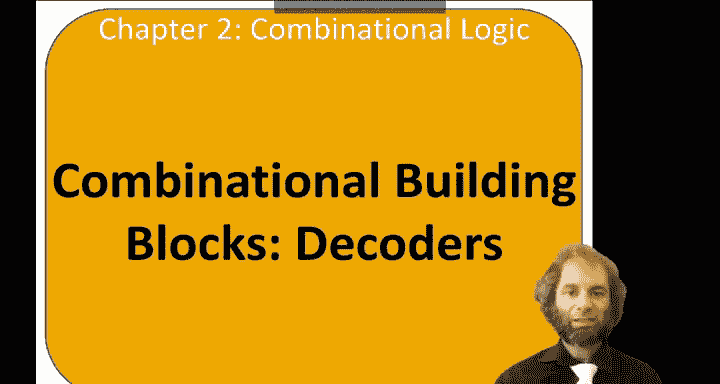
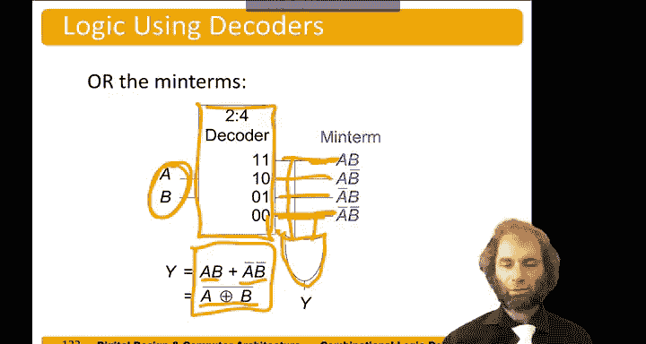

数字设计与计算机架构：2.14：译码器 🔌

在本节中，我们将学习组合逻辑电路中的另一个重要构建模块：译码器。译码器是一种能将一组输入编码转换为特定输出信号的电路，在内存寻址和逻辑函数实现中非常有用。

---

译码器是一种实用的组合电路。它包含 **n** 个输入和 **2^n** 个输出。在任何时刻，它都会使这 **2^n** 个输出中**恰好一个**变为高电平。因此，我们根据输入从 **2^n** 种可能性中选择一个输出。

例如，一个 **2-4 译码器** 有两个输入（通常称为地址位，因为常用于内存寻址），我们称它们为 **A0** 和 **A1**。它有四个输出，我们称之为 **Y0** 到 **Y3**。

以下是其功能描述：
*   当输入 **A** 为 `00` 时，输出 **Y0** 有效（高电平）。
*   当输入 **A** 为 `01` 时，输出 **Y1** 有效。
*   当输入 **A** 为 `10` 时，输出 **Y2** 有效。
*   当输入 **A** 为 `11` 时，输出 **Y3** 有效。

本质上，我们根据两位地址码来选择四个输出中的一个。

---

上一节我们了解了译码器的基本功能，现在来看看它的一个具体实现。译码器可以通过一组与门来实现，每个输出由输入变量及其反变量的逻辑与运算决定。

具体实现如下：
*   **Y0 = NOT(A1) AND NOT(A0)**
*   **Y1 = NOT(A1) AND A0**
*   **Y2 = A1 AND NOT(A0)**
*   **Y3 = A1 AND A0**

这种结构确保了在任何给定时刻，只有一个输出条件为真。

---

译码器的一个强大应用是实现任意逻辑函数。我们可以利用译码器生成一个函数的所有最小项，然后通过或门组合这些项来得到输出。这是实现逻辑功能的另一种方法。

假设我们有一个两变量函数：**Y = (A AND B) OR (NOT(A) AND NOT(B))**。请注意，这个函数等价于 **A XNOR B**（同或）。

以下是实现步骤：
1.  将输入 **A** 和 **B** 接入一个 2-4 译码器。
2.  译码器会输出四个最小项：**m0 (A'B')**, **m1 (A'B)**, **m2 (AB')**, **m3 (AB)**。
3.  我们的函数 **Y** 在 **A 和 B 同时为真**（对应 **m3**）或 **A 和 B 同时为假**（对应 **m0**）时为真。
4.  因此，我们只需将译码器的输出 **Y0** (m0) 和 **Y3** (m3) 通过一个或门连接起来，即可得到最终输出 **Y**。

通过这种方式，我们使用译码器和或门构建了所需的逻辑功能。

---

本节课中，我们一起学习了译码器。我们首先定义了译码器，它是一个具有 **n** 个输入和 **2^n** 个输出的组合电路，每次仅激活一个输出。接着，我们以 2-4 译码器为例，查看了其真值表和基于与门的电路实现。最后，我们探讨了译码器的一个关键应用：通过生成所有最小项并与或门结合，来实现任意逻辑函数。掌握译码器是理解更复杂数字系统（如内存和可编程逻辑器件）的基础。