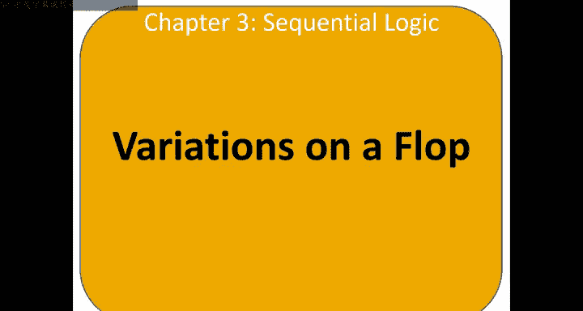
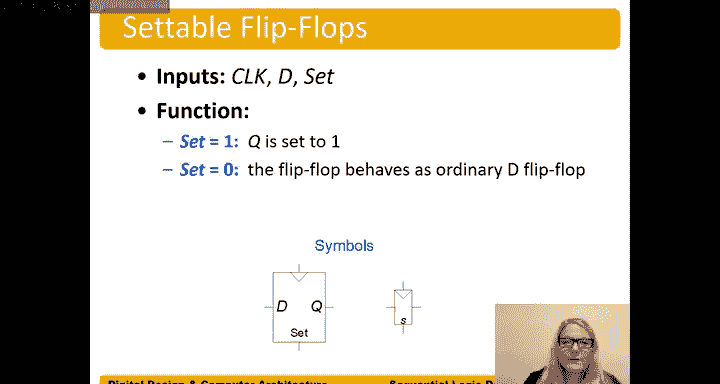

**数字设计和计算机架构：3.6：触发器变体 🔄**

在本节中，我们将探讨几种触发器的变体。触发器是本课程中将使用的核心状态元件。理解其他状态元件很重要，因为触发器本质上是由它们构建而成的。

---

### **寄存器**

首先介绍寄存器。寄存器是一组触发器。例如，一个4位寄存器就是由四个触发器组成的。当我们提到“触发器”时，通常指的就是D触发器，有时也简称为“flop”。

这些触发器共享同一个时钟信号。时钟信号连接到所有触发器的时钟输入端。

为了绘图简洁，我们通常使用总线符号来表示多位寄存器。例如，一个4位寄存器可以画成一条带斜杠的线，旁边标注数字4，这等价于四根独立的线。当寄存器位数很多时（例如32位），使用总线符号绘图会方便得多。

以下是两种表示4位寄存器的方式，它们是等价的。

---

### **带使能端的触发器**

接下来，我们看看带使能端的触发器。除了常规的时钟和D输入外，它还有一个额外的**使能**输入，通常标记为 `EN` 或 `E`。

使能信号控制着状态元件何时存储新数据或保持原有状态。
*   当 `EN = 1` 时，触发器表现得像一个普通的D触发器，在时钟边沿，输出Q获取输入D的值。
*   当 `EN = 0` 时，触发器保持其原有状态，忽略D输入的值。

那么，如何构建这样一个带使能的触发器呢？我们可以从一个普通的D触发器开始，并在其D输入端前添加一些组合逻辑。

我们可以通过真值表来推导所需的逻辑。目标是控制输入到D触发器内部（记为 `D_in`）的信号。

以下是推导过程：
*   当 `EN = 0` 时，我们希望 `D_in = Q_prev`（前一个Q值），以保持状态。
*   当 `EN = 1` 时，我们希望 `D_in = D`，以采样新数据。

由此，我们可以写出 `D_in` 的逻辑方程：
`D_in = (EN' * Q_prev) + (EN * D)`

根据这个方程，我们可以用与门和或门搭建电路。另一种更直观的实现方式是使用一个2选1多路选择器：使能信号 `EN` 作为选择端，当 `EN=1` 时选择 `D`，当 `EN=0` 时选择 `Q_prev`，然后将选择器的输出连接到D触发器的 `D_in`。

---

### **可复位触发器**

另一种常见的变体是**可复位触发器**。它在普通触发器的基础上增加了一个**复位**输入，通常标记为 `R` 或 `CLR`（清除）。

当复位信号有效时（`R = 1`），触发器存储的状态位被强制清零（`Q = 0`）。当 `R = 0` 时，它表现得像一个普通的D触发器。

可复位触发器分为两种类型：
1.  **同步复位**：复位操作仅在时钟边沿生效。即使复位信号变高，也必须等到下一个时钟上升沿到来时，Q才会被清零。
2.  **异步复位**：复位操作立即生效。一旦复位信号变高，Q会立刻被清零，无需等待时钟边沿。

异步复位触发器需要修改触发器内部锁存器的电路结构。而同步复位触发器则可以用我们为“使能”触发器设计的类似方法来构建。

构建同步复位触发器的方法如下：
我们同样在D触发器前添加组合逻辑。目标是：当 `R = 0` 时，`D_in = D`；当 `R = 1` 时，`D_in = 0`。

其逻辑方程非常简单：
`D_in = R' * D`

这个方程意味着，只有当复位无效（`R=0`）时，D输入才能通过；一旦复位有效（`R=1`），`D_in` 被强制为0，从而在下一个时钟边沿将Q清零。

可复位触发器非常重要，因为在系统上电时，触发器的初始状态是未知的。通过复位操作，我们可以将电路置于一个已知的确定状态，这是系统可靠工作的基础。

---

### **可置位触发器**

最后，我们简要介绍**可置位触发器**。它有一个**置位**输入，通常标记为 `S`。

其功能是：当置位信号有效（`S = 1`）时，输出Q被强制置为1（`Q = 1`）；当 `S = 0` 时，它表现得像一个普通触发器。

与可复位触发器类似，可置位触发器也分为同步置位和异步置位两种版本。同步版本的构建思路与同步复位触发器相似，而异步版本同样需要修改触发器内部电路。

---

### **总结**

本节课我们一起学习了触发器的几种重要变体。我们首先了解了**寄存器**是多位触发器的集合，并用总线符号简化表示。然后，我们深入探讨了**带使能端的触发器**，它通过一个使能信号控制数据的采样与保持，并学习了其逻辑方程 `D_in = (EN' * Q_prev) + (EN * D)` 和实现方法。接着，我们介绍了**可复位触发器**，它能够将状态强制清零，并区分了同步复位（`D_in = R' * D`）与异步复位的不同。最后，我们提到了**可置位触发器**的基本概念。理解这些变体对于设计和分析复杂的时序逻辑电路至关重要。