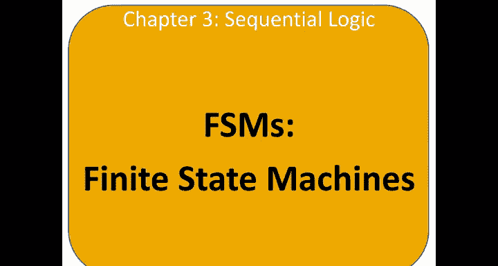
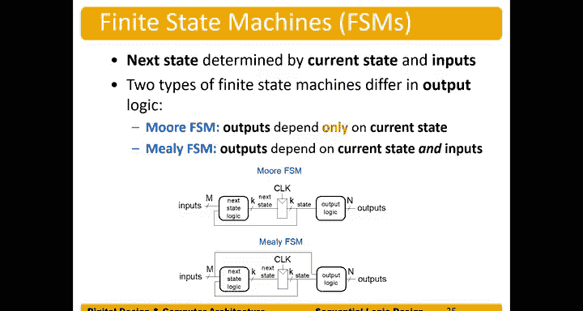

# 035：有限状态机简介 🧠

在本节课中，我们将要学习有限状态机的基本概念。有限状态机是数字系统中用于控制逻辑的核心组件，它能够根据当前状态和输入来决定系统的行为。我们将了解其构成、工作原理以及两种主要类型。

## 有限状态机的构成

有限状态机由一个状态寄存器和组合逻辑构成。

状态寄存器存储着系统的状态。系统的状态 `S`，我们也可以称之为当前状态，就是该寄存器输出的值，即寄存器中保持的比特位。

在下一个时钟边沿，下一个状态就会成为当前状态。我们使用带撇号的符号 `S'` 来表示下一个状态，而 `S` 本身表示当前状态。

我们同时使用组合逻辑来计算下一个状态，以及计算输出。这被称为输出逻辑。

因此，我们通过两个组合逻辑块和一个状态寄存器来定义有限状态机的功能。

## 状态转换逻辑

在有限状态机中，下一个状态由当前状态和输入共同决定。

例如，假设我们正在智能手机上输入解锁密码“5，7，3”。如果我们已经输入了“5”，那么系统就处于“已输入5”的状态。此时，下一个状态就取决于这个当前状态（已输入5）和下一个输入。如果下一个输入是“7”，状态就会变为“已输入5和7”。如果接下来输入的是“4”，系统则不会解锁。由此可见，系统的后续行为完全取决于当前状态和输入信号。

## 有限状态机的类型

有限状态机有两种主要类型，它们的区别仅在于输出逻辑，即输出是如何生成的。

### 摩尔型有限状态机

在摩尔型有限状态机中，输出仅取决于当前状态。

以下是摩尔型FSM的结构示意图。中间是状态寄存器，输出当前状态，左侧是下一个状态。我们有一个“下一个状态逻辑”组合逻辑块，它利用系统的当前状态和输入来计算下一个状态。而在摩尔型FSM中，输出仅由系统的状态位，即当前状态来决定。

摩尔型FSM是实际应用中最常见的有限状态机类型。

### 米利型有限状态机

第二种有限状态机称为米利型FSM。

其状态计算，即下一个状态的计算，与摩尔型FSM一样，由输入和当前状态决定。但输出逻辑不同，因为其输出由输入和当前状态共同决定。

而在摩尔型FSM中，输出仅由当前状态决定。因此，这两种FSM的区别仅在于输出逻辑的计算方式。我们将在后续课程中给出这两种状态机的具体例子。

## 总结

本节课中我们一起学习了有限状态机的基础知识。我们了解到FSM由状态寄存器和组合逻辑构成，其下一个状态由当前状态和输入决定。我们重点区分了两种主要的FSM类型：输出仅取决于当前状态的摩尔型FSM，以及输出同时取决于当前状态和输入的米利型FSM。理解这些核心概念是设计复杂数字控制逻辑的第一步。