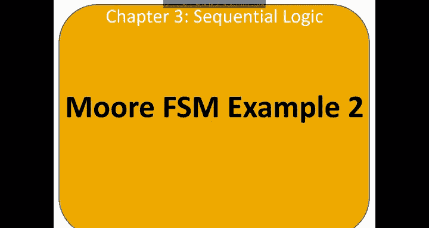
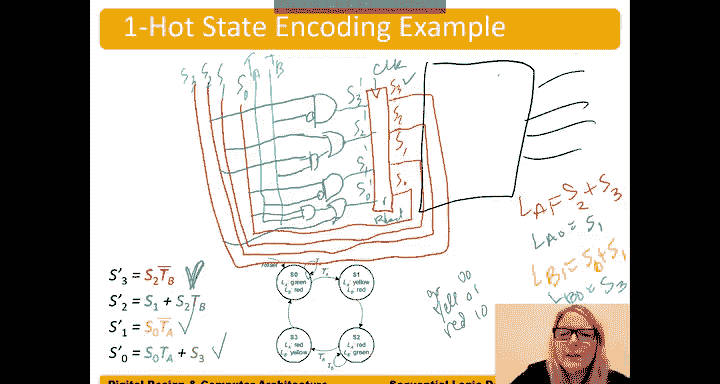

# 037：摩尔型有限状态机示例2 🚦

在本节中，我们将通过一个交通灯控制器的具体例子，深入学习如何设计一个摩尔型有限状态机。我们将从状态图开始，逐步完成状态编码、状态转移表和输出表的推导，并最终实现其电路。

## 概述

我们将设计一个控制两条道路交叉口交通灯的有限状态机。该系统有两个输入传感器，用于检测两条道路上是否有车辆。根据交通状况，控制器将改变交通灯的状态，以高效地管理交通流。

## 状态转移图

首先，我们定义系统的行为，并用状态转移图来描述它。

系统有两个输入：
*   **TA**：学术大道上的交通传感器。当有车辆时，TA = 1。
*   **TB**：布拉瓦达大道上的交通传感器。当有车辆时，TB = 1。

系统有两个输出，分别控制两条道路的交通灯：
*   **LA**：学术大道的交通灯。
*   **LB**：布拉瓦达大道的交通灯。

每个交通灯可以有三种状态：绿色（G）、黄色（Y）、红色（R）。因此，每个输出（LA 和 LB）需要多个比特位来表示。

以下是状态转移图的描述：
*   **状态 S0**：LA 为绿色，LB 为红色。只要 TA 为 1（学术大道有车），就保持在 S0 状态。当 TA 变为 0 时，转移到状态 S1。
*   **状态 S1**：LA 为黄色，LB 为红色。在下一个时钟边沿，无条件转移到状态 S2。
*   **状态 S2**：LA 为红色，LB 为绿色。只要 TB 为 1（布拉瓦达大道有车），就保持在 S2 状态。当 TB 变为 0 时，转移到状态 S3。
*   **状态 S3**：LA 为红色，LB 为黄色。在下一个时钟边沿，无条件转移回状态 S0。

## 状态转移表

根据状态转移图，我们可以创建状态转移表（也称为次态表）。该表使用当前状态和输入来决定下一个状态。

以下是状态转移表的内容：

| 当前状态 | 输入 TA | 输入 TB | 次态 |
| :--- | :--- | :--- | :--- |
| S0 | 0 | X | S1 |
| S0 | 1 | X | S0 |
| S1 | X | X | S2 |
| S2 | X | 0 | S3 |
| S2 | X | 1 | S2 |
| S3 | X | X | S0 |

> **注意**：表中的 `S` 代表状态变量，不要与状态名 S0, S1, S2, S3 混淆。`X` 表示“无关项”。

## 状态编码

状态名 S0, S1, S2, S3 是符号化的，我们需要为它们分配具体的二进制编码。首先，我们使用**二进制编码**，即使用最少的比特数来表示所有状态。

我们有 4 个状态，所以至少需要 2 个比特（`log2(4) = 2`）。我们选择如下编码：
*   S0 -> `00`
*   S1 -> `01`
*   S2 -> `10`
*   S3 -> `11`

我们用这些编码替换状态转移表中的状态名。我们用两个状态位 S1 和 S0（S1 是高位，S0 是低位）来表示状态。

以下是编码后的状态转移表：

| 当前状态 S1 S0 | 输入 TA | 输入 TB | 次态 S1‘ S0’ |
| :--- | :--- | :--- | :--- |
| 0 0 | 0 | X | 0 1 |
| 0 0 | 1 | X | 0 0 |
| 0 1 | X | X | 1 0 |
| 1 0 | X | 0 | 1 1 |
| 1 0 | X | 1 | 1 0 |
| 1 1 | X | X | 0 0 |

## 推导次态方程

现在，我们可以根据编码后的状态转移表，为每个次态位（S1‘ 和 S0’）写出逻辑方程。我们使用**积之和**（SOP）的形式。

以下是次态位 S1‘ 的推导过程：
*   观察 S1‘ 为 1 的行：第 3 行 (01 -> 10)，第 4 行 (10 -> 11)，第 5 行 (10 -> 10)。
*   对应的乘积项为：
    1.  `(~S1 & S0)` （来自第3行，输入为无关项）
    2.  `(S1 & ~S0 & ~TB)` （来自第4行）
    3.  `(S1 & ~S0 & TB)` （来自第5行）
*   合并第 2 和第 3 项：`(S1 & ~S0 & ~TB) + (S1 & ~S0 & TB) = (S1 & ~S0)`。
*   因此，S1‘ 的方程为：`S1‘ = (~S1 & S0) + (S1 & ~S0) = S1 ^ S0` （异或）。

以下是次态位 S0‘ 的推导过程：
*   观察 S0‘ 为 1 的行：第 1 行 (00 -> 01)，第 4 行 (10 -> 11)。
*   对应的乘积项为：
    1.  `(~S1 & ~S0 & ~TA)` （来自第1行）
    2.  `(S1 & ~S0 & ~TB)` （来自第4行）
*   因此，S0‘ 的方程为：`S0‘ = (~S1 & ~S0 & ~TA) + (S1 & ~S0 & ~TB)`。

## 输出表与输出编码

在摩尔型有限状态机中，输出完全由当前状态决定。因此，我们创建输出表。

以下是输出表的内容：

| 当前状态 | 输出 LA | 输出 LB |
| :--- | :--- | :--- |
| S0 | 绿色(G) | 红色(R) |
| S1 | 黄色(Y) | 红色(R) |
| S2 | 红色(R) | 绿色(G) |
| S3 | 红色(R) | 黄色(Y) |

输出值（绿、黄、红）也需要编码。每个灯有3种状态，至少需要2个比特。我们选择如下编码：
*   绿色(G) -> `00`
*   黄色(Y) -> `01`
*   红色(R) -> `10`

我们用状态编码和输出编码替换输出表中的符号。

以下是编码后的输出表：

| 当前状态 S1 S0 | LA1 LA0 | LB1 LB0 |
| :--- | :--- | :--- |
| 0 0 | 0 0 | 1 0 |
| 0 1 | 0 1 | 1 0 |
| 1 0 | 1 0 | 0 0 |
| 1 1 | 1 0 | 0 1 |

## 推导输出方程

根据编码后的输出表，我们可以为每个输出位写出逻辑方程。

以下是各输出位的方程：
*   `LA1 = S1`
*   `LA0 = ~S1 & S0`
*   `LB1 = ~S1`
*   `LB0 = S1 & S0`

## 电路实现

有了次态方程和输出方程，我们就可以画出有限状态机的电路图。电路主要由三部分组成：状态寄存器、次态逻辑和输出逻辑。

以下是电路实现的描述：
1.  **状态寄存器**：由两个 D 触发器构成，存储当前状态位 S1 和 S0。其输入（D端）连接次态逻辑的输出（S1‘ 和 S0’），在时钟边沿更新。
2.  **次态逻辑**：一组组合逻辑电路，根据当前状态（S1, S0）和输入（TA, TB）计算下一个状态（S1‘, S0’）。其实现基于我们推导出的方程：
    *   `S1‘ = S1 ^ S0`
    *   `S0‘ = (~S1 & ~S0 & ~TA) + (S1 & ~S0 & ~TB)`
3.  **输出逻辑**：另一组组合逻辑电路，根据当前状态（S1, S0）计算输出（LA1, LA0, LB1, LB0）。其实现基于我们推导出的方程：
    *   `LA1 = S1`
    *   `LA0 = ~S1 & S0`
    *   `LB1 = ~S1`
    *   `LB0 = S1 & S0`

## 独热编码

上一节我们使用了二进制编码。现在，我们来看看另一种常用的编码方式：**独热编码**。

在独热编码中，状态位的数量等于状态的数量。每个状态对应一个唯一的状态位，并且在任何时候，只有一个状态位为高（1）。

对于我们的4状态系统，独热编码如下：
*   S0 -> `0001`
*   S1 -> `0010`
*   S2 -> `0100`
*   S3 -> `1000`

使用独热编码时，次态方程的推导可以更直接地从状态转移图得到，并且通常更简单，但需要更多的触发器（4个 vs 2个）。

以下是基于独热编码的次态方程（注意：方程中只包含当前为高的那个状态位，因为其他位根据编码规则必然为0）：
*   `S3‘ = S2 & ~TB` （从S2转移到S3的条件）
*   `S2‘ = S1 + (S2 & TB)` （从S1无条件转移到S2，或在S2且TB=1时保持）
*   `S1‘ = S0 & ~TA` （从S0转移到S1的条件）
*   `S0‘ = (S0 & TA) + S3` （在S0且TA=1时保持，或从S3无条件转移到S0）

输出方程也需要用独热编码的状态位重写：
*   `LA1 = S2 + S3`
*   `LA0 = S1`
*   `LB1 = S0 + S1`
*   `LB0 = S3`

**一个重要注意事项**：当使用独热编码并带有复位信号时，必须确保复位后能进入正确的初始状态（例如 S0=`0001`）。这通常需要将对应 S0 的触发器设置为**可置位**（SET），而其他触发器设置为**可复位**（RESET）。这样，当复位信号有效时，电路会初始化为 `0001`，而不是 `0000`。

## 总结

本节课我们一起学习了如何设计一个完整的摩尔型有限状态机。我们从交通灯控制器的状态图出发，逐步完成了状态转移表、状态编码（包括二进制编码和独热编码）、次态方程和输出方程的推导，并理解了其对应的电路实现结构。关键点在于：摩尔机的输出仅取决于当前状态；状态编码的选择（二进制或独热）会影响电路的复杂度和使用的触发器数量。