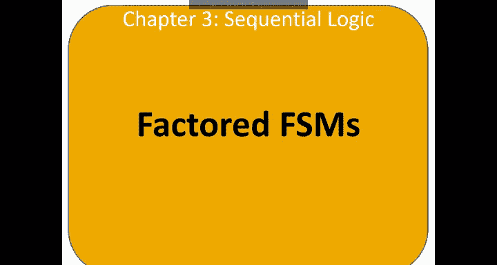
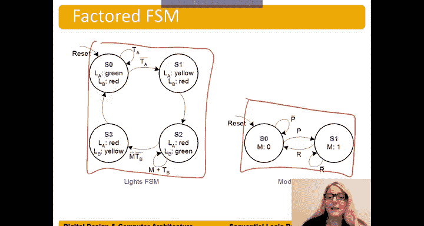

# 039：分解式有限状态机 🧩

在本节中，我们将学习如何通过“分解”来简化复杂的有限状态机设计。我们将以交通灯控制器为例，为其添加一个“游行模式”，并对比分解前后的设计差异。

---

分解式有限状态机将复杂的有限状态机拆分为多个更小、相互作用的FSM。这有助于降低FSM的复杂度。当复杂度降低时，设计、测试和调试过程都能得到简化，因此具有诸多优势。

举例来说，假设我们想修改之前构建的交通灯控制器，为其增加一个游行模式。为此，我们将引入两个新的输入信号：`P` 和 `R`。当 `P` 等于1时，系统进入游行模式，Bravada大道将保持绿灯，以便游行队伍通过。当 `R` 等于1时，系统退出游行模式，恢复正常运行模式。

我们可以设计一个未分解的FSM，将所有功能都集成在一个更新后的、更复杂的FSM中。或者，我们可以采用分解的方法：保留原有的交通灯控制FSM，并新增一个模式控制FSM，由它来决定何时让交通灯FSM保持Bravada大道为绿灯。

为了实现这种交互，我们需要一个内部信号 `M`（模式信号），由模式FSM输出，用于告知交通灯FSM当前处于何种模式。这样，原有的交通灯FSM只需稍作修改，增加一个输入端口 `M`，而新增的模式FSM则负责处理两个新输入信号，并决定当前应处于的模式。

下图展示了一个未分解版本的FSM，它将所有功能都包含在一个有限状态机中。

然而，分解后的FSM设计则清晰得多。这里我们有模式FSM。

只要游行模式输入 `P` 为低电平，它就保持在 `S0` 状态，输出模式信号 `M` 为0。当游行输入 `P` 有效（变为1）时，FSM则转移到 `S1` 状态，同时输出 `M` 变为1。

现在，对于交通灯FSM，当它处于 `S2` 状态（Bravada大道绿灯）时，其转移条件发生了变化。原先的逻辑是：当 `TB`（Bravada大道计时器）为真时保持 `S2`，为假时转移到 `S3`。现在的新逻辑是：当 `TB` 为真 **或** 从模式FSM接收到的输出 `M` 为真时，都保持在 `S2` 状态。这意味着，如果 `M` 等于1，系统将停留在 `S2` 状态，保持Bravada大道绿灯，让游行队伍通过。

相应地，另一个转移条件也需要包含模式信号。我们需要的条件是 `M` 或 `TB` 的“非”，即 `(M OR TB)` 的取反，这在逻辑上等价于 `(NOT M) AND (NOT TB)`。我们可以更清晰地将其表述为：当 `M` 和 `TB` 均为0时，表达式 `(M OR TB)` 的结果为0，此时我们希望离开 `S2` 状态，开始将LA大道变为绿灯。

通过这种方式，我们得到了两个更简单的FSM，使得设计、测试和调试都变得更加容易。

---

在本节中，我们一起学习了分解式有限状态机的概念。通过将复杂的单一FSM拆分为多个协同工作的简单FSM，我们有效地降低了系统复杂度，从而简化了整个设计流程。这种方法在需要为现有系统添加新功能时尤为有用。