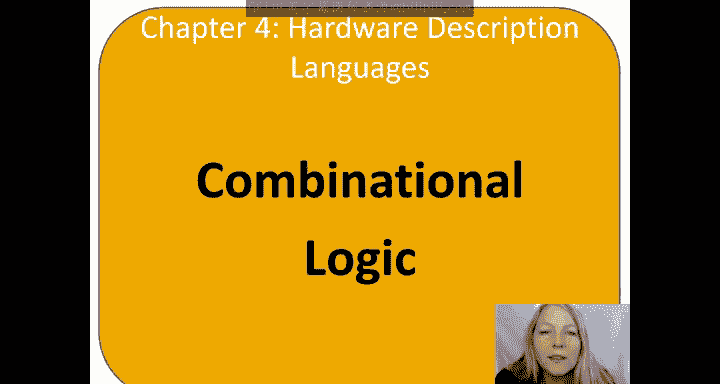
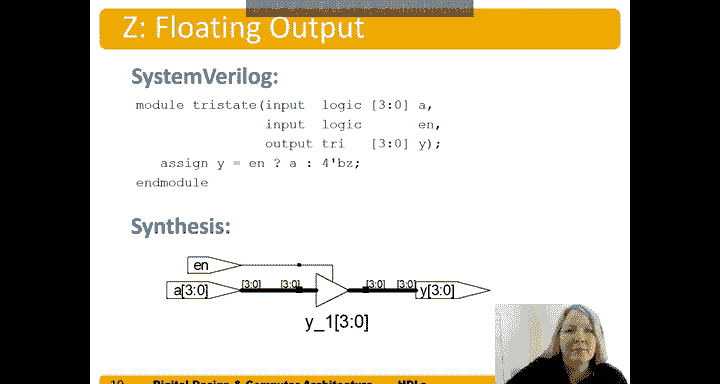

# 046：组合逻辑的SystemVerilog描述 🧠



在本节课中，我们将学习如何使用硬件描述语言（HDL）来描述组合逻辑电路。我们将重点介绍SystemVerilog中的位运算符、条件赋值、内部信号、运算符优先级以及位操作等核心概念。

---

## 位运算符与总线操作

上一节我们介绍了模块的基本结构，本节中我们来看看如何对多比特总线进行位运算。

```systemverilog
module gates (
    input logic [3:0] A, B,
    output logic [3:0] Y1, Y2, Y3, Y4, Y5
);
    assign Y1 = A & B;  // 与门
    assign Y2 = A | B;  // 或门
    assign Y3 = A ^ B;  // 异或门
    assign Y4 = ~(A & B); // 与非门
    assign Y5 = ~(A | B); // 或非门
endmodule
```

在上述代码中，`A`和`B`是4比特总线（位3到0），输出`Y1`到`Y5`也是4比特总线。每个逻辑门操作都独立应用于总线的每一位。例如，`Y1[0] = A[0] & B[0]`，`Y1[1] = A[1] & B[1]`，依此类推。

需要注意的是，对于与非门（NAND）的写法。不能直接写`~A & B`，因为取反运算符`~`的优先级高于与运算符`&`，这会导致先对A取反再与B相与，结果并非我们想要的`~(A & B)`。因此，必须使用括号：`~(A & B)`。

---

## 缩减运算符

为了简化对总线所有位进行相同操作（如所有位相与）的代码，我们可以使用缩减运算符。

```systemverilog
// 不使用缩减运算符的冗长写法
assign y = A[7] & A[6] & A[5] & A[4] & A[3] & A[2] & A[1] & A[0];

// 使用缩减运算符的简洁写法
assign y = &A; // 对8比特总线A的所有位进行与操作
```

缩减运算符将运算符（如`&`, `|`, `^`）放在信号名前，即可对该信号的所有位执行相应的操作。

---

## 条件赋值（三目运算符）

接下来，我们学习如何使用条件赋值来实现一个多路选择器（MUX）。

```systemverilog
module mux2 (
    input logic [3:0] D0, D1,
    input logic S,
    output logic [3:0] Y
);
    assign Y = (S == 1‘b1) ? D1 : D0;
endmodule
```

这是一个2选1多路选择器，输入`D0`和`D1`以及输出`Y`都是4比特总线。`S`是1比特的选择信号。三目运算符`? :`的语法是：`条件 ? 表达式1 : 表达式2`。如果条件为真（`S`为1），则`Y`等于`D1`；否则，`Y`等于`D0`。

---

## 内部信号

在构建复杂逻辑时，使用内部信号可以使代码更清晰、更易于维护。以下是一个使用内部信号`P`（传播）和`G`（生成）构建的1比特全加器示例。

```systemverilog
module fulladder (
    input logic A, B, Cin,
    output logic Sum, Cout
);
    logic P, G; // 内部信号声明

    assign P = A ^ B;       // 传播信号
    assign G = A & B;       // 生成信号
    assign Sum = P ^ Cin;   // 和输出
    assign Cout = G | (P & Cin); // 进位输出
endmodule
```

内部信号`P`和`G`在模块内部定义和使用，不直接作为模块的输入或输出。这种结构清晰地表达了全加器的逻辑：和（`Sum`）是`A`、`B`、`Cin`三者的异或，而进位（`Cout`）在`A`和`B`都为1（生成）或其中一位为1且进位输入为1（传播）时产生。

---

## 运算符优先级

在编写表达式时，了解运算符的优先级至关重要，它决定了运算的执行顺序。以下是SystemVerilog运算符从高到低的优先级列表：

1.  `~` （按位取反、逻辑非）
2.  `*`， `/`， `%` （乘、除、取模）
3.  `+`， `-` （加、减）
4.  `&` （与）
5.  `^`， `^~` （异或、同或）
6.  `|` （或）
7.  `? :` （三目条件运算符）

根据优先级，我们可以判断何时需要括号。例如：
*   `assign w = A & B | ~B & C;` 是正确的，因为`&`的优先级高于`|`，`~`的优先级最高。
*   如果想实现 `Y = (A | B) & (C | D)`，则必须使用括号，否则会先计算`B & C`，违背原意。

---

## 位操作与拼接

SystemVerilog提供了强大的位选择和拼接功能，用于构建和操作总线。

以下是位操作和拼接运算符的示例：

```systemverilog
assign Y = {A[2:1], {3{B[0]}}, 6‘b100010};
```

这条语句将多个部分拼接成一个12比特的信号`Y`：
1.  `A[2:1]`：取`A`总线的第2位和第1位。
2.  `{3{B[0]}}`：将`B[0]`的值重复3次。
3.  `6‘b100010`：一个6比特的二进制常量。

下划线`_`可用于数字常量中以提高可读性（如`16‘b0001_0101_1001_0010`），它会被综合工具忽略。

---

## 结构描述：实例化模块

我们可以通过实例化已有的模块来构建更复杂的电路，这称为结构描述。

```systemverilog
module mux2_8bit (
    input logic [7:0] D0, D1,
    input logic S,
    output logic [7:0] Y
);
    // 实例化两个4比特的2选1MUX
    mux2 lsb_mux (.D0(D0[3:0]), .D1(D1[3:0]), .S(S), .Y(Y[3:0]));
    mux2 msb_mux (.D0(D0[7:4]), .D1(D1[7:4]), .S(S), .Y(Y[7:4]));
endmodule
```

这里，我们通过实例化两个之前定义的4比特`mux2`模块，构建了一个8比特的2选1多路选择器。一个处理低4位（`[3:0]`），另一个处理高4位（`[7:4]`），选择信号`S`同时控制两者。

---

## 三态缓冲器

最后，我们看看如何描述具有高阻态（`‘z`）输出的三态缓冲器。

```systemverilog
module tristate (
    input logic [3:0] A,
    input logic enable,
    output tri [3:0] Y // 注意输出类型为‘tri‘（三态）
);
    assign Y = (enable == 1‘b1) ? A : 4‘bz;
endmodule
```

当使能信号`enable`为1时，输出`Y`等于输入`A`；当`enable`为0时，输出`Y`变为高阻态（`4‘bz`），这意味着该输出线 effectively 断开连接，允许其他驱动源控制该线路。这在总线共享的场景中非常有用。

---

## 总结



本节课中我们一起学习了使用SystemVerilog描述组合逻辑的多种方法。我们从基本的位运算符和总线操作开始，然后探讨了用于简化代码的缩减运算符和用于实现条件逻辑的三目运算符。我们还学习了通过定义内部信号来构建清晰、模块化的设计（如全加器），并深入理解了运算符优先级以避免逻辑错误。此外，我们掌握了强大的位选择和拼接技术，以及通过实例化现有模块进行结构描述的方法。最后，我们了解了如何创建具有高阻态输出的三态缓冲器。掌握这些基础是进行更复杂数字电路设计的关键。