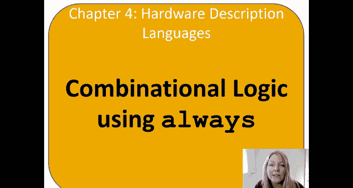
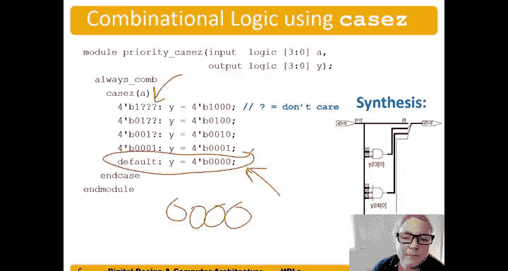

# 049：使用always语句的组合逻辑



在本节中，我们将学习如何使用Verilog中的`always`语句块来描述组合逻辑电路。我们将重点介绍`if-else`、`case`和`casez`语句的用法，并理解它们在组合逻辑设计中的关键作用。

---

## 使用always语句描述组合逻辑

上一节我们介绍了组合逻辑的基本描述方式。本节中我们来看看如何使用`always`语句块来实现组合逻辑。

某些语句必须放在`always`语句或`always`块中才能使用，例如`if-else`语句、`case`语句以及一种包含无关项的特殊`case`语句——`casez`。

以下是一个使用`always`语句块的组合逻辑模块示例。

```verilog
always_comb begin
    y1 = A & B;
    y2 = A | B;
    y3 = A ^ B;
    y4 = ~(A & B);
    y5 = ~(A | B);
end
```

这里我们使用`always_comb`来指示这是一个组合逻辑块。注意，在`always`块内部，我们直接使用`y1 = A & B;`这样的赋值语句，而不是`assign y1 = A & B;`。这个模块的功能与我们之前使用`assign`语句编写的模块几乎完全相同。

对于这个简单的例子，使用`assign`语句可能更简洁，代码行数更少，没有必要使用`always`块。但这个例子展示了如何使用`always_comb`语句块来生成组合逻辑。

---

## 七段数码管译码器示例

现在，我们来看一个更复杂的例子：一个七段数码管译码器。这是一个使用`always`块和`case`语句描述的组合电路。

以下是该译码器的核心代码结构：

```verilog
always_comb begin
    case (data)
        4'b0000: segments = 7'b1111110; // 显示 0
        4'b0001: segments = 7'b0110000; // 显示 1
        4'b0010: segments = 7'b1101101; // 显示 2
        // ... 其他数字 3-9 的编码
        default: segments = 7'b0000000; // 默认情况，不显示
    endcase
end
```

七段数码管的段编号通常为a, b, c, d, e, f, g。例如，要显示数字0，需要点亮a, b, c, d, e, f段（g段熄灭），对应的编码就是`7'b1111110`。

这是一个十进制译码器，只处理输入0到9。如果输入是10到15（即十六进制的A到F），则所有段都不点亮，输出全零。

**这里有一个非常重要的点：** `default`语句是必需的。对于组合逻辑，我们必须为所有可能的输入组合确定性地指定输出值。`case`语句类似于真值表，它直接列出了每种输入对应的输出。

如果你不包含`default`语句，综合工具可能会不确定在某些未列出的输入情况下该做什么，从而推断出一个锁存器（latch）来保持之前的值。这可能导致仿真正确，但实际硬件无法正常工作。因此，务必在`case`语句中包含`default`语句。

---

## 使用casez语句处理优先级电路

最后，我们介绍`casez`语句。这是我们在之前视频中讨论过的优先级电路的一个例子。

以下是优先级电路的`casez`实现：

```verilog
always_comb begin
    casez (a)
        4'b1???: y = 4'b1000; // a[3]优先级最高
        4'b01??: y = 4'b0100; // 其次a[2]
        4'b001?: y = 4'b0010; // 其次a[1]
        4'b0001: y = 4'b0001; // 最后a[0]
        default: y = 4'b0000; // 无请求
    endcase
end
```

注意代码中的问号`?`，它们表示“无关项”（don't cares）。例如，`4'b1???`意味着只要最高位`a[3]`为高，我们就不关心其他位的值是什么，因为此时优先级将给予`a[3]`，输出`y[3]`为1。

`casez`语句允许我们在输入条件中包含这些无关项，从而更简洁地描述具有优先级逻辑的电路。

同样，**必须包含`default`语句**。在这个例子中，如果输入`a`是`4'b0000`（没有任何请求），这个组合没有被前面的分支覆盖，`default`语句会将其输出指定为`4'b0000`。

---

## 总结

本节课中我们一起学习了如何使用Verilog的`always`语句块来描述组合逻辑。关键要点包括：
1.  `if-else`、`case`和`casez`语句必须放在`always`块内使用。
2.  使用`always_comb`来明确指示一个组合逻辑块。
3.  在`always`块内对信号直接赋值，无需`assign`关键字。
4.  使用`case`语句可以像真值表一样直接描述逻辑功能。
5.  **至关重要**：在`case`或`casez`语句中，必须包含`default`分支来指定所有未覆盖输入情况的输出，否则综合工具可能推断出锁存器，导致非组合逻辑行为。
6.  `casez`语句中的`?`表示无关项，常用于描述优先级逻辑。



通过掌握这些语句，你可以更灵活、更清晰地用HDL描述各种组合逻辑电路。