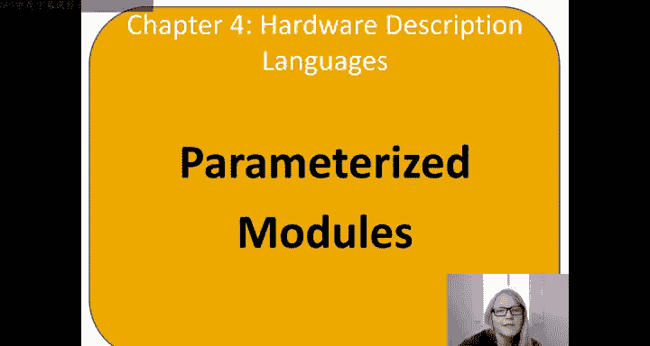
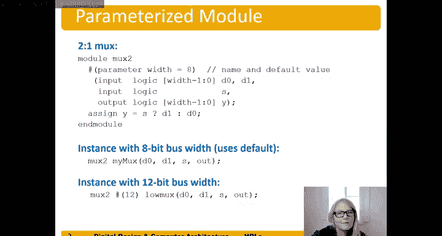

# 052：参数化模块 📚

在本节中，我们将学习参数化模块的概念。参数化模块通过“规则性”原则帮助我们复用模块，从而更高效地设计不同规格的电路。

## 概述



参数化模块允许我们定义一个通用的模块模板，通过参数来调整其具体规格（如数据宽度），而无需为每种规格都重写一个模块。本节我们将通过一个2选1多路选择器的例子来理解其工作原理。

## 参数化模块示例

上一节我们介绍了普通的2选1多路选择器。本节中，我们来看看如何将其改造为参数化模块。

以下是参数化2选1多路选择器的Verilog代码描述：

```verilog
module mux2 #(parameter WIDTH = 8) (
    input [WIDTH-1:0] d0, d1,
    input s,
    output [WIDTH-1:0] y
);
    assign y = s ? d1 : d0;
endmodule
```

这段代码与之前的非参数化模块非常相似。关键区别在于，我们使用 `#(parameter WIDTH = 8)` 定义了一个名为 `WIDTH` 的参数，其默认值为8。在声明输入 `d0`、`d1` 和输出 `y` 的位宽时，我们不再使用固定数字（如 `[3:0]`），而是使用参数表达式 `[WIDTH-1:0]`。电路的功能逻辑 `assign y = s ? d1 : d0;` 则保持不变。

## 模块实例化

定义好参数化模块后，我们可以在其他模块中实例化它。实例化时，我们可以选择使用默认参数值，也可以指定新的参数值。

### 使用默认参数实例化

如果我们不指定参数值，模块将使用其定义时设置的默认值。

```verilog
mux2 myMux (.d0(a), .d1(b), .s(sel), .y(out));
```

在这个例子中，我们实例化了一个名为 `myMux` 的 `mux2` 模块。由于没有指定 `WIDTH` 参数，它将采用默认值8，因此这是一个8位宽度的2选1多路选择器。

### 指定参数值实例化

如果我们需要一个不同位宽的模块，可以在实例化时通过 `#( )` 语法指定参数值。

```verilog
mux2 #(12) myMux12 (.d0(a), .d1(b), .s(sel), .y(out));
```

这里，我们通过 `#(12)` 将 `WIDTH` 参数设置为12，从而实例化了一个12位宽度的多路选择器。请注意，`#` 符号在Verilog中被重载了：在 `always` 块等上下文中它表示延迟，而在模块实例化时则用于指定参数值。

## 总结



本节课中我们一起学习了参数化模块。我们了解到，参数化模块通过引入参数（如 `WIDTH`）使模块定义变得通用和灵活。这允许我们使用同一段模块代码来生成不同规格的电路实例，极大地提高了代码的复用性和设计效率。关键点包括：使用 `parameter` 关键字定义参数及其默认值，在端口声明中使用参数表达式，以及在实例化时选择使用默认参数或通过 `#(value)` 指定新参数。