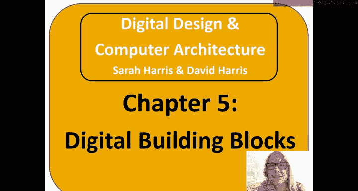
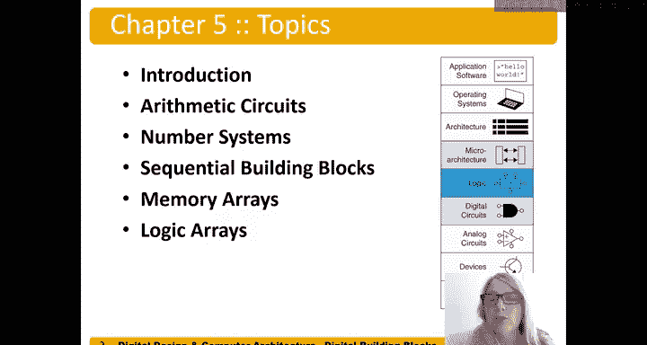
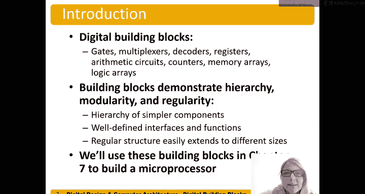

# 054：引言 🧱

在本章中，我们将探讨数字构建模块，特别是那些在许多数字电路（包括处理器）中广泛使用的基本模块。

我们将要讨论的主要主题包括算术电路、数字系统、时序构建模块，以及最后两种类型的阵列：存储器阵列和逻辑阵列。

## 概述

在之前的章节中，我们已经介绍了一些数字构建模块，如逻辑门、多路复用器、解码器和寄存器。本章我们将重点关注算术电路、计数器、存储器阵列和逻辑阵列。所有这些构建模块都体现了我们已经讨论过的设计原则，包括层次化、模块化和规整性。这些模块由更简单的组件构成，展示了层次化；它们具有定义明确的接口和功能，体现了模块化；而其规整的结构使得扩展至不同规模或位宽变得容易。我们将在第7章中使用这些构建模块来构建一个微处理器，它们是许多数字电路的基础。

## 章节主要内容

以下是本章将要涵盖的核心内容：

*   **算术电路**：用于执行加法、减法等数学运算的电路。
*   **数字系统**：理解计算机如何表示和处理数字的基础。
*   **时序构建模块**：具有状态记忆功能的电路模块，如计数器。
*   **存储器阵列**：用于存储数据的规整结构。
*   **逻辑阵列**：用于实现复杂逻辑功能的规整结构。

## 总结

本节课我们一起学习了第5章的引言部分，明确了本章将深入探讨算术电路、数字系统、时序模块以及存储器与逻辑阵列这几类关键的数字构建模块。这些模块是构成复杂数字系统（如处理器）的基石，其设计充分运用了层次化、模块化和规整性的原则。在接下来的小节中，我们将逐一详细学习它们。