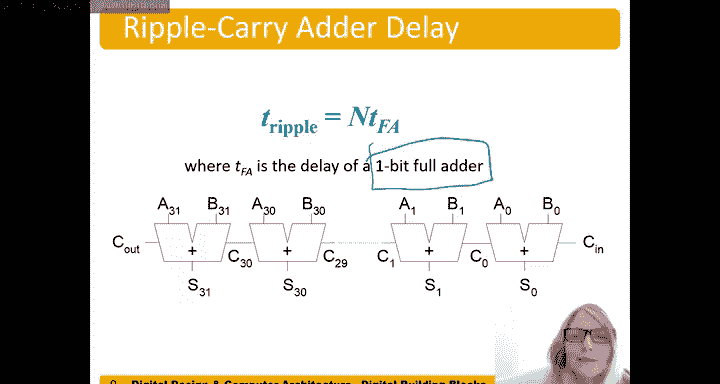

# 056：行波进位加法器 🧮

在本节中，我们将学习一种基本的加法器设计——行波进位加法器。我们将了解其工作原理、结构特点以及性能分析。

行波进位加法器通过将多个1位全加器串联而成。其核心思想是，低位的进位输出作为高位的进位输入，进位信号像波浪一样从最低有效位“传播”到最高有效位。

## 基本结构

首先，我们从最低有效位（第0位）开始。虽然可以使用半加器，但为了保持结构一致性并允许一个全局的进位输入，我们通常在第0位也使用全加器。

以下是构建一个n位行波进位加法器的步骤：

1.  **第0位加法**：输入为 `A[0]`、`B[0]` 和进位输入 `C_in`（通常为0）。全加器计算和 `S[0]` 与进位输出 `C[0]`。
    *   **公式**：`{C[0], S[0]} = A[0] + B[0] + C_in`
2.  **后续位加法**：对于第 `i` 位（`i` 从1到 `n-1`），输入为 `A[i]`、`B[i]` 和前一位的进位输出 `C[i-1]`。全加器计算和 `S[i]` 与进位输出 `C[i]`。
    *   **公式**：`{C[i], S[i]} = A[i] + B[i] + C[i-1]`
3.  **最终输出**：最高位的进位输出 `C[n-1]` 即为整个加法器的最终进位输出 `C_out`。所有位的和 `S[0]` 到 `S[n-1]` 组成最终的和。

## 工作原理示例

让我们通过一个具体例子来理解进位是如何“行波”传递的。假设我们要计算 `1011` + `0111`。

*   **第0位（最低位）**：`A[0]=1`, `B[0]=1`, `C_in=0`。计算得 `S[0]=0`, `C[0]=1`。
*   **第1位**：`A[1]=1`, `B[1]=1`, `C[1]=C[0]=1`。计算得 `S[1]=1`, `C[1]=1`（因为 `1+1+1=3`，二进制为 `11`）。
*   **第2位**：`A[2]=0`, `B[2]=1`, `C[2]=C[1]=1`。计算得 `S[2]=0`, `C[2]=1`。
*   **第3位（最高位）**：`A[3]=1`, `B[3]=0`, `C[3]=C[2]=1`。计算得 `S[3]=0`, `C_out=C[3]=1`。

最终结果为：和 `S = 0010`，进位 `C_out = 1`，即 `1011 + 0111 = 10010`（十进制 `11+7=18`）。可以看到，进位 `C[0]` 的产生影响了 `C[1]` 的计算，`C[1]` 又影响了 `C[2]`，以此类推。

## 电路布局与关键路径

在电路图中，数据流通常从左向右。但对于表示数字的加法器，我们习惯将最高有效位（MSB）放在左边，最低有效位（LSB）放在右边。因此，行波进位加法器的进位信号是从右（LSB）向左（MSB）传递的，这与我们书写数字的习惯一致。

行波进位加法器的主要缺点是速度较慢。其延迟由最长的信号路径决定，即**进位传播链**。

*   **关键路径**：从最低位的输入 `A[0]`/`B[0]` 开始，到最高位的进位输出 `C_out` 为止，进位信号需要依次通过每一个全加器。
*   **延迟计算**：对于一个n位行波进位加法器，其总延迟 `T_ripple` 大约是单个全加器延迟 `T_FA` 的n倍。
    *   **公式**：`T_ripple ≈ n * T_FA`

例如，一个32位的行波进位加法器，其延迟大约是32个全加器的延迟。这使得它在需要高速运算的场景下效率不高。

## 特点总结

以下是行波进位加法器的主要优缺点：

*   **优点**：
    *   结构非常简单，易于理解和实现。
    *   所需的逻辑门数量较少，硬件成本低。
*   **缺点**：
    *   延迟与位数n成正比，当位数增加时，速度会显著下降。
    *   进位传播路径长，是限制其速度的主要瓶颈。

因此，行波进位加法器适用于对速度要求不高，但追求电路简单和低成本的场合。

## 本节总结

本节课我们一起学习了行波进位加法器。我们了解了其通过串联全加器来构建多位数加法的基本原理，并通过示例观察了进位信号的传播过程。我们重点分析了其数据流方向以及最关键的**进位传播延迟**问题，认识到其延迟公式为 `n * T_FA`。最后，我们总结了其结构简单但速度较慢的特点，为后续学习更高效的高速加法器（如超前进位加法器）奠定了基础。