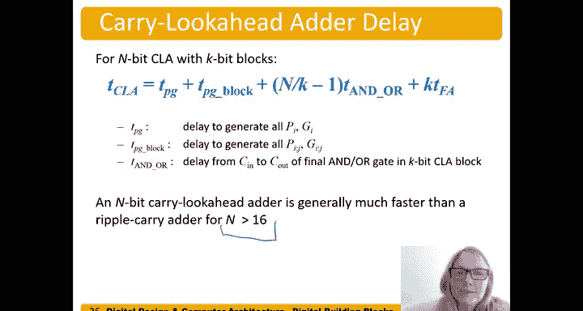

# 057：进位前瞻加法器 (CLA) 🚀

在本节中，我们将学习如何加速加法器中进位信号的传播过程。我们将介绍一种名为“进位前瞻加法器”的结构，它通过提前计算进位来显著减少加法运算的延迟。

## 概述

在上一节中，我们介绍了行波进位加法器，其缺点是进位信号必须从最低有效位逐级传递到最高有效位，这成为了加法运算的“关键路径”，限制了速度。本节中，我们将探讨进位前瞻加法器，它通过计算“生成”和“传播”信号来并行预测进位，从而加速这一过程。

## 生成与传播信号

首先，我们需要理解两个核心概念：**生成**和**传播**。它们描述了加法器中某一列（或某一位）对进位的处理方式。

*   **生成**：指该列自身会产生一个进位输出，无论是否有进位输入。这发生在两个加数位都为1时。
    *   **公式**：`G_i = A_i · B_i`
*   **传播**：指该列会将输入的进位原样传递到输出。这发生在至少一个加数位为1时。
    *   **公式**：`P_i = A_i + B_i`

基于这两个信号，某一列的进位输出 `C_i` 可以表示为：
**公式**：`C_i = G_i + (P_i · C_{i-1})`
这意味着，该列的进位输出要么由自身生成，要么是将输入的进位传播出去。

## 列级生成与传播计算

以下是计算一个具体加法示例中每一列的生成和传播信号的步骤：

1.  对于每一列 `i`，计算 `P_i = A_i + B_i`。
2.  对于每一列 `i`，计算 `G_i = A_i · B_i`。

通过这种方式，我们可以用逻辑门快速计算出所有列的 `P` 和 `G` 信号。

## 块级生成与传播信号

仅计算列级信号并未带来速度优势，因为进位公式依然依赖前一级的进位。真正的加速来自于将多个位（例如4位）组合成一个“块”，并计算整个块的生成和传播信号。

*   **块传播信号**：一个 `k` 位块（如4位）会将输入进位传播到输出进位的条件是，块内的**每一列**都能传播进位。
    *   **公式**：`P_{i:j} = P_i · P_{i-1} · ... · P_j` （对于从 `i` 到 `j` 的块）
*   **块生成信号**：一个 `k` 位块会**自行生成**一个输出进位的条件是，块内某一列生成了进位，并且该进位能被其右侧的所有列传播出去。
    *   **逻辑描述**：生成信号 `G_{3:0}`（对于4位块）为真，如果：
        *   第3列生成进位 (`G_3`)，或
        *   第2列生成进位 (`G_2`) 且第3列传播进位 (`P_3`)，或
        *   第1列生成进位 (`G_1`) 且第2、3列传播进位 (`P_2·P_3`)，或
        *   第0列生成进位 (`G_0`) 且第1、2、3列传播进位 (`P_1·P_2·P_3`)。
    *   这个逻辑表达式可以优化为便于电路实现的形式。

有了块级的 `P_{block}` 和 `G_{block}`，该块的进位输出 `C_{out}` 可以快速计算：
**公式**：`C_{out} = G_{block} + (P_{block} · C_{in})`

## 进位前瞻加法器结构

现在，我们来看一个32位进位前瞻加法器的结构，它由多个4位CLA块组成。

1.  **第一步：计算列信号**。所有位的 `P_i` 和 `G_i` 通过一级与门/或门并行产生。
2.  **第二步：计算块信号**。每个4位块利用其内部的 `P_i` 和 `G_i`，通过多级逻辑门（图中显示为6级门延迟）并行计算出该块的 `P_{block}` 和 `G_{block}`。
3.  **第三步：快速计算块间进位**。利用公式 `C_{out} = G_{block} + (P_{block} · C_{in})`，进位信号可以通过两级门延迟（一个与门和一个或门）从一个块传递到下一个块。由于所有块的 `P_{block}` 和 `G_{block}` 已经提前算好，进位链得以快速通过。
4.  **第四步：计算和位**。每个CLA块内部实际上包含一个小的行波进位加法器，用于计算该块4位的和。它使用外部快速计算得到的进位输入 `C_{in}` 来工作。对于最后一块，得到最终进位后，仍需经过该块内部的全加器延迟才能产生最终的和位。

## 延迟分析

进位前瞻加法器的关键路径延迟由以下几部分组成：

*   `T_{PG}`：计算列级 `P` 和 `G` 信号的延迟（1级门延迟）。
*   `T_{PG块}`：计算块级 `P` 和 `G` 信号的延迟（对于4位块，约为6级门延迟）。
*   `(N/K - 1) * T_{AND-OR}`：进位信号通过块间进位逻辑链的延迟。`N` 是总位数，`K` 是每块位数，`T_{AND-OR}` 是每级块间进位逻辑的延迟（2级门延迟）。
*   `K * T_{FA}`：最后一块内部行波进位产生和位的延迟。`T_{FA}` 是全加器的延迟。

**总延迟公式**：`T_{CLA} = T_{PG} + T_{PG块} + (N/K - 1) * T_{AND-OR} + K * T_{FA}`

对于位数较多（如 N > 16）的情况，进位前瞻加法器通常比行波进位加法器快得多。

## 总结

本节课中，我们一起学习了进位前瞻加法器。我们首先定义了“生成”和“传播”这两个核心概念，并展示了如何用它们描述进位。然后，我们将这些概念从单列扩展到多位列块，引入了块级生成和传播信号，从而能够并行预测进位。最后，我们分析了CLA的整体结构和工作原理，并对其性能延迟进行了量化分析。通过将进位计算从串行改为部分并行，CLA有效地解决了行波进位加法器的速度瓶颈问题。