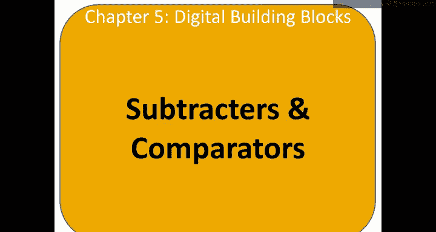
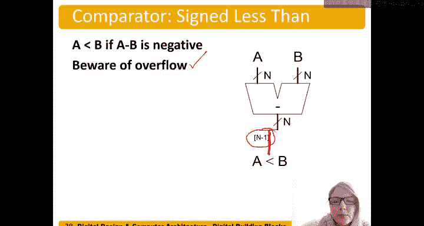

# 059：减法器与比较器 🔢



在本节课中，我们将要学习减法器和比较器的基本概念与实现方法。减法器用于计算两个数字的差，而比较器则用于判断两个数字的大小关系。理解这些组件是构建更复杂算术逻辑单元的基础。

## 减法器

上一节我们介绍了加法器，本节中我们来看看减法器。减法器与加法器类似，其功能是计算 **A - B**。实际上，减法可以看作是 **A** 加上 **B** 的负数，即 **A + (-B)**。

那么，如何对一个二进制补码数进行取反操作呢？我们通过计算其二进制补码来翻转符号。因此，**-B** 实际上等于 **对 B 取反再加 1**。

所以，**A - B** 的运算可以表示为：
```
A - B = A + (~B + 1)
```

以下是减法器的符号，它看起来像一个加法器，只是将加号替换为减号。


如何实现一个减法器呢？我们可以利用已有的加法器设计作为指导。我们已经知道如何设计多种类型的加法器。

实现减法器的步骤如下：
1.  将输入 **A** 连接到加法器的一端。
2.  将输入 **B** 取反后，连接到加法器的另一端。
3.  为了完成 **+1** 的操作，我们可以利用加法器的进位输入（Carry In）端。将其固定设置为高电平（1）。
4.  这样，加法器就计算了 **A + (~B + 1)**，从而输出了 **A - B** 的结果。

## 比较器

接下来，我们讨论如何比较数字。一个常见的比较是判断两个数是否相等。

### 相等比较器

这是一个四位数相等比较器的符号，用于检查 **A** 是否等于 **B**。



如何实现这个功能呢？实际上有多种方法。一种常见的方式是使用异或非门（XNOR），它也被称为同或门或相等门。

异或非门的真值表如下：
| A | B | 输出 |
|---|---|------|
| 0 | 0 | 1    |
| 0 | 1 | 0    |
| 1 | 0 | 0    |
| 1 | 1 | 1    |

从真值表可以看出，当两个输入位相等（同为0或同为1）时，输出为真。因此，对于单个比特的比较，我们可以使用一个异或非门。

对于多位数的比较，我们需要将每一位分别进行比较。以下是实现多位相等比较器的步骤：
1.  对 **A** 和 **B** 的每一位分别使用异或非门进行比较，得到一系列表示该位是否相等的信号。
2.  只有当所有位都相等时，两个数才完全相等。因此，我们将所有异或非门的输出通过一个与门（AND gate）连接起来。
3.  与门的最终输出即为 **A == B** 的结果。这种方法可以轻松扩展到任意数量的比特位。

### 有符号数比较器（小于比较）

我们可能还需要执行有符号数的比较，例如判断 **A < B** 是否成立。

让我们通过一些例子来思考如何实现。假设我们计算 **A - B**：
*   若 **A < B**（例如 5 - 7 = -2），结果为负数。
*   若 **A > B**（例如 7 - 5 = 2），结果为正数。
*   若 **A = B**（例如 5 - 5 = 0），结果为零（非负）。

观察发现，当 **A < B** 时，减法结果 **A - B** 为负数。在二进制补码表示中，负数的符号位（最高有效位）为 1。

因此，实现 **A < B** 比较器的电路如下：
1.  将 **A** 和 **B** 输入到一个减法器中。
2.  取出减法器输出结果的符号位（即最高位）。
3.  该符号位的值直接指示了 **A < B** 是否为真：若为 1，则 **A < B**；若为 0，则 **A >= B**。

> **注意**：在实际设计中需要考虑溢出的情况，但本基础教程中暂不深入讨论溢出处理。

---


本节课中我们一起学习了减法器和比较器的原理与实现。减法器通过将减法转化为加法（A + ~B + 1）来实现。比较器则用于判断数字间的关系：相等比较器通过逐位异或非再相与来实现；小于比较器则巧妙地利用减法器结果的符号位来判断大小。这些组件是构成计算机算术逻辑单元的核心部分。