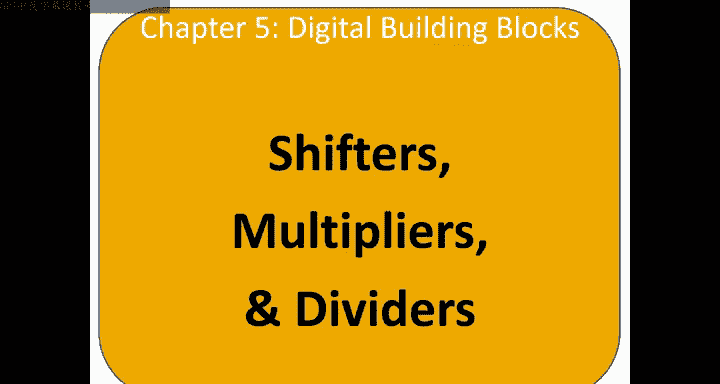
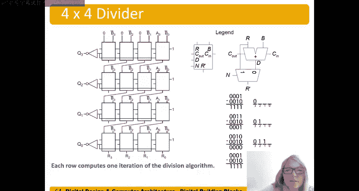

# 061：移位器、乘法器和除法器 🧮

在本节课中，我们将要学习移位器、乘法器和除法器的基本概念、工作原理以及如何构建它们。这些组件是计算机算术运算的核心，理解它们对于掌握计算机架构至关重要。

## 移位器

移位器有两种形式：逻辑移位和算术移位。

逻辑移位器将数值向左或向右移动，并在空出的位置上填充零。例如，这是一个逻辑右移两位的操作。我们从这个数字开始，将这两位向右移出。这是一个一位右移，但我们希望移出两位。从左侧移入的是零。因此我们得到两个零，这两个零被移入，而这两位被移出到右侧。我们得到 0，0，1，1，0。

逻辑左移类似。但我们是向左移动，在这个例子中移动相同的位数。我们移出左边的两位。因为执行的是逻辑左移，所以在右侧移入零。我们得到 001，这两位被移出，在右侧移入两个零。所以，左移时，我们从左侧移出位。对于逻辑移位器，我们在空位上移入零。

算术移位器仅在右移时有所不同。在右移时，我们不是移入零，而是移入最高有效位的值。在这个例子中，最高有效位是 1，所以算术右移两位仍然会将两位移出到右侧，但我们移入的是 1，而不是零。我们得到 1，1，1，1，0。现在我们移入 1，或者说是最高有效位的值，不总是 1。如果最高有效位是 0，我们也会移入 0。在这个例子中，最高有效位是 1，我们移入 1。而在逻辑右移中，无论最高有效位是什么，都只移入零。

对于左移，逻辑左移和算术左移是相同的。我们移出左边的两位，在右侧移入零。我们得到 0，0，1，0，0。可以看到，它们是相同的。所以逻辑和算术左移相同，但右移可能不同。算术右移中，我们移入符号位；逻辑右移中，我们总是移入零。因此，我们必须查看符号位或最高有效位是什么，才能知道要移入什么。

## 循环移位器

循环移位器与移位器类似，但不是简单地将位移出边缘，而是将它们循环回来。这是一个循环右移。我们循环右移两位。这一位会移出并向右移动，实际上是循环并回到前端。所以我们在这里得到那个 1。然后 0 循环回来，而不是直接掉出，它循环到前端。我们得到 0，1，它们不再在末端，而是循环到了前端，得到 0，1，1，1，0。

左循环移位类似。循环左移类似，这一位将循环回来。所以它不会从左端掉出，而是循环并落在右侧。然后这一位循环并落在右侧。我们得到 0，0，1，1，1。它们不再在左侧，而是循环到了右侧。

如果我们循环右移三位，那么会得到这个 0。它不会从左端掉出，而是循环并来到右侧，这将是循环左移三位。我们将得到 0，1，1，1，0，从左端掉出并循环到右侧。

## 移位器的设计

现在我们来讨论如何设计这些移位器。让我们以一个四位左移位器为例。记住算术和逻辑左移是相同的，所以它被称为左移位器。我们从一个四位数字开始，输入是 A3, A2, A1, A0，这是一个四位输入，我们将有四位输出。

我们可以移动多少位呢？我们可以不移位（0位），可以移动 1 位、2 位或 3 位。如果移动 4 位，我们就得到 0，这没有意义。这看起来像是使用多路复用器的好地方。

我们有一个选择线，我们希望它有四个选项，所以需要两位。我们设置一个移位量信号来选择移动多少位。如果我们移动 0 位，我们将这个 4 位信号馈送到 Y，这就是我们想要的，没有移位。

如果我们想左移一位呢？我们的输入 A3, A2, A1, A0，这个 A3 会移出。它会向左移动，然后我在这里得到零。所以我们可以取我们的 A 输入，我们想要 A2 到 Y3，A1 到 Y2，A0 到 Y1，并且在最右边的位上得到零。

如果我们移动两位呢？现在这两位都会移出，我们在右侧得到两个零。所以如果我们移动两位，我们会想要 A1 到 Y3，A0 到 Y2，并且在右侧得到两位零。

最后一个选项是移动三位。那么所有三个最高有效位都会向左移出，我们在右侧得到三个零。所以我们得到 A0 到 Y3，然后在左侧得到三位零。

移位器不要与稍后会谈到的移位寄存器混淆。移位器是纯组合逻辑的。我们使用移位量来指定要移动多少位。例如，如果我们想左移三位，那么我们选择那个输入并将其馈送到输出 Y。

我们可以为逻辑右移和算术右移考虑相同的事情。这里我用不同的位 A3, A2, A1, A0 画出来了。例如，你可以看到 Y3。如果我们移动零位，这个顶部输入是我们多路复用器的零输入。如果我们的移位量是 00，我们直接得到 A3, A2, A1, A0，我们根本不移动，直接发送到输出 Y。但如果我们移动一位，现在不是 A3，所有东西都向右移动（实际上是左移一位？这里上下文是右移，可能描述有混淆，按电路逻辑理解）。所以我们得到 A2, A1, A0，然后在 Y0 得到零。以此类推。当我们移动三位时，例如，现在我们只剩下这个位，我们向左移动了 A3, A2, A1, A0。所有这些位都向左移出，我们有一个零，后面跟着三个零。所以我们得到 A0，后面跟着 0,0,0。

逻辑右移非常相似，但现在我们有 A3, A2, A1, A0，当我们右移时，位从右侧掉出，我们得到零。我们看到唯一在 Y 的最高位不是零的情况是当没有右移时，即移位量为 0。否则，那些零会从左侧移入。所以在所有这些情况下，无论是右移一位、两位还是三位，我们都会在那个最高有效位得到零。以此类推，只有那个最低位，首先是 A0，然后右移一位后得到 A1，右移两位后得到 A2，右移三位后得到 A3。

算术移位和逻辑移位的区别在于，我们不是将零移入左侧，而是移入最高有效位。所以不是移入这些零，它们被连接到输入的最高有效位 A3。对于这些选项也是如此。

## 移位器作为乘除法器

我们可以使用移位器作为乘法和除法器。就像在十进制中一样，如果我们左移一个值，比如说我们有数字 53，我们将其左移两位，我们将得到 53,0,0。这相当于将 53 乘以 10 的（移动位数）次方。在这个例子中，53 乘以 100，是的，这就是我们得到的结果。

在二进制中也是如此，如果我们将一个数字左移 n 位（二进制数字），就相当于将该数字乘以 2 的 n 次方。让我们举个例子，假设我们有一个数字 3，我们将其左移两位。这两位将掉出，零将从右侧移入。所以我们得到 0,0,0,0,1,1,0,0。我们期望这个结果是，原始数字是 3，左移两位应该是 3 乘以 2 的 2 次方（这是我们移动的位数）。所以 3 乘以 4 应该是 12。检查一下，我们得到了 12。

这是另一个例子，假设值为 1。我们将其左移 3 位。我们期望结果是原始数字 1 乘以 2 的（移动位数 3）次方。事实上，这是正确的。我们将那个 1 左移三位，那些掉出，我们在前面放入零，得到 8。

这对正数和负数都有效。假设我们从 -3 开始，我们将其左移两位。我们期望那是 -3 乘以 2 的 2 次方，即 -3 乘以 4，得到 -12。将这个左移两位，那些掉出，在右侧放入零，我们得到 1,0,1,0,0。事实上，这是 -12。我们可以取二进制补码来确认大小是 12，并且它是负数，所以我们确实得到了 -12。

右移则相反。当我们右移时，具体使用算术右移，符号表示算术右移 n 位，这相当于除以 2 的 n 次方。我们可以再次使用十进制类比，假设我们有一个数字 37,000，我们将其右移三位。那将是相同的。我们将其右移三位，那三位掉出，我们得到 37,000 变成 37。这相当于原始数字 37,000 除以 10 的（移动位数）次方，我们右移了，所以除以 10 的 3 次方。37,000 除以 1000，是的，是 37。

这里原理相同。假设我们从某个数字开始，在这个例子中是 8。我们将其算术右移一位。在这种情况下，算术或逻辑移位结果相同，但对有符号数很重要。算术右移一位，我们期望它将 8 除以 2 的 1 次方。事实上，我们将这个右移一位，算术右移这位，我们取这个符号位，这就是被移入的，我们得到 0,0,1,0,0。事实上，我们得到 4。8 除以 2 的（移动位数）次方，算术右移，我们得到 8 除以 2 确实是 4。

这对我们的负数也有效。这里我们有 -16，我们想将其算术右移两位，所以这两位掉出，记住我们移入最高有效位或符号位。所以我们在这里移入 1，得到 1,1,1,0,0。事实上，那是 -4。所以得到 -16 算术右移 2 位，相当于将其除以 2 的（右移位数）次方，即 2 的 2 次方。所以 -16 除以 4，是的，我们得到 -4，检查无误。

因此，移位器比通用乘法器/除法器便宜得多。如果我们能用移位器代替乘法器/除法器来进行乘法或除法运算，那将节省大量硬件，降低功耗等。所以这是进行 2 的幂次乘除运算的一种简单方法。

## 乘法器

现在我们来讨论乘法器和除法器，看看如何构建它们。乘法器，我们知道，以前在十进制中做过手算乘法。在二进制中过程类似，但实际上更简单一些。我们将通过创建部分积然后将它们相加来执行乘法。

所以，2 乘以整个被乘数。2 乘以 0 得 0，2 乘以 3 得 6，2 乘以 2 得 4。然后我们要移位，因为这个 4 在十位，不是个位，然后我们做 4 乘以 0，再写 4 乘以整个被乘数，4 乘以 0 得 0，4 乘以 3 得 12，进位 1，4 乘以 2 得 8 加 1 得 9。然后我们把它们加在一起。我们将这些部分积相加得到结果。

在二进制中，除了乘法运算更容易之外，其他都相同。乘数乘以被乘数，下面的这些位。我仍然要将那个 1 乘以整个被乘数，或者如果最高有效位是 0，结果就全是零。所以我的部分积要么是被乘数（如果乘数位是 1），要么全是零（如果乘数位是 0）。我们可以看到这些部分积是被乘数、被乘数，最后是零。这样更容易，因为乘法很简单，基本上是与门：被乘数与乘数位进行与运算。如果该位是 0，我们希望它是零；如果是 1，我们希望它是被乘数本身。然后我们将这些部分积相加得到结果。在这个例子中，5 乘以 7，我们得到 35，事实上我们得到 32 加 3。

我们如何构建它呢？我们通过观察如何计算那些部分积来构建。这是一个 4 位乘 4 位的乘法器。我们有 4 位操作数，我们可以得到最多 8 位作为乘积结果。与加法不同，如果我们有 4 位操作数，我们得到 4 位结果；而乘法器，4 位操作数给我们 8 位结果；16 位操作数，我们得到 32 位结果。

如前所述，这些部分积将是乘数位与被乘数各位的与。所以 B0 与 A0，B0 与 A1，B0 与 A2，B0 与 A3。然后我们应该移动一个位置，然后得到 B1 与所有这些位：B1 与 A0，B1 与 A1，B1 与 A2，B1 与 A3。同样，B2 与所有那些被乘数位。最后，B3 与所有那些被乘数位。然后我们将它们相加以得到最终乘积。

我们可以在电路上看到。我们从这些加法器开始，进位为 0。我们执行 A0 与... 我们开始时，B0 与所有 A 位进行与运算：B0 与 A0，B0 与 A1... 然后我们将其与 B1 相加... 这一个直接进入乘积位 0。然后我们将这两个相加，这在这里执行。然后，我们将这三个相加。一个，两个，加到第三个上。以此类推。

我们注意到这个电路是一个 4 位乘 4 位的乘法器。它用了相当多的逻辑：一堆加法器和一些与门来执行乘法，所以乘法实际上相当昂贵。一些非常简单的处理器、微处理器没有乘法器或除法器，就是因为硬件成本高。因此，这些乘法或除法运算将在软件中完成，而不是由硬件执行。

## 除法器

现在我们来讨论除法器。这里有一个我们做过的例子，小除法，2584 除以 15 结果是 172 余 4。所以我们有要运算的操作数 A 除以 B，得到商加上余数除以 B。

这是手算过程，我们以前都做过，15 进 25，嗯，如果能进一次。减去 15，得到 10。带下一位数字，得到 108，15 能进多少次？进 7 次。7 乘以 15 是 105。减去 105，得到 3。带下最后一位数字，34，15 能进多少次？2 次。2 乘以 15 是 30。减去那个，得到 4，这就是我们的余数。所以我们得到 172，余数为 4。

我将展示一种稍微不同的方法，因为这是我们在硬件中进行二进制除法时要做的。我们可以这样想：我们试图看看这些数字... 基本上是从右边移入，我们进行左移，看看那个数字在什么时候能被 15 整除？

我们从 2 开始，尝试看 15 能进 2 吗？不能。我们在心里跳过了那部分，因为我们显然知道 15 不能进 2。但我们没有进到 258，我们在得到 25 时停下了，因为我们说，哦，是的，15 能进 25。但通常，我们从最高有效数字开始，说，好吧，能进吗？2 减 15 是负数，不能进，所以再次移位，将那个数字再次左移。现在我们得到 25。我们说，能进吗？25 减 15，是的，能进。所以我们可以看到它进了，并且进了一次。现在我们说，好的，很好，这是我们剩下的，25 减 15 是 10。所以现在，我们不是使用这个 25，而是说我们将使用这里剩下的任何数量作为我们现在要移位并带下一位数字的数量。我们说，嗯，15 能进那个多少次？进 7 次。现在我们再次看到 3，而不是 105，因为这是正数而不是负数，它确实能进。我们将那个 3 带下来，这就是我们移位并带入最后一位数字 4 的数量。

这是另一种思考方式，因为这就是我们在二进制中要做的。我们将以类似的方式执行二进制除法。这是无符号二进制除法。我们的 A 这里是 13 除以 2。我们期望得到 6，余数 1。6 乘以 2 是 12，然后我们有余数 1。

让我们看看。我们有我们的 A 这里：A3, A2, A1, A0。我们要做的第一件事是取 A 的最高有效位并将其移入。我们从右边移入。所以我们有 A3。我们将看看我们的除数 B 是否能进那个数。我们执行 1 减 2，不能，是负数。所以我们说，好吧。负的结果意味着 2 不能进那个数。这意味着我们在那个商位中放入 0。好的，这没问题。所以我们取 A3，这个值，整个东西，我们将其左移一位，所以 A3 仍然在这里。然后我们取下一位 A2 并将其从右边移入。现在我们再次检查，我们说，嘿，我们的除数能进那个数吗？3 减 2。是的，能进。所以结果是正数。3-2 是 1。因为它是正数，我们在商位那里放入 1，并说，是的，能进。二进制的一个好处是，它要么能进，要么不能。它不会是它的倍数。所以它要么是 1（能进），要么是负数结果，或者是 0（不能进）。

好的，所以能进，3 减 2 是 1，我们取这个值 1。这就是余数，是我们要移位的数量。现在，左移，然后带下下一个最高有效位 A1 和最低有效位 A0。现在我们说，好吧。让我们看看 2 能进 2 吗？2 减 2 是正数。我们得到正数结果。2 减 2 是 0，0 被认为是正数。所以 2 减 2 是 0，所以是正数，不是负数。所以我们得到 1，在商的下一个最高有效位。然后我们取那个结果，嗯，全是零。所以几乎看不到，但将其左移 1 位，最后带入 A 的最后一位 A0。我们检查并说，好吧，2 能进那个数吗？1 减 2 是 -1，哦，是负数。所以最后一位是 0。这是我们的余数。它不能进。所以我们的商是 6。这实际上是除法过程的最后一步，我们的余数是 1。

我们可以用算法形式写出来。我们有这个 R‘，余数值，我们想执行 A 除以 B 等于 Q 加 R 除以 B，其中 R 是余数。

我们将对 i 从 n-1 到 0 执行此操作，从被除数 A 的最高有效位开始。我们将初始化余数为零，所以我们从 0,0,0,0 开始。然后我们移入，将这个左移一位，所以那位掉出，我们移入 A_i，在第一次迭代中是 A 的最高有效位 A3。现在我们得到 0,0,0, A3，那是最高有效位。这就是这一步。

现在我们将执行这个差值 R 减 B。我们将检查 B 是否能进那里。这是我们的 R 减 B。我们说，嗯，如果那个差值小于 0，所以如果是负数，那么它不能进。我们将保持那个余数，并说，嘿，它不能进。所以那个商位是 0。好的，这是我们的第一步或第一次迭代。在这种情况下，我们没有执行 else 步骤。我们将在下一步看到会发生什么，现在它将重复，因为我们在这个 for 循环中，i 从 n-1 到 0。

现在我们在第二次迭代中。所以现在 i 等于 n-2。我们的 R‘，在这种情况下是 0,0,0, A3，也就是 1，我们就保持这样。现在我们将这个 R’ 左移一位。现在我们将得到 0,0, A3，零掉出，我们移入下一个最高有效位 A2。这就是这里发生的情况。现在我们将说，好吧，我们将再次执行那个差值，并说 R 减 B，B 能进那个值吗？事实上，这次能进。它说 D 小于 0 吗？不，不是这种情况。在这种情况下，它大于或等于 0，是 1。所以现在我们使商 Q_i（在这种情况下 Q2）等于 1，现在，我们不是传递这个 R 向前，而是传递差值向前，即我们的 0001，到我们的 R‘ 或余数 R’ 中。

好的，现在我们说，好吧，R‘ 等于 D，即 0001，将其左移一位，所以 0001 左移，丢掉那位，下一个最高有效位 A1 移入。在我们的例子中 A1 是 0，所以现在我们到达这一步。现在我们检查并说，B 能进那里吗？我们再次执行那个差值，R 减 B。是的，能进。D 小于 0 吗？不，不小于 0，所以我们在 else 情况下。我们说，好吧，Q 是 1，i 是这个 1。我们使 R‘ 等于那个差值。

好的，现在我们进入最后一次迭代。R‘ 是 0,0,0,0，那个差值。我们将其左移一位。我们丢掉那位，并移入 A 的最后一位，即 A0。在这个例子中，它是 1。我们得到 0,0,0,1。再次，我们现在在这个阶段 0001，我们执行那个差值。1 减 2，小于 0 吗？是的。我们最后的商位是 0。Q0 是 0，然后 R‘ 等于 R（保持不变）。我们只是等于那个。

现在我们在迭代结束时，我们已经从 i 等于 n-1 运行到 0。现在我们完成了那个 for 循环。我们说 R 等于 R‘。所以余数等于 R’ 值。我们得到我们的结果，即 6（0,1,1,0），这个值星号商，以及我们的余数 1。

## 除法器的构建

我们如何构建这个呢？这是构建方法。我们这里有一个盒子，每个盒子在这里显示，因为空间原因，我们没有在这个大图中写出所有小盒子的名称。但这个盒子里面是这个电路。这个电路基本上在执行减法，正如你所看到的，我们馈入 B 的反码加 1 到进位中。所以那是在做这个，0,0,0, A3。这是第一次迭代，0,0,0, A_i 在第一次迭代中是 A3。所以每个盒子都在执行一次迭代。这是第 n-1 次迭代。这是第 n-2 次迭代。这是第 n-3 次迭代。这是第 n-4 次迭代，在这个例子中 n 是 4。所以我们有 A 的位 3、位 2、位 1 和位 0 被移入。

好的，所以这正在执行那个差值 R 减 B，因为我们有 B 的反码输入和进位上的 1。所以这正在执行减法，然后我们得到差值。我们想知道，嗯，我们要么将那个差值作为 R‘ 向前馈送（在 else 情况下），要么如果结果是负数，即 B 不能进，我们就馈送这个余数 R。

进位输出，这只是一个行波进位加法器，它服从这些其他盒子。这里的关键是，我们想看看那个差值的结果是什么。所以我们想看看差值的最高有效位 P3。这是差值的最高有效位，它将决定我们选择什么。如果它是负数，那么 Q_i，在这种情况下 Q3，如果这是负数，这是 1，所以 Q3 是它的反码，将是 0。如果它是负数，R‘ 等于 R。所以如果这里是负数，我们希望将 R 馈送到 R‘，它不能进。这是一个输出。这是差值的最高有效位，它告诉我们结果是否为负数。然后我们将其馈送到我们的... 这些是输入。在每个那些 N 输入选择的多路复用器中。

好的，所以每个盒子都在执行算法的一次迭代，每一行都在执行算法的一次迭代。然后你可以看到，我们取要么... 所以无论 R‘ 是什么，我们取它，左移一位，然后移入 A 的下一个最高有效位。同样的事情，下一行，取那个 R‘，然后移入下一个最高有效位。对于最后一行也是如此。

正如你所看到的，这个除法器也相当昂贵，就像乘法器一样，有加法器、多路复用器，构建这个 4 位除 4 位的除法器将花费我们不少成本。

## 总结

在本节课中，我们一起学习了移位器、乘法器和除法器。我们了解了逻辑移位和算术移位的区别，以及循环移位的工作原理。我们探讨了如何使用移位器高效地进行 2 的幂次的乘法和除法运算。我们还深入研究了乘法器和除法器的构建方式，理解了它们如何通过部分积相加或迭代减法来工作，并认识到这些硬件组件在成本和复杂性方面的考量。这些知识是理解计算机如何执行基本算术运算的基础。