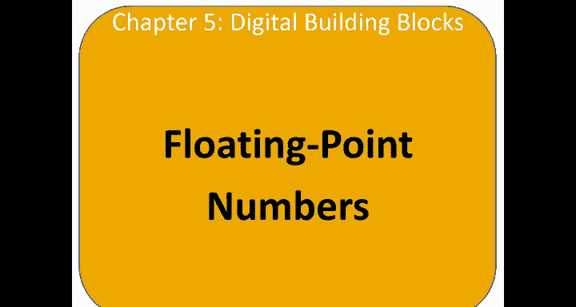
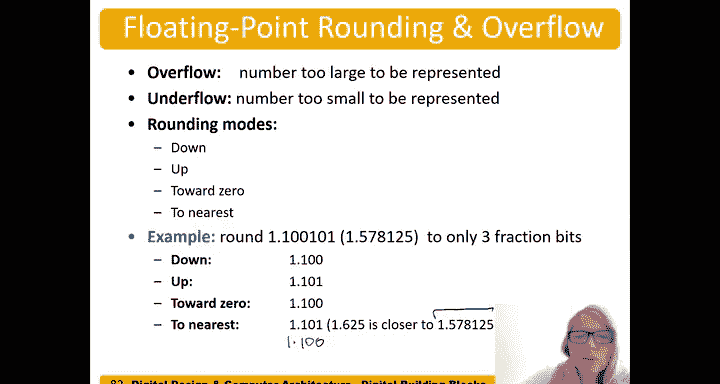

# 063：浮点数 🧮

在本节课中，我们将学习浮点数的概念、表示方法及其与定点数的区别。浮点数类似于科学计数法，能够表示更大范围的数值，是通用计算中的重要组成部分。

---

## 从定点数到浮点数

上一节我们介绍了定点数，本节中我们来看看浮点数。与定点数不同，浮点数允许二进制小数点的位置“浮动”，使其始终位于最高有效位1的右侧。这类似于十进制的科学计数法。

例如，十进制数 243 可以表示为：
**2.43 × 10²**

在二进制浮点数中，我们采用类似的方法。一个浮点数通常由以下部分组成：
**(-1)^S × M × B^E**

其中：
*   **S** 是符号位（0 表示正，1 表示负）。
*   **M** 是尾数（Mantissa）。
*   **B** 是基数（Base），在二进制浮点数中固定为 2，因此无需编码。
*   **E** 是指数（Exponent）。

与定点数相比，浮点数提供了更大的动态范围（能表示更小和更大的数），但这是以牺牲一定精度和增加算术运算复杂度为代价的。浮点数在加法前需要对齐尾数，这会消耗更多的性能和时间。

以下是浮点数与定点数的主要对比：

*   **浮点数**：编程更容易，动态范围大，但硬件实现更复杂，功耗和性能开销大。适用于通用计算。
*   **定点数**：编程更复杂（需警惕溢出），动态范围小，但硬件实现简单高效。适用于对功耗和成本敏感的信号处理、机器学习等领域。

---

## IEEE 754 32位浮点数标准

现在，我们来看看如何将浮点数的各个部分编码到具体的位格式中。最常用的标准是 IEEE 754 单精度（32位）浮点数格式。

一个32位浮点数包含以下字段：
*   **1位** 符号位（S）
*   **8位** 指数位（E）
*   **23位** 尾数位（M）

我们将通过一个例子，分三步构建出最终的 IEEE 754 表示形式。

### 示例：表示十进制数 228

**第一步：转换为二进制并隐含“×2⁰”**
首先，将十进制数 228 转换为二进制：
`228₁₀ = 11100100₂` （可理解为 `11100100 × 2⁰`）

**第二步：规范化（移动二进制小数点）**
将二进制小数点向左移动，直到它位于最高有效位1的右侧。这里需要移动7位。
`1.1100100 × 2⁷`
现在，我们得到了：
*   符号 S = 0（正数）
*   尾数 M = `1.1100100`
*   指数 E = 7

**第三步：编码为IEEE 754格式**
1.  **符号位**：直接填入 `0`。
2.  **指数位**：采用**偏置指数**。对于32位浮点数，偏置量是127。因此，存储的指数值是 `7 + 127 = 134`。
    `134₁₀ = 10000110₂`
3.  **尾数位**：只存储**小数部分**。因为规范化的尾数总是 `1.xxxxx` 的形式，所以开头的“1”是隐含的，无需存储。我们只存储小数点后的部分 `1100100`，并在右侧用0补足23位。

最终，228 的 IEEE 754 单精度表示为：
`0 10000110 11001000000000000000000`

可以将其转换为十六进制以便阅读：
`0x43640000`

**常见错误**：不要试图直接从十进制的科学计数法（如 `2.28 × 10²`）转换到二进制浮点。必须遵循上述“先转二进制，再规范化”的步骤。

---

## 另一个示例：表示 -58.25

让我们用完整的流程处理一个负数和小数。

1.  **转换绝对值 58.25 为二进制**：
    *   整数部分 58：`58₁₀ = 111010₂`
    *   小数部分 0.25：`0.25₁₀ = 0.01₂` (因为 0.25 = 2⁻²)
    *   合并：`58.25₁₀ = 111010.01₂` （即 `111010.01 × 2⁰`）

2.  **规范化**：将二进制小数点左移5位。
    `1.1101001 × 2⁵`
    *   符号 S = 1（负数）
    *   尾数 M = `1.1101001`
    *   指数 E = 5

3.  **编码**：
    *   符号位：`1`
    *   偏置指数：`5 + 127 = 132`，即 `10000100₂`
    *   尾数小数部分：`1101001`（后补0至23位）

最终32位表示为：
`1 10000100 11010010000000000000000`

十六进制表示为：
`0xC2690000`

---

## 特殊值、双精度与舍入

浮点数格式需要定义一些特殊值。

**特殊编码**：
*   **零**：由于零没有最高有效位1，因此用特殊编码表示。指数和尾数部分全为0。符号位可为0或1，因此存在 `+0` 和 `-0`。
*   **无穷大**：指数全为1，尾数全为0。符号位决定正负无穷。
*   **非数**：指数全为1，尾数非0。用于表示无效操作的结果，如 `0 ÷ 0`。

**单精度与双精度**：
*   **单精度**：即我们讨论的32位格式（1位符号，8位指数，23位尾数）。偏置量 = 127。
*   **双精度**：使用64位（1位符号，11位指数，52位尾数）。偏置量 = 1023。双精度极大地增加了尾数位数，从而提供了更高的精度，适用于科学计算等需要极高精度的场景。

**溢出、下溢与舍入**：
*   当数字的绝对值过大而无法表示时，发生**溢出**。
*   当数字的绝对值过小（过于接近0）而无法表示时，发生**下溢**。
*   由于尾数位数固定，实数经常无法精确表示，需要进行**舍入**。常见的舍入模式有：
    *   向零舍入
    *   向下舍入
    *   向上舍入
    *   向最近值舍入（最常用）

例如，假设我们只能用3个小数位表示二进制数 `1.11001`（十进制约1.78125）。
*   向下舍入得到：`1.110` (1.75)
*   向上舍入得到：`1.111` (1.875)
*   向零舍入（正数时同向下舍入）：`1.110` (1.75)
*   向最近值舍入：由于 `1.11001` 更接近 `1.110` 而非 `1.111`，因此结果为 `1.110` (1.75)。

---

本节课中我们一起学习了浮点数的核心思想、IEEE 754单精度浮点数的编码方式（包括规范化、偏置指数和隐含位），并了解了双精度格式、特殊值以及舍入等关键概念。浮点数通过牺牲一定的精度和硬件效率，换取了表示极大动态范围数值的能力，是现代计算机处理实数运算的基石。