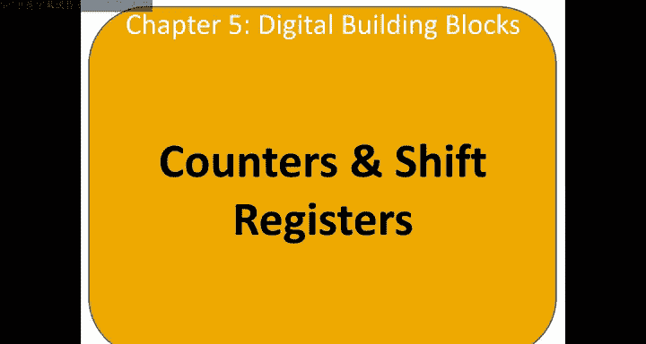
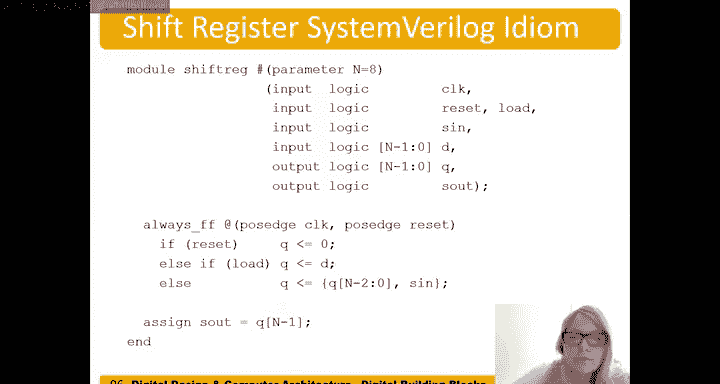

# 065：计数器和移位寄存器 🧮



在本节课中，我们将要学习两种重要的时序逻辑电路：计数器和移位寄存器。计数器用于按顺序生成数字，而移位寄存器则用于在时钟边沿移动数据位。我们将探讨它们的工作原理、构建方法以及在实际系统中的应用。

## 计数器

上一节我们介绍了寄存器，本节中我们来看看计数器。计数器在每个时钟边沿递增。例如，手表就是一个计数器，它从0计数到59，然后回到0，这是一个模60计数器。计数器用于循环遍历数字序列。

一个3位计数器的例子是：从0开始计数，依次经过1、2、3、4、5、6、7，然后回到0。计数器的应用包括数字时钟显示和程序计数器。程序计数器（我们将在下一章讨论）用于跟踪当前正在执行的指令，例如，指令0正在执行，然后是指令1，接着是指令2。

以下是计数器的符号表示。它没有输入，但有一个复位端（Reset）用于将其重置为零，还有一个N位的输出端。其符号看起来像一个没有输入端的触发器。

### 如何构建计数器？

我们如何构建这个计数器？我们可以使用一个加法器。我们想让计数器每次加1，即加上二进制表示的1。但直接连接加法器会产生竞争问题。解决方案是加入一个触发器。

具体构建方法如下：使用一个可复位的触发器，其输出Q反馈到加法器的一个输入端。加法器的另一个输入端是常数1（N位表示）。加法器的输出连接到触发器的D输入端。在下一个时钟边沿，递增后的值成为新的Q值，如此循环。

以下是构建一个N位计数器的示意图，它每次递增1。我们也可以构建递增不同数值（如4）的计数器。

### Verilog 实现

以下是计数器在SystemVerilog中的实现。这是一个8位计数器的模块。

```verilog
module counter (
    input logic clk,
    input logic reset,
    output logic [7:0] q
);
    always_ff @(posedge clk) begin
        if (reset) begin
            q <= 8‘b0;
        end else begin
            q <= q + 8‘b1;
        end
    end
endmodule
```

另一种更详细的实现方式会显式地展示加法器：

```verilog
module counter_verbose (
    input logic clk,
    input logic reset,
    output logic [7:0] q
);
    logic [7:0] next_q;

    // 显式加法器
    assign next_q = q + 8‘b1;

    always_ff @(posedge clk) begin
        if (reset) begin
            q <= 8‘b0;
        end else begin
            q <= next_q;
        end
    end
endmodule
```

## 使用计数器进行时钟分频

计数器也可用于对时钟进行分频。例如，如果我们想控制一个LED闪烁，而板载时钟通常至少为50MHz，人眼无法察觉如此快速的闪烁。因此我们需要降低时钟频率。

假设我们有一个时钟信号，周期为Tc。一个1位计数器在每个时钟边沿从0翻转到1。其输出信号的周期是2Tc，频率是时钟频率的一半。

对于N位计数器，其最高有效位（MSB）的输出频率是时钟频率除以2^N。例如，一个3位计数器，其最高位的周期是8Tc，频率是时钟频率的1/8。

因此，计数器可用于分频。例如，一个50MHz的时钟，经过一个24位计数器后，其最高位的输出频率是50MHz / 2^24 ≈ 2.98Hz。

## 数字控制振荡器

我们还可以使用计数器产生数字控制振荡器。我们使用刚才讨论的N位计数器，但每次循环不是加1，而是加一个值P。

现在，该计数器最高有效位的输出将以（时钟频率 × P / 2^N）的频率翻转，而不是之前的1 / 2^N。

例如，假设时钟频率为50MHz，我们想产生一个200Hz的信号。我们需要使 P / 2^N = 200 / 50,000,000。

我们可以尝试N=24（24位计数器），P=67。输出频率 = 50MHz × 67 / 2^24 ≈ 199.676Hz，非常接近200Hz。

我们也可以使用32位计数器，设置P=17,179，可以得到更接近200Hz的频率。

## 移位寄存器

现在，让我们转向另一种有用的时序电路：移位寄存器。移位寄存器可以在每个时钟边沿移入一个新的位。它看起来像是一系列首尾相连的寄存器。

移位寄存器有一个串行输入（S_in或Serial In）和一个串行输出（S_out或Serial Out）。内部还有并行输出Q0, Q1, Q2, ..., Q_{n-1}。

例如，我们可以随时间移入一个值，如0, 1, 1, 0, 1。最初移入的0会随着新位的移入而向右移动。最终，这些位会出现在内部并行输出线上。

因此，移位寄存器可以将串行输入转换为并行输出，我们称之为串并转换器。这在芯片引脚数量有限时非常有用。我们可以通过单根线（串行）随时间移入多位数据，然后在芯片内部以并行方式使用这些数据。

例如，如果要设置计数器的值，可以通过串行方式移入该值，然后在计数器内部并行使用。

## 带并行加载的移位寄存器

移位寄存器的另一个版本是带并行加载功能的移位寄存器。让我们看看它的结构。

如果没有多路选择器和加载（Load）信号，这部分电路就是一个常规的移位寄存器。但现在，我们增加了一个多路选择器。

以下是其工作原理：

*   当 **Load = 1** 时，多路选择器将数据输入D馈送到寄存器中。此时，电路就像一个普通的N位寄存器。
*   当 **Load = 0** 时，多路选择器将串行输入S_in馈送到第一个寄存器，同时每个寄存器的输出连接到下一个寄存器的输入。此时，电路就像一个移位寄存器。

这种电路非常有用。例如，在计数器电路中，通常我们希望它像普通寄存器/计数器一样工作（Load=1）。但有时我们想通过串行输入预设一个值，这时我们可以设置Load=0，通过S_in串行移入数据。

带并行加载的移位寄存器也常用于芯片测试。我们可以将芯片中所有或大多数寄存器串联起来，通过串行输入为所有寄存器加载一个已知值，然后将Load设回1，使其忽略串行输入并从该状态开始计算。

### Verilog 实现

以下是带并行加载的移位寄存器的SystemVerilog实现。

```verilog
module shift_register_parallel_load (
    input logic clk,
    input logic reset,
    input logic load,
    input logic ser_in,
    input logic [N-1:0] d, // 假设N已定义
    output logic [N-1:0] q,
    output logic ser_out
);
    // 异步复位，同步逻辑
    always_ff @(posedge clk, posedge reset) begin
        if (reset) begin
            q <= {N{1‘b0}}; // 复位为全零
        end else if (load) begin
            q <= d; // 并行加载模式
        end else begin
            // 移位模式：左移一位，移入ser_in
            q <= {q[N-2:0], ser_in};
            // 最高位移出到ser_out
            ser_out <= q[N-1];
        end
    end
endmodule
```

代码说明：
*   当`reset`有效时，寄存器`q`被清零。
*   当`load`为1时，`q`从数据输入`d`加载，表现为普通寄存器。
*   当`load`为0时，`q`向左移位（低位向高位移动），最低位由`ser_in`填充，最高位被移出到`ser_out`。

## 总结

本节课中我们一起学习了计数器和移位寄存器。
*   **计数器** 在每个时钟边沿递增，可用于计数、程序跟踪和时钟分频。其核心是一个加法器加一个触发器的反馈环路。
*   **移位寄存器** 可以将数据位在寄存器链中移动，实现串行到并行的转换，在接口引脚受限时非常有用。
*   **带并行加载的移位寄存器** 结合了普通寄存器和移位寄存器的功能，通过一个加载信号进行控制，增加了灵活性，常用于初始化和测试。



理解这些基本时序逻辑模块是设计更复杂数字系统（如后续章节将介绍的处理器）的重要基础。