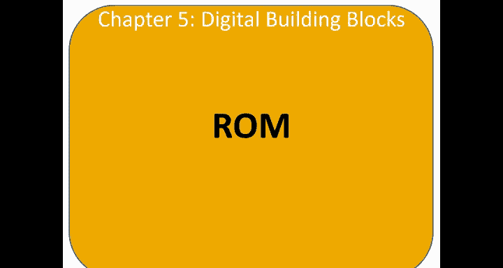
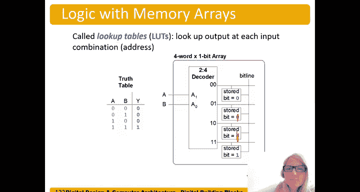

# 068：只读存储器（ROM）与逻辑实现

在本节中，我们将学习只读存储器（ROM）的基本结构，并探索如何利用ROM阵列来实现逻辑功能。我们将看到，通过存储特定的数据模式，ROM可以充当一个可编程的查找表，执行与门、或门等逻辑运算。

---

## ROM的存储原理

上一节我们介绍了存储器的基本概念，本节中我们来看看ROM的具体实现方式。ROM使用点阵图表示法，其中圆点表示存储的值为1。

例如，在地址10处，存储的值为1、0、0。在地址11处，存储的值为0、1、0。

存储单元中，值为1的单元基本上是空的，而值为0的单元则有一个晶体管连接到地线。因此，当字线被激活（变为高电平）时，它会将对应的位线（例如数据位1）下拉至0。

如果我们将它画在这里，当字线变为高电平时，它会将该位线拉低至0。而在存储1的地方，由于没有连接，当字线变为高电平时，该位线将保持为1，而不会被拉低至0。因此，这里存储的是010。

在地址1、0处，我们存储了1、0、0，以此类推。和所有存储器一样，ROM也有深度（本例中为2^2=4个字）和宽度（字长为3位）。

---

## 闪存的发明

藤尾增冈在东芝公司从事存储器和高速电路研发。他在未经授权的项目中发明了闪存，这个项目是他在夜晚和周末完成的。擦除存储器的过程让他联想到了闪光灯相机，因此他将其命名为“闪存”。

然而，东芝在商业化这个想法上行动迟缓，英特尔在1988年率先将其推向市场。如今，闪存的应用已经极其广泛，我们每个人都至少拥有数个，甚至数十个日常使用的闪存设备。

---

## 使用存储器阵列实现逻辑

我们可以用存储器阵列来执行逻辑运算。事实上，可编程逻辑门阵列（如FPGA）的工作原理就是使用存储器来实现逻辑。

例如，我们不再横向查看存储的值（如0、1、0），而是可以纵向查看。对于地址位的任何组合，查看存储的数据。

如果我们称地址位为A1和A0，那么数据位D2执行的是异或（XOR）运算。因为对于输入11和00，输出是0；对于输入10和01，输出是1。因此，**D2 = A1 XOR A0**。

类似地，我们可以查看数据位D0，它执行的是与（AND）运算：**D0 = A1 AND A0**。我们还可以得到D1，它等于**A1 AND (NOT A0)**，根据德摩根定律，这等价于**(NOT A1) OR A0**。

因此，我们可以将存储器视为在执行逻辑运算。这非常有用，因为根据我们存储的位模式，可以实现不同的逻辑功能。

---

## 实例：用ROM实现逻辑函数

现在，让我们使用一个2位地址、3位数据宽度的ROM来实现左侧列出的逻辑函数。我们将X、Y、Z连接到输出位线，将A和B连接到地址线。

我们希望实现：
*   **X = A AND B**
*   **Y = A OR B**
*   **Z = A AND (NOT B)**

为了实现这些功能，我们需要在ROM中存储对应的真值表。我们仍然可以将其视为在不同地址存储不同的值：
*   地址0存储值 0， 0， 0
*   地址1存储值 0， 1， 0
*   地址2存储值 0， 1， 1
*   地址3存储值 1， 1， 0

但现在，我们正在使用这个存储器来执行我们不同输出（X， Y， Z）的逻辑运算。

我们可以分析这个存储器阵列，看看它实现了什么功能：
*   **D2** 执行的是 **A1 XOR A0**。
*   **D1** 执行的是 **A1 OR (NOT A0)**。
*   **D0** 执行的是 **(NOT A1) AND (NOT A0)**（因为唯一的1出现在A1和A0都为低电平时）。

实际上，我们可以使用任何类型的存储器阵列（ROM、DRAM、SRAM或RAM）来实现以下逻辑函数，只需存储相应的位模式即可。

以下是实现特定函数所需的存储内容（注意，这里的书写顺序可能与常规真值表上下颠倒）：
*   实现 **X = A AND B**， 存储模式为：`1， 0， 0， 0`
*   实现 **Y = A OR B**， 存储模式为：`1， 1， 1， 0`
*   实现 **Z = A AND (NOT B)**， 存储模式为：`0， 1， 0， 0`

---

## 查找表（LUT）的概念

这里的关键点在于，我们可以用存储器阵列来执行逻辑。这些用于实现逻辑的存储器阵列有一个特殊的名称，叫做**查找表**。我们可以为每个输入组合“查找”对应的输出。

它本质上就是一个存储在存储器中的真值表。在本例中，我们执行的是与操作。我们将输入变量A和B连接到地址输入端，然后存储器就充当了该真值表的查找表。

假设我们最初实现的是A和B的与操作，但后来发现我本意是想实现或操作。那么，我只需要改变存储在存储器中的值，现在它就成了一个或门，而不是与门。

这种**可重构性**正是我们使用查找表（或用于逻辑的存储器阵列）时所依赖的重要特性。

---

## 总结

本节课中我们一起学习了只读存储器（ROM）如何通过内部的晶体管连接来存储固定数据，以及闪存发明的有趣历史。更重要的是，我们深入探讨了存储器阵列的一个强大应用：将其作为查找表来实现组合逻辑功能。通过将输入变量连接到地址线，并将期望的真值表输出存储到数据位中，同一个物理存储器结构可以灵活地配置成与门、或门、异或门等多种逻辑门。这种基于查找表的可重构逻辑是实现现代可编程逻辑器件（如FPGA）的核心基础。