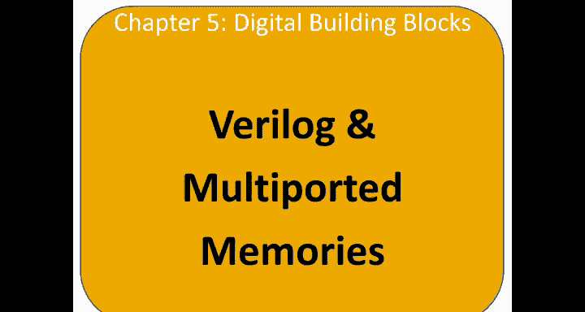
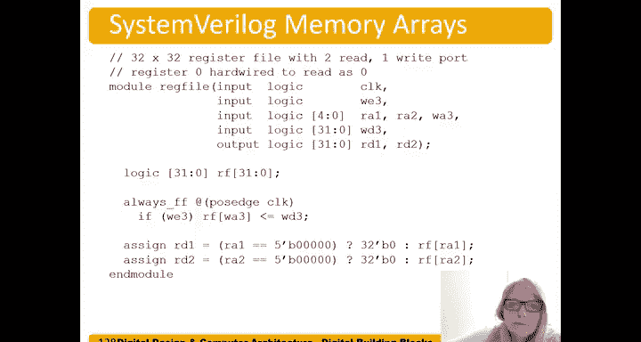

# 069：SystemVerilog中的存储器阵列 🧠



在本节中，我们将学习如何使用SystemVerilog来描述和实现存储器阵列，包括RAM和ROM。我们将探讨单端口和多端口存储器的结构，并了解寄存器文件的基本实现原理。

---

## 单端口RAM示例

上一节我们介绍了存储器阵列的基本概念，本节中我们来看看如何在SystemVerilog中具体描述一个RAM。

这是一个256x3位的RAM。字大小为3位，地址大小为8位。深度为2的8次方，即256个字。

以下是该RAM的输入和操作描述：
*   **输入信号**：时钟`clk`、写使能`writeEnable`、地址`A`、写数据`WD`。
*   **这是一个单端口存储器**，但该端口既可读也可写。
*   **读操作是组合逻辑**：读数据`RD`等于存储在RAM阵列中地址`A`处的值。
*   **写操作是时序逻辑**：仅在时钟上升沿且写使能有效时，才会将写数据`WD`写入到地址`A`指向的RAM单元。

其核心行为可以用以下代码描述：
```systemverilog
// 读操作（组合逻辑）
assign RD = ram[A];
// 写操作（时序逻辑）
always_ff @(posedge clk) begin
    if (writeEnable) begin
        ram[A] <= WD;
    end
end
```

---

## 单端口ROM示例

接下来，我们看一个只读存储器（ROM）的例子。

这是一个128x32位的ROM。字大小为32位，地址大小为7位，深度为128（2的7次方）。

以下是该ROM的关键特性：
*   **它只有输入和输出**：地址输入`A`和读数据输出`RD`。
*   **ROM的内容通过文件初始化**：在这个例子中，ROM从名为`memfile.dat`的文件中加载初始数据。
*   **读操作是组合逻辑**：给定一个地址，它组合逻辑地输出该地址对应的数据。

ROM的初始化方式如下：
```systemverilog
logic [31:0] rom [0:127];
initial begin
    $readmemh("memfile.dat", rom);
end
assign RD = rom[A];
```

数据文件`memfile.dat`可以包含多达128行，每行是一个32位的十六进制数。地址0对应第一行的值，地址1对应第二行，依此类推。

---

## 多端口存储器

存储器也可以拥有多个端口，一个端口即一个地址-数据对。下面我们来看一个多端口存储器的例子。

这个例子展示了一个3端口存储器，包含2个读端口和1个写端口。存储器阵列本身仍然是单一的，深度为2的N次方，宽度为M位。

以下是其端口定义：
*   **两个读端口**：地址`address1`和`address2`，对应读数据`readData1`和`readData2`。
*   **一个写端口**：地址`address3`、写数据`WD3`和写使能`writeEnable3`。

该存储器的行为是：可以同时从两个地址读取数据，并在时钟边沿条件满足时向第三个地址写入数据。我们将在第七章使用这种多端口存储器来实现寄存器文件，用于存储多个值并通过读写操作访问它们。

---

## 寄存器文件示例

最后，我们来看一个在SystemVerilog中表示的多端口存储器阵列的具体实例，即一个寄存器文件。

这是一个32x32位的寄存器文件，深度为32，字大小为32位，因此需要一个5位地址来访问。

以下是该寄存器文件的结构：
*   **两个读端口**：读地址`RA1`和`RA2`，对应读数据`RD1`和`RD2`。
*   **一个写端口**：写地址`WA3`、写数据`WD3`和写使能`WE3`。
*   **一个单一的存储器阵列**存储所有数据。

其操作逻辑如下：
1.  **写操作是时序逻辑**：在时钟上升沿，如果写使能`WE3`有效，则将`WD3`写入到地址`WA3`指向的寄存器单元。
2.  **读操作是组合逻辑**：`RD1`等于读地址`RA1`指向的寄存器值；`RD2`等于读地址`RA2`指向的寄存器值。

寄存器文件有一个特殊之处，如第六、七章将详述的，**寄存器0的值恒为0**。因此，如果读地址是0，则无论寄存器阵列中存储了什么，读操作都返回0；否则，返回对应地址存储的值。此规则对`RD1`和`RD2`均适用。

其核心部分代码描述如下：
```systemverilog
logic [31:0] rf [0:31]; // 寄存器文件阵列
// 写操作
always_ff @(posedge clk) begin
    if (WE3 && WA3 != 0) begin // 通常约定寄存器0不可写
        rf[WA3] <= WD3;
    end
end
// 读操作（组合逻辑，寄存器0恒为0）
assign RD1 = (RA1 == 0) ? 32'b0 : rf[RA1];
assign RD2 = (RA2 == 0) ? 32'b0 : rf[RA2];
```

---

## 总结



本节课中我们一起学习了SystemVerilog中描述存储器阵列的方法。我们首先分析了单端口RAM和ROM的结构与行为描述，理解了读操作（组合逻辑）与写操作（时序逻辑）的区别。接着，我们探讨了多端口存储器的概念，它允许同时进行多个读写访问。最后，我们以一个具体的32位寄存器文件为例，详细说明了其多端口（两读一写）的实现方式，并特别指出了寄存器0值恒为0这一重要设计约定。这些存储器模块是构成复杂数字系统，特别是处理器数据通路的基础组件。