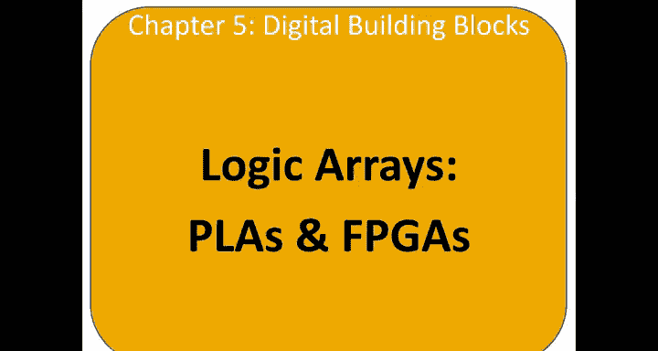
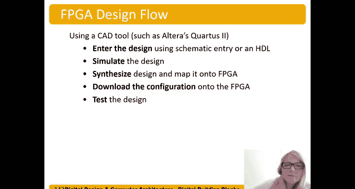

# 070：逻辑阵列 🧩

在本节课中，我们将学习本章的最后一个主题：逻辑阵列。我们将介绍两种主要的逻辑阵列类型，并了解它们如何用于实现数字逻辑电路。

---

## 逻辑阵列概述

逻辑阵列是用于实现数字逻辑电路的集成电路。主要有两种类型：可编程逻辑阵列和现场可编程门阵列。

上一节我们介绍了各种逻辑实现方式，本节中我们来看看这两种可配置的逻辑阵列结构。

---

## 可编程逻辑阵列

可编程逻辑阵列是一种只能实现组合逻辑的器件。其内部结构固定，由**与阵列**后接**或阵列**组成。这种结构与我们之前学过的两级逻辑（先与后或）类似，可以轻松实现**积之和**形式的逻辑方程。

以下是PLA的基本结构：
*   **与阵列**：生成乘积项（即蕴含项）。
*   **或阵列**：将选定的乘积项进行或运算，得到最终输出。

由于PLA内部连接固定且只能实现组合逻辑，其灵活性有限。但它结构简单，因此成本通常低于FPGA。

---

## 现场可编程门阵列

现场可编程门阵列则更为灵活。它不仅可以实现组合逻辑，还可以实现时序逻辑。其“可编程”部分既包括逻辑功能，也包括内部连接。

FPGA主要由以下部分构成：
*   **逻辑单元**：执行逻辑运算的基本单元，包含组合逻辑和时序逻辑部件。
*   **输入/输出单元**：位于芯片外围，用于与外部引脚接口。
*   **可编程互连**：以可编程的方式连接各个逻辑单元和I/O单元。
*   **常用模块**：许多FPGA还集成了乘法器、RAM等常用模块，以方便设计。

以下是FPGA的一般布局示意图：

---

## 逻辑单元内部结构

让我们深入了解逻辑单元的内部。以Altera Cyclone IV FPGA的逻辑单元为例，其核心部件包括：

1.  **查找表**：这是一个小型存储器（例如4输入LUT相当于一个16x1位的存储器），用于实现组合逻辑功能。它可以实现任意四输入变量的函数。
    *   代码表示：`LUT[addr] = output_value`
2.  **触发器**：一个D触发器，用于实现时序逻辑和存储状态。
3.  **多路选择器**：用于灵活地连接查找表和触发器，可以选择将查找表的组合输出或触发器的寄存器输出作为LE的输出，并支持内部反馈。

Cyclone IV LE最重要的部分是：一个四输入查找表、一个寄存器输出、一个组合输出，并且可以在两者之间进行选择。

---

## 逻辑单元配置示例

了解结构后，我们来看看如何配置逻辑单元来实现特定功能。

**示例1：实现三输入函数**
假设要实现函数 `X = A'B'C + AB'C'`。
*   我们将输入A、B、C连接到查找表的 `data1`, `data2`, `data3`。
*   第四个输入 `data4` 必须连接到固定值（0或1），不能悬空。
*   然后，我们需要根据真值表对查找表进行编程。对于此函数，当地址为`001`（A’B’C）和`110`（AB’C’）时，输出为1，其余为0。
*   最后，配置多路选择器，选择查找表的组合输出作为LE的输出。

**示例2：实现多输入函数**
对于六输入异或函数 `Y = A1 ⊕ A2 ⊕ A3 ⊕ A4 ⊕ A5 ⊕ A6`，单个4输入LUT无法实现。我们需要使用多个LE进行级联：
*   **第一个LE**：用其LUT计算 `W1 = A1 ⊕ A2 ⊕ A3 ⊕ A4`，输出W1。
*   **第二个LE**：将其LUT的输入连接到W1、A5、A6，并将第四个输入接地。该LUT实现 `Y = W1 ⊕ A5 ⊕ A6`。
*   因此，这个六输入异或函数需要**2个**逻辑单元。

---

## 电路所需逻辑单元数量估算

我们可以估算实现一个电路所需LE的数量。

**示例3：32位2选1多路选择器**
一个1位的2选1MUX有3个输入（S, D0, D1）。一个4输入LUT足以实现它（剩余1输入接地）。因此，1位需要1个LE。32位则需要 **32个LE**。

**示例4：有限状态机**
假设一个FSM有：2位状态、2个输入、3个输出。
*   **状态存储**：每个LE只有一个触发器，存储2位状态需要 **2个LE**。
*   **次态逻辑**：计算每个次态位需要当前状态（2位）和输入（2位），共4个输入。这可以由一个4输入LUT完成。因此，计算2个次态位需要 **2个LE**（但注意，这2个LE可以与存储状态的LE是同一个，因为每个LE既有LUT又有触发器）。
*   **输出逻辑**：输出仅由当前状态（2位）决定。每个输出位可由一个LUT实现（剩余2输入接地）。3个输出需要 **3个LE**。
*   **总计**：最简情况下，至少需要 **5个LE**（2个用于存储状态并计算次态，另外3个用于计算输出）。

---

## FPGA设计流程

最后，我们简要了解使用FPGA的设计流程：
1.  **设计输入**：使用CAD工具（如Quartus），通过原理图或硬件描述语言输入设计。
2.  **仿真**：对设计进行仿真，验证逻辑功能。
3.  **综合与映射**：工具将HDL代码综合成门级网表，并映射到FPGA的具体资源（LE、互连等）。
4.  **下载配置**：将生成的配置文件下载到FPGA芯片中。
5.  **硬件测试**：在实际硬件上测试设计功能。

---

## 总结

本节课中我们一起学习了两种主要的逻辑阵列：
1.  **PLA**：结构简单、成本低，但只能实现组合逻辑，内部连接固定。
2.  **FPGA**：功能强大且灵活，通过可编程的逻辑单元和互连，能够实现复杂的组合与时序逻辑电路。我们深入了解了其核心部件**逻辑单元**的结构，并学习了如何估算实现给定电路所需的资源数量。最后，我们概述了标准的FPGA设计流程。