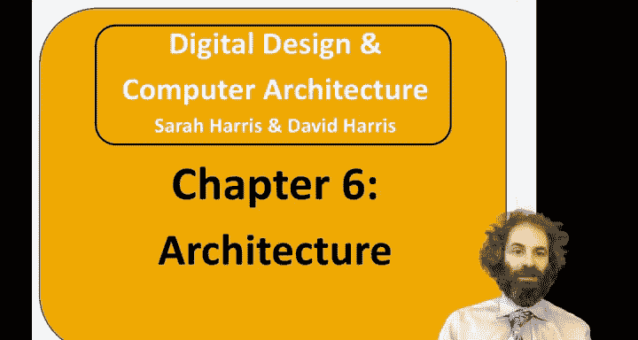
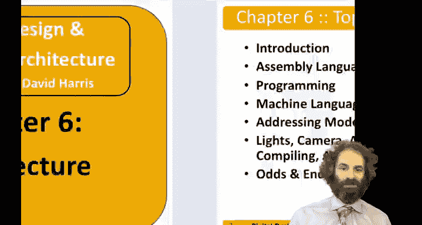
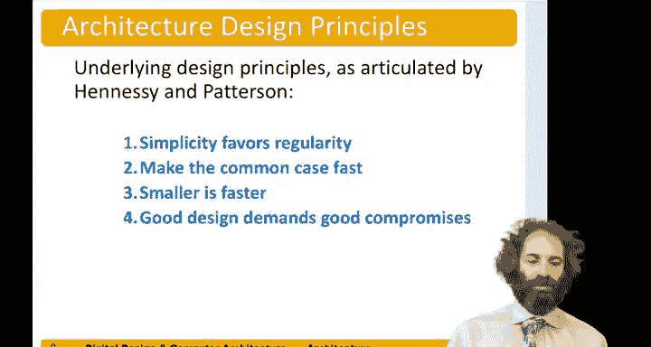

# 071：引言 🖥️

在本章中，我们将学习计算机架构。架构是程序员视角下的计算机，它定义了程序员需要了解的指令集和内存。如果两台计算机具有相同的架构，即使它们的实现完全不同，也能运行相同的程序。我们还将稍微向上看一层，了解运行在架构之上的软件和操作系统。

## 什么是计算机架构？🔍

上一节我们介绍了本章的主题。本节中，我们来看看架构的具体定义。

架构是程序员对计算机的视图。它是一组指令和内存，程序员需要了解这些才能定义计算机。如果你用相同的架构构建两台不同的计算机，它们可以有完全不同的实现，但仍然可以运行相同的程序。

我们也将关注更高一点的层次，即运行在架构上的软件和操作系统。

## 本章学习路径 📚

上一节我们定义了架构。本节中，我们将概述本章的学习路径。

我将首先关注汇编语言编程，这是机器的原生语言，以及如何将像C语言这样的程序翻译成汇编语言。

然后我们将进入机器语言，即实际在硬件上运行的1和0。

我们将讨论寻址模式，以及编译、汇编和加载程序的过程及其各种细节。

## 从底层到高层：抽象层次的跃升 ⬆️

之前，我们一直在较低的抽象层次上工作。我们从器件开始，逐步上升到数字电路和逻辑，现在我们跃升到另一端——架构，即程序员视角下的计算机。

然后在第7章，我们将向下回到微架构，在中间汇合，看看如何构建实际实现架构的硬件。

## 指令与语言：汇编与机器码 💬

上一节我们提到了抽象层次的跃升。本节中，我们来具体看看计算机的语言。

指令和汇编语言是计算机语言中的命令。它们有两种格式。汇编语言是这些指令的人类可读格式。而机器语言是一串1和0，这是计算机可读的。

## RISC-V 架构简介 🎯

世界上有许多不同的架构，本书专注于 **RISC-V** 架构。

RISC-V架构由伯克利的研究人员于2010年开始开发，它是第一个被广泛接受的开源计算机架构，因此任何人都可以自由使用和增强它。目前它在工业界获得了很大的关注，是一个热门事物。所以在本课程中我们专注于它。

但一旦你学会了一种架构，学习其他所有架构就变得非常容易。

以下是RISC-V发展中的关键人物：
*   **Krste Asanović** 来自伯克利，是开发RISC-V的先驱，目前是RISC-V基金会董事会主席，也是SiFive公司的联合创始人，该公司正在将RISC-V商业化。
*   他的同事 **David Patterson** 是伯克利长期的计算机架构师，他在20世纪80年代共同提出了精简指令集计算机（RISC）的概念，也是RISC-V的创始成员之一。
*   David Patterson与斯坦福大学的 **John Hennessy** 共同获得了图灵奖，以表彰他们在计算机架构设计和评估的定量方法方面的开创性贡献。John Hennessy也是经典教科书《计算机体系结构》的合著者。

## RISC设计原则 🧱

在Hennessy和Patterson之前，计算机架构通常根据其优雅程度来评估。例如，一个可能直接运行Pascal或Lisp程序的架构。

Hennessy和Patterson在1990年左右大胆地提出，计算机架构应该根据其运行程序的速度来评估。这导致了精简指令集计算机（RISC）的概念，即不追求最大或最灵活的指令集，而是简化为一个能够运行任何程序的最小指令集。由于简化，它们可以用非常快速、高效的硬件构建，并且可以以更高的频率运行，提供更高的性能。

因此，20世纪80年代的RISC计算机彻底改变了计算机架构领域。Hennessy和Patterson的书已成为经典，并经历了多个版本。他们还合著了教科书《计算机组成与设计》，以一种与本书非常相似的方式呈现微架构，并启发了本书。

Hennessy和Patterson阐述了四个主要设计原则：

以下是四个核心设计原则：
1.  **简单源于规整**：保持简单，并尽可能减少特殊情况。
2.  **加速常见情况**：观察你的架构大部分时间在做什么，并让这些情况运行得非常快。
3.  **越小越快**：如果你能用更少的指令、更少的寄存器构建一个架构，那么它运行这些指令的速度就会更快。
4.  **好的设计需要好的折衷**：与其刻板地坚持前三个原则，偶尔为了效率，你确实需要做出妥协。

## 总结 📝

本节课中，我们一起学习了计算机架构的基本概念，它是程序员与计算机硬件之间的接口。我们介绍了从底层硬件到高层架构的抽象层次，明确了汇编语言与机器语言的区别。本章重点聚焦于**RISC-V**这一开源架构，并了解了其背后的发展历程与核心的RISC设计原则，即追求简单、规整和高效。在接下来的章节中，我们将深入汇编语言编程，开始探索如何用计算机的“母语”进行交流。