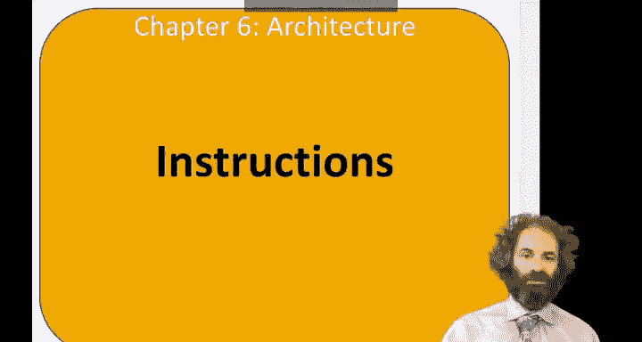
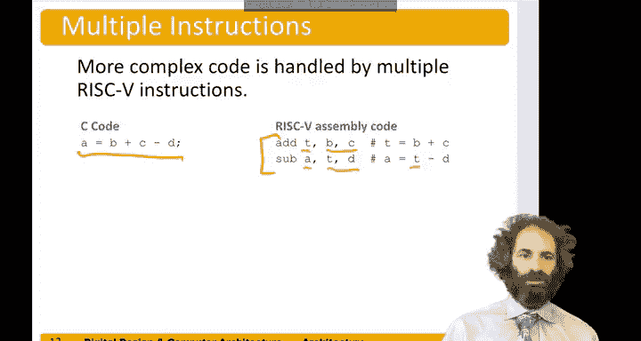

# 072：指令集详解 🧠

在本节中，我们将学习汇编语言编程中使用的指令。我们将从简单的算术运算开始，了解RISC-V指令的格式和设计原则，并探讨如何将复杂操作分解为一系列简单指令。

---

## 汇编语言中的基本指令

上一节我们介绍了汇编语言的基础概念，本节中我们来看看具体的指令是如何工作的。

假设我们有一个简单的程序：`a = b + c`。我们想用RISC-V汇编语言来编写它。

我们会写成：`add a, b, c`。你也可以这样理解它：`add a` 得到 `b + c` 的结果。

*   `add` 被称为**助记符**，它指示了要执行哪条指令。
*   这条指令接受两个源操作数和一个目标操作数。
*   目标操作数是 `a`，这是存放结果的地方。
*   两个源操作数是 `b` 和 `c`。

减法指令与此类似，只是助记符不同。如果我们想执行 `a = b - c`，我们可以使用 `sub` 指令：`sub a, b, c`。同样，助记符现在是 `sub`，操作数保持不变：目标操作数是 `a`，两个源操作数是 `b` 和 `c`。

---

## 设计原则：简单性促进规律性

这里引出了一个重要的设计原则：**简单性促进规律性**。

请注意，`add` 和 `sub` 指令的格式是一致的。它们都有相同数量的操作数：两个源操作数和一个目标操作数。它们只在助记符上有所不同。这种规律性使得在硬件中编码和处理指令变得更加容易。

---

## 处理复杂操作：分解为简单指令

假设我们想编写一个稍复杂的程序：`a = b + c - d`。

你可能会设想一种架构，它拥有一条指令能一次性完成所有这些操作。但在RISC-V中，我们将其分解为两个步骤。

1.  首先，我们执行 `add t, b, c`。这里我们引入了一个临时寄存器 `t` 来存放 `b + c` 的中间结果。
2.  然后，我们执行 `sub a, t, d`，这将得到最终结果 `b + c - d`。

因此，我们使用了一个临时寄存器 `t` 和两条连续的指令来运行这个程序。

---

## 设计原则：加速常见情况

这引出了另一个设计原则：**加速常见情况**。

RISC-V只包含简单、常用的指令。因此，用于解码和执行这些指令的硬件可以做得简单、快速且小巧（我们将在第7章详细探讨这一点）。如果你想执行那些不常见的、更复杂的操作，我们就把它们分解成一系列更简单的指令。

所以，RISC-V是**精简指令集计算机**的一个绝佳例子，它拥有数量较少、设计简单的指令集。这与**复杂指令集计算机**（如Intel的x86架构）形成鲜明对比，后者拥有大量不同的指令，甚至包括像“将整个字符串从一个内存位置复制到另一个位置”这样的单一复杂指令。

---

## 本节总结

本节课中我们一起学习了RISC-V汇编语言的基本指令格式。我们了解了 `add` 和 `sub` 指令的用法，认识了“简单性促进规律性”和“加速常见情况”这两个关键的设计原则，并掌握了如何通过将复杂操作分解为多条简单指令来解决问题。理解这些基础是后续学习更复杂指令和计算机架构工作原理的关键。