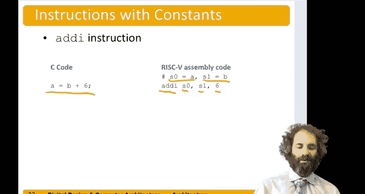

# 073：操作数 💾


在本节中，我们将学习计算机指令所使用的操作数，并重点聚焦于寄存器操作数。

## 概述

指令执行计算时需要数据，这些数据被称为操作数。操作数必须物理存储在计算机的某个位置。本节课我们将探讨操作数的三种存储位置：寄存器、内存和常量，并深入理解RISC-V架构中32个寄存器的设计、命名约定及其在编程中的具体应用。

## 操作数的存储位置

回想我们之前的例子 `A = B + C`。其中的 `A`、`B` 和 `C` 都是操作数。该指令有两个源操作数和一个目的操作数。这些操作数必须物理存储在计算机中。

操作数主要有三种存储位置选择：
*   **寄存器**：通常由触发器或寄存器文件构成的小型高速存储单元，访问速度极快。
*   **内存**：通常由SRAM或DRAM构成，容量更大，但访问时间也更长。
*   **常量**：也称为立即数，它们直接编码在指令本身中，是硬连线的。

## 聚焦寄存器

让我们重点关注寄存器。RISC-V架构拥有 **32个寄存器**，每个寄存器的宽度为 **32位**。访问寄存器的速度远快于访问内存。RISC-V被称为32位架构，正是因为它主要操作32位宽的数据。

> **设计原则3：更小意味着更快**
> RISC-V仅有32个寄存器，数量较少。计算机架构师非常谨慎地选择寄存器文件的大小，以确保系统的时钟周期不受其限制。我们选择一个足够小的寄存器文件，使其不会成为计算机性能的瓶颈，从而能够构建快速的计算机。

## RISC-V寄存器命名与约定

RISC-V的32个寄存器被命名为 `x0` 到 `x31`。虽然可以用这些“x”名称来调用它们，但程序员更常用一些具有特定约定的别名，这使代码更易读。

*   **寄存器零**：名为 `zero` 或 `x0`，它被硬连线为常数值 **0**。在程序中，值0出现的频率非常高，因此拥有一个始终为0的寄存器非常有用。

其余31个寄存器用于处理数据。原则上，你可以将任何信息存储在任何寄存器中，但程序员们约定俗成，将特定寄存器用于特定目的，这便于不同程序员编写的函数能够轻松交互。

以下是关键的寄存器及其约定用途：

*   **`x1`**：称为返回地址寄存器。用于存储函数调用后应返回的地址。
*   **`x2`**：称为栈指针寄存器。指向内存中栈的顶部，用于在函数调用时保存变量。
*   **`x3`** 和 **`x4`**：分别是全局指针和线程指针寄存器，本章暂不深入讨论。

其余寄存器主要分为三组：保存寄存器、临时寄存器和参数寄存器。

以下是这些寄存器的分组详情：
*   **保存寄存器**：由程序员约定用于存储需要长期保存的变量。在函数调用返回后，这些寄存器中的值需要保持不变。包括 `s0`、`s1` 以及 `s2` 到 `s11`，对应 `x8`、`x9` 和 `x18` 到 `x27`，共12个。
*   **临时寄存器**：用于保存临时或中间计算结果。例如，在计算 `A = B + C - D` 时，需要一个临时寄存器来存放 `B+C` 的中间结果。包括 `t0`、`t1`、`t2` 以及 `t3` 到 `t6`。
*   **参数寄存器**：用于向函数传递参数值，以及从函数调用返回值。包括 `a0` 到 `a7`。

作为程序员，你可以使用 `x` 系列名称或别名（如 `ra`、`s0`）。使用别名能使代码对阅读者更清晰。

## 使用寄存器的指令示例

现在，让我们使用真实的寄存器来重写之前的指令。

**示例1：寄存器加法**
我们之前的指令是 `A = B + C`。现在假设我们将变量 `A` 保存在寄存器 `s0` 中，`B` 在 `s1` 中，`C` 在 `s2` 中。那么程序将重写为：
```assembly
add s0, s1, s2   # s0 = s1 + s2
```
在汇编语言中，井号 `#` 表示单行注释。在代码中添加注释来说明寄存器用于存储哪个变量，是一个好习惯，能使代码更易理解。

**示例2：使用立即数的加法**
考虑指令 `A = B + 6`。这里引入了一个新指令：`addi`。`i` 代表立即数。该指令接受一个目的寄存器、一个源寄存器和一个常量（立即数）。

同样，假设 `A` 在 `s0`，`B` 在 `s1`，那么指令为：
```assembly
addi s0, s1, 6   # s0 = s1 + 6
```

## 总结



本节课我们一起学习了计算机指令的操作数。我们了解到操作数可以存储在寄存器、内存或作为立即数编码在指令中。我们重点探讨了RISC-V架构的32个寄存器，理解了“更小更快”的设计原则，并掌握了寄存器的命名约定（如 `zero`、`s0`、`t0`、`a0`）及其在编程中的典型用途。最后，我们通过 `add` 和 `addi` 指令的示例，实践了如何使用寄存器来执行加法运算。理解这些是编写高效汇编程序的基础。