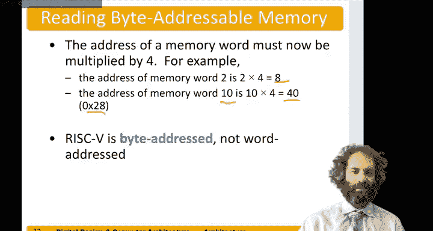

# 074：内存指令 💾


在本节中，我们将学习处理器如何与内存进行交互。我们将探讨为什么需要内存指令，以及RISC-V架构中用于读写内存的具体指令。

## 概述

大多数程序的数据量都超过了32个寄存器所能容纳的范围，因此需要将额外的数据存储在内存中。内存容量远大于寄存器，但访问速度较慢。我们将最常用的变量保存在寄存器中，而将不常用的数据存储在更大但更慢的内存中。首先，我们将讨论字寻址内存，然后介绍更常见的字节寻址内存，并解释RISC-V处理器如何处理这两种模式。

## 字寻址内存

在字寻址内存模型中，每个内存地址存储一个32位的字。例如，地址0可能存储字`ABCDEF78`，地址1可能存储字`F2F1AC07`。

常规的算术指令（如`add`和`sub`）不能直接操作内存中的数据。因此，我们需要一种新的指令类型，称为**加载指令**，用于将数据从内存读入寄存器。

### 加载字指令

加载字指令`lw`（load word）从一个内存地址读取一个值，并将其放入指定的寄存器中。其语法格式为：
```
lw rd, offset(rs1)
```
其中，`rd`是目标寄存器，`offset`是一个偏移量，`rs1`是基址寄存器。计算出的内存地址为 `rs1 + offset`。

例如，指令 `lw t1, 5(s0)` 表示：将内存地址 `s0 + 5` 处的字读取出来，存入寄存器 `t1`。

假设我们想将内存地址1处的字读入寄存器`s3`。我们可以使用指令：
```
lw s3, 1(zero)
```
这里，基址寄存器`zero`的值恒为0，加上偏移量1，得到内存地址1。执行后，内存地址1处的值`F2F1AC07`将被存入寄存器`s3`。

### 存储字指令

与加载指令相对应的是**存储字指令**`sw`（store word），它将一个寄存器的值写入内存。其语法格式为：
```
sw rs2, offset(rs1)
```
其中，`rs2`是要存储的源寄存器，`offset`是偏移量，`rs1`是基址寄存器。计算出的内存地址同样为 `rs1 + offset`。

例如，指令 `sw t4, 3(zero)` 表示：将寄存器`t4`的值存储到内存地址 `0 + 3`（即地址3）处。假设`t4`的值为`FEEDCAB`，执行后，内存地址3处的内容将变为`FEEDCAB`。

## 字节寻址内存

实际上，包括RISC-V在内的大多数现代微处理器都使用**字节寻址内存**。这意味着每个字节（8位）都有自己唯一的地址。

由于我们的处理器字长为32位（4个字节），因此每个字地址都是4的倍数。具体对应关系如下：
*   字0：字节地址 0, 1, 2, 3
*   字1：字节地址 4, 5, 6, 7
*   字2：字节地址 8, 9, A, B
*   字3：字节地址 C, D, E, F
*   字4：字节地址 10, 11, 12, 13

因此，在字节寻址系统中，要访问第N个字，其内存地址需要乘以4。例如：
*   访问第2个字（字索引为2），其内存地址为 `2 * 4 = 8`。
*   访问第10个字（字索引为10），其内存地址为 `10 * 4 = 40`（十六进制为`0x28`）。

**重要提示**：RISC-V是字节寻址的，而非字寻址。

### 字节寻址下的指令示例

在字节寻址模式下，要读取第二个字（位于字节地址8），正确的RISC-V指令是：
```
lw s3, 8(zero)
```
这条指令会将内存地址8处的字（即字节地址8、9、A、B四个字节组成的数据）读入寄存器`s3`。



同样，要将一个值写入第四个字的地址（字节地址`0x10`），可以使用指令：
```
sw t7, 0x10(zero)
```
这条指令会将寄存器`t7`的值存储到从字节地址`0x10`开始的连续四个字节中。

## 总结

本节课中，我们一起学习了处理器与内存交互的核心机制。我们了解到，由于寄存器数量有限，程序需要将大量数据存储在内存中。我们首先介绍了字寻址内存的概念，然后重点讲解了RISC-V架构实际使用的字节寻址内存模型。我们学习了两种关键的内存指令：`lw`（加载字）用于从内存读取数据到寄存器，`sw`（存储字）用于将寄存器数据写回内存。理解字节寻址是正确计算内存地址的关键，因为字地址需要乘以4才能得到对应的字节地址。