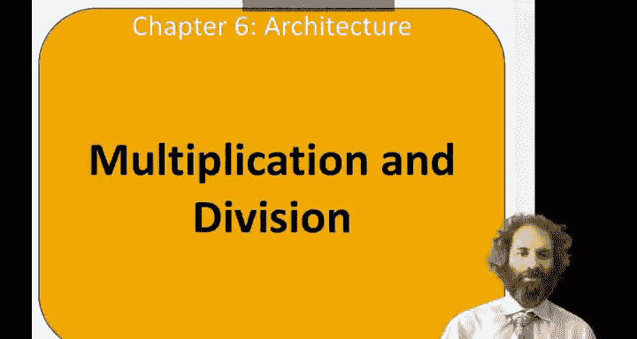
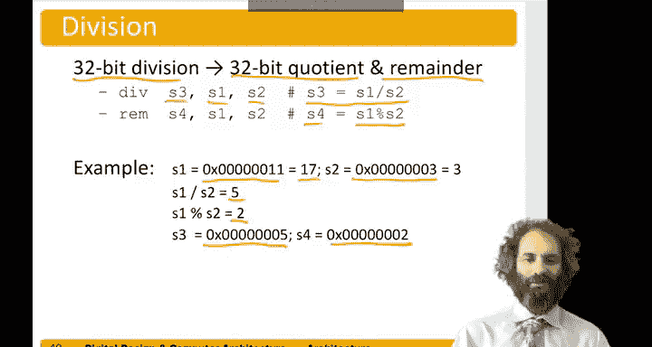

# 077：乘法与除法指令 🔢

在本节中，我们将学习RISC-V架构中用于执行乘法和除法运算的指令。我们将了解如何计算32位整数的乘积与商，并处理相关的细节。

---



## 概述

在计算机中，对两个32位数进行乘法运算会产生一个64位的结果。为了处理这种情况，RISC-V指令集提供了专门的乘法指令。同样，除法运算会产生一个商和一个余数，RISC-V也提供了相应的指令来处理这些运算。

---

## 乘法指令

上一节我们介绍了RISC-V的基本算术指令，本节中我们来看看用于乘法的指令。

RISC-V使用两条指令来处理32位整数的乘法：`mul` 和 `mulh`。
*   `mul rd, rs1, rs2` 指令计算 `rs1` 和 `rs2` 的乘积，并将结果的**低32位**存入目标寄存器 `rd`。
*   `mulh rd, rs1, rs2` 指令计算 `rs1` 和 `rs2` 的乘积，并将结果的**高32位**存入目标寄存器 `rd`。

因此，要获得完整的64位乘积结果，需要组合使用这两条指令。

假设我们想计算 `s1` 和 `s2` 的完整64位乘积，并将结果存入寄存器对 `s4`（高32位）和 `s3`（低32位）。我们可以执行以下指令序列：

```assembly
mulh s4, s1, s2  # s4 = (s1 * s2)的高32位
mul  s3, s1, s2  # s3 = (s1 * s2)的低32位
```

**示例**：
假设寄存器 `s1` 中的值是十六进制数 `0x4000_0000`（即 2³⁰），寄存器 `s2` 中的值是 `0x8000_0000`（在二进制补码表示中，这代表 -2³¹）。它们的乘积应为 2³⁰ × (-2³¹) = -2⁶¹。

-2⁶¹ 用十六进制表示为 `0xE000_0000_0000_0000`。因此，执行上述指令后：
*   `s4` 将得到值 `0xE000_0000`（高32位）。
*   `s3` 将得到值 `0x0000_0000`（低32位）。

---

## 除法指令

了解了乘法之后，我们接下来看看除法运算。除法指令会同时产生商和余数。

RISC-V同样使用两条指令来处理32位整数的除法：
*   `div rd, rs1, rs2` 指令计算 `rs1` 除以 `rs2` 的**商**，并将结果存入目标寄存器 `rd`。
*   `rem rd, rs1, rs2` 指令计算 `rs1` 除以 `rs2` 的**余数**（即 `rs1 mod rs2`），并将结果存入目标寄存器 `rd`。

**示例**：
假设寄存器 `s1` 中的值是 `0x11`（十进制17），寄存器 `s2` 中的值是 `3`。
*   执行 `div s3, s1, s2` 后，`s3` 将得到商 `5`（因为 17 ÷ 3 = 5）。
*   执行 `rem s4, s1, s2` 后，`s4` 将得到余数 `2`（因为 17 ÷ 3 余 2）。

---

## 处理负数

除法指令也适用于负数，但在处理负数时，需要特别注意商和余数的定义。RISC-V的除法指令遵循向零取整的规则，这意味着商会被截断为最接近零的整数。余数的符号与被除数 (`rs1`) 的符号相同。

例如，`-7 ÷ 3` 的商是 `-2`（向零取整），余数是 `-1`（因为 -7 = 3 × (-2) + (-1)）。

---

## 总结

本节课中我们一起学习了RISC-V架构中的乘法和除法指令。我们了解到：
1.  使用 `mul` 和 `mulh` 指令组合可以获得两个32位整数相乘的完整64位结果。
2.  使用 `div` 和 `rem` 指令可以分别获得两个32位整数相除的商和余数。
3.  在处理涉及负数的除法时，指令遵循特定的规则来确定商和余数的值。



掌握这些指令对于在RISC-V汇编语言中执行基本的数学运算是至关重要的。