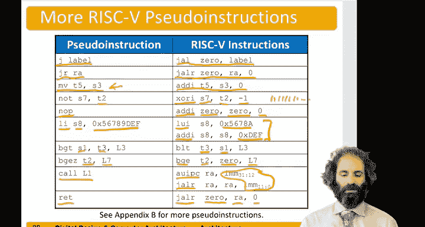

# 084：深入理解跳转与伪指令 🧠


在本节中，我们将深入探讨RISC-V汇编语言，了解跳转指令和伪指令的工作原理。我们将看到，处理器实际支持的跳转指令种类有限，但通过伪指令，程序员可以更方便地编写代码。

## 处理器支持的跳转指令

上一节我们介绍了多种跳转指令，但实际上，RISC-V处理器只直接支持两种核心的跳转指令：`JAL`（跳转并链接）和`JALR`（跳转并链接寄存器）。

*   **`JAL`（跳转并链接）**：该指令接受一个21位的立即数偏移量（以补码形式表示，可向前或向后跳转约100万字节），并将其与程序计数器（PC）相加作为目标地址。同时，它还会将`PC + 4`（返回地址）存入指定的目标寄存器（`rd`）。
    *   **公式**：`PC <- PC + sign_extend(offset)`；`rd <- PC + 4`
*   **`JALR`（跳转并链接寄存器）**：该指令与`JAL`类似，但它不是将立即数加到PC上，而是将一个源寄存器（`rs1`）的值与一个12位的立即数相加作为目标地址。同样，它也会将`PC + 4`存入目标寄存器（`rd`）。
    *   **公式**：`PC <- rs1 + sign_extend(imm)`；`rd <- PC + 4`

这两种跳转指令足以实现所有跳转功能。然而，从程序员的角度来看，并非总是需要用到全部功能。

## 伪指令的概念

为了编程的便利性，RISC-V定义了**伪指令**。伪指令并非真实的处理器指令，但汇编器（Assembler）会自动将它们转换为一条或多条真实的RISC-V指令。

以下是关于跳转的常见伪指令及其等效的真实指令：

*   **`J label`**：无条件跳转到标签`label`。
    *   **等效指令**：`JAL x0, label`
    *   **解释**：`x0`是硬连线为0的寄存器，向其写入数据会被忽略。因此，`JAL x0, label`执行跳转，但丢弃了返回地址，实现了简单的跳转。
*   **`JAL label`**：用于函数调用，跳转到标签`label`并将返回地址存入`ra`（x1）寄存器。
    *   **等效指令**：`JAL ra, label`（默认目标寄存器就是`ra`）
*   **`JR rs`**：跳转到寄存器`rs`指定的地址。
    *   **等效指令**：`JALR x0, rs, 0`
    *   **解释**：将返回地址丢弃（存入`x0`），并将目标地址设置为`rs + 0`，即直接跳转到`rs`的值。
*   **`RET`**：从函数返回。
    *   **等效指令**：`JALR x0, ra, 0`
    *   **解释**：这是`JR ra`的另一种更清晰的写法，专门用于函数返回。

## 标签与跳转偏移量

标签（Label）用于标记跳转的目标位置。在机器码中，它被编码为相对于当前`PC`的字节偏移量。

例如，如果当前指令地址是`0x300`，我们想跳转到标签`simple`（地址为`0x51C`），那么偏移量就是 `0x51C - 0x300 = 0x21C`。汇编器会将`JAL simple`编码为`JAL ra, 0x21C`。

然而，`JAL`的偏移量被限制在20位（约±1MB），`JALR`的立即数偏移量被限制在12位。为了支持更远距离的跳转（例如，调用一个距离很远的函数），需要使用特殊指令组合。

## 长距离跳转：`CALL` 伪指令

`CALL`伪指令允许使用32位的偏移量进行函数调用，突破了`JAL`的20位限制。

它的实现原理是将其分解为两条真实指令：
1.  `AUIPC ra, offset_hi`：将当前`PC`与偏移量的高20位相加，结果临时存入`ra`寄存器。
2.  `JALR ra, ra, offset_lo`：再将`ra`的值与偏移量的低12位相加，作为最终目标地址进行跳转，同时将真正的返回地址存入`ra`。

*   **代码示例**：
    ```assembly
    # 伪指令：CALL far_away_function
    # 等效的真实指令序列：
    AUIPC ra, offset_upper_20_bits
    JALR  ra, ra, offset_lower_12_bits
    ```

## 其他常用伪指令

除了跳转，汇编器还提供了其他方便的伪指令来简化代码编写。

以下是几个例子：

*   **`MV rd, rs`（数据移动）**：将寄存器`rs`的值复制到`rd`。
    *   **等效指令**：`ADDI rd, rs, 0`
*   **`NOT rd, rs`（按位取反）**：将寄存器`rs`的所有位取反后存入`rd`。RISC-V没有专门的`NOT`指令。
    *   **等效指令**：`XORI rd, rs, -1` （因为-1的补码表示是全1，与1进行异或会翻转该位）
*   **`NOP`（空操作）**：一条不执行任何操作的指令，常用于延时或占位。
    *   **等效指令**：`ADDI x0, x0, 0`
*   **`LI rd, immediate`（加载大立即数）**：将一个32位的立即数加载到寄存器`rd`中。
    *   **实现方式**：通常分解为`LUI`（加载高20位）和`ADDI`（加上低12位）两条指令。
*   **分支比较伪指令**：RISC-V只直接提供`BLT`（小于则分支）和`BGE`（大于等于则分支）。其他比较可以通过交换操作数或与零比较来实现。
    *   `BGT rs1, rs2, label` （大于则分支）等效于 `BLT rs2, rs1, label`。
    *   `BGEZ rs, label` （大于等于零则分支）等效于 `BGE rs, x0, label`。

## 总结

本节课中，我们一起深入学习了RISC-V的跳转机制和伪指令。

*   我们了解到处理器核心只支持`JAL`和`JALR`两种跳转指令。
*   **伪指令**是汇编器提供的语法糖，它们会被转换为真实的指令，使代码更易读、易写。
*   我们学习了`J`、`JAL`、`JR`、`RET`、`CALL`等跳转相关伪指令的等效实现。
*   标签在汇编中代表地址，跳转偏移量有其范围限制，长距离跳转需要`AUIPC`和`JALR`指令组合完成。
*   此外，我们还认识了`MV`、`NOT`、`NOP`、`LI`等常用伪指令，它们极大地简化了数据操作、逻辑运算和常量加载等常见任务。



理解伪指令及其背后的真实指令转换，对于阅读汇编代码和深入理解计算机架构至关重要。