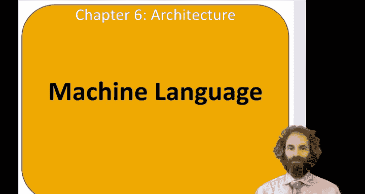
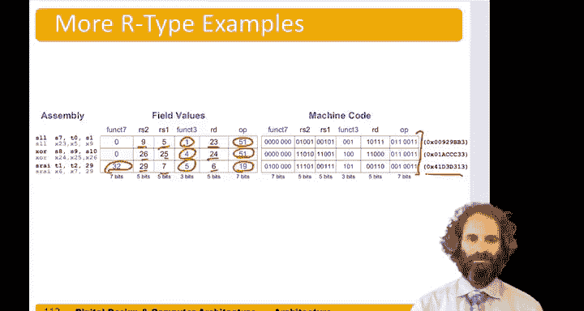

# 085：机器语言R型指令格式 🖥️

在本节中，我们将学习机器语言。到目前为止，我们一直关注汇编语言，它是计算机原生语言的人类可读版本。但计算机本质上是数字系统，它们只理解0和1。因此，每条汇编语言指令实际上都表示为一个由0和1组成的模式。

在RISC-V架构中，每条指令的长度是32位。这意味着每条汇编语言指令都有一个对应的机器语言指令，它是一个由32个0和1组成的模式。我们将所有指令设为相同大小的原因是：简单性倾向于规律性。通过让指令与数据字大小相同，每条指令也恰好占用一个字，便于规整地存储。

理想情况下，我们希望所有指令都使用同一种格式。但我们知道，有些指令需要两个源寄存器和一个目标寄存器；有些指令需要较少的寄存器，但需要一个立即数；还有一些指令需要一个较长的立即数，例如20位的立即数。因此，作为一种折中方案，RISC-V定义了四种不同的指令格式。我们将在本节和下一节中介绍它们。

R型指令格式用于需要两个源寄存器和一个目标寄存器的寄存器类型指令。I型指令格式包含一个源寄存器、一个立即数和一个目标寄存器。S型或B型指令格式用于存储和分支指令。U型和J型指令格式用于加载上立即数以及需要20位立即数的跳转指令。

现在，让我们首先关注R型指令。这些指令需要三个寄存器操作数：两个源寄存器Rs1和Rs2，以及一个目标寄存器Rd。指令还需要一些位来指明它是什么指令，我们将把这些信息存储在三个不同的字段中：一个是`op`（也称为操作码），另外两个是`funct7`和`funct3`，它们是7位和3位的字段，用于告知执行何种类型的操作。通过拥有这么多不同的位，我们可以在指令集中编码大量不同的指令，甚至包括设计者尚未构想出的指令。

R型指令的格式是一个32位的字。最低的7位是操作码`op`。接下来的5位用于指定目标寄存器，因为有32个寄存器，log₂(32)=5，所以我们需要5位来指定是哪一个。再往上，我们有源寄存器1和源寄存器2，它们也是5位的字段，用于指定32个寄存器中的一个。然后我们还剩下3位和7位，我们将它们用作功能字段`funct3`和`funct7`，以提供更多关于执行何种操作的信息。

假设我们想执行一条加法指令：`add s2, s3, s4`。我们需要查阅一个列出所有指令操作码的表格，课本的附录B中有这样一个表格。对于`add`指令，`op`是51，`funct3`是0，`funct7`是0。我们还需要知道使用了哪些寄存器。在本章开头，我们讨论过寄存器名称与其编号的对应关系：寄存器`s2`是18号，`s3`是19号，`s4`是20号。因此，目标寄存器是18，源寄存器1是19，源寄存器2是20。必须注意将它们按正确的顺序放入指令格式中。

以下是这些值的十进制表示，让我们将它们转换为二进制：
*   `op` = 51（十进制） = **`0110011`**（二进制）
*   `rd` = 18（十进制） = **`10010`**（二进制）
*   `funct3` = 0（十进制） = **`000`**（二进制）
*   `rs1` = 19（十进制） = **`10011`**（二进制）
*   `rs2` = 20（十进制） = **`10100`**（二进制）
*   `funct7` = 0（十进制） = **`0000000`**（二进制）

现在，如果我们把这堆比特位按四位一组进行划分，并转换为十六进制，会更容易阅读和表达。这条`add s2, s3, s4`指令的机器语言编码是十六进制的`0x01498933`。将这个值告诉RISC-V处理器，它就能准确地知道要做什么。

减法指令`sub`与此类似。它的`op`码也是51，`funct3`也是0，但我们通过`funct7`字段为32（而不是0）来将其与加法区分开。例如，指令`sub t0, t1, t2`中，`t0`是5号寄存器，`t1`是6号寄存器，`t2`是7号寄存器。按照相同的过程编码并转换为十六进制，结果是`0x407302b3`。

让我们再看几个例子。以下是几个R型指令及其编码的总结：

以下是几个R型指令的编码示例：
*   **`sll s7, t0, s1`**（逻辑左移）
    *   `op` = 51, `funct3` = 1, `funct7` = 0
    *   寄存器：`s7`(23), `t0`(5), `s1`(9)
*   **`xor t1, t2, s3`**（异或）
    *   `op` = 51, `funct3` = 4, `funct7` = 0
    *   寄存器：`t1`(6), `t2`(7), `s3`(19)
*   **`srai s3, s4, 2`**（算术右移立即数）
    *   `op` = 19, `funct3` = 5, `funct7` = 32
    *   注意：这是一个I型指令（涉及立即数），此处列出是为了对比。其寄存器字段为：`s3`(19), `s4`(20)，立即数为2。

对于每一条指令，我们都可以查阅附录B中的表格找到其操作码和功能码，查找寄存器的编号，将所有值转换为二进制，然后最终转换为十六进制，从而得到对应的机器语言指令。

在本节课中，我们一起学习了机器语言的基本概念，特别是RISC-V架构中R型指令的格式。我们了解到，每条32位的汇编指令都对应一个由操作码、寄存器字段和功能字段组成的特定比特模式。通过将指令各部分的值转换为二进制并组合，最终可以得到十六进制表示的机器码。理解这种编码方式是理解计算机如何执行底层操作的关键一步。在接下来的章节中，我们将继续探讨其他类型的指令格式。