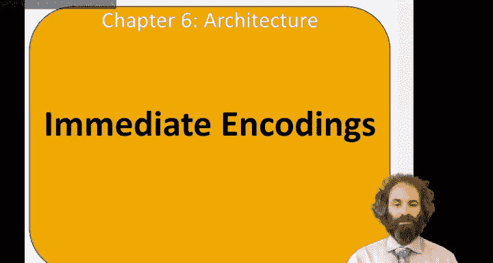
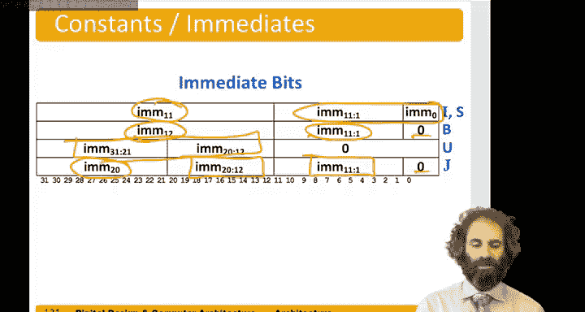

**数字设计和计算机架构：6.17：立即数编码 🧩**

在本节中，我们将探讨RISC-V指令中立即数的编码方式。理解这些编码对于掌握指令格式和硬件实现至关重要。

---

### **概述**

RISC-V指令集使用多种类型的指令，如I型、S型、B型、U型和J型，它们都需要处理立即数。这些立即数在指令中的编码位置看似复杂，但从硬件设计的角度看，这种安排是为了实现高效解码和操作。

---

### **立即数的用途与表示**

上一节我们介绍了不同类型的指令。本节中，我们来看看这些指令如何编码立即数。

I型指令（如`lw`、`addi`）使用一个12位的二进制补码立即数。例如，`addi`指令将一个12位立即数与寄存器值相加。值得注意的是，没有专门的`subi`（立即数减法）指令，因为可以通过使用负的立即数来实现减法。例如：
- 执行 `a + 4`：`addi s0, s0, 4`
- 执行 `a - 4`：`addi s1, s1, -4`

---

### **从硬件角度看编码**

如果仅看指令字中的位分布，立即数的编码顺序可能显得不规则。但从硬件实现的角度分析，这种设计就变得合理了。

以下是各类型指令的立即数构成方式：
- **I型或S型指令**：取指令中的12位立即数，并将其符号扩展至高位。
- **B型指令**：取立即数位`imm[11:1]`（最低有效位`imm[0]`固定为0），并将第12位（`imm[12]`）符号扩展至高位。
- **U型指令**：低12位为0，立即数放置在高20位。
- **J型指令**：立即数首位为0，随后是11位，然后是剩余的立即数位，最后符号扩展至高位。

---

### **编码一致性与硬件优化**

指令解码的难点在于快速识别关键字段：操作码（opcode）、功能码（funct）和源寄存器。RISC-V的设计致力于最大化这些字段在不同指令类型间的一致性。

以下是关键字段的位置规律：
- **操作码（opcode）**：始终位于指令字的第6至第0位。
- **寄存器字段**：目标寄存器`rd`、源寄存器`rs1`和`rs2`在所有指令类型中的位置都固定不变。
- **功能码（funct3）**：位置也始终固定。

唯一变化较大的是**立即数字段**。在硬件中，从指令字的不同位置选取位来组装立即数是一项相对简单的操作，它不涉及访问寄存器文件、内存或算术逻辑单元（ALU），因此速度很快。设计者可以承受这部分复杂度。

尽管如此，指令集仍尽可能系统化地打包立即数。例如，在S型和B型指令中，位`imm[4:1]`出现在相同位置。S型需要`imm[0]`，而B型需要`imm[11]`，因此将`imm[11]`安排在了另一个特定位置，而不是移动整个B型指令的位域。通过这种方式，在可能的情况下，我们保持了比特位位置的一致性。

---

### **总结**

本节课中，我们一起学习了RISC-V指令集中立即数的编码方式。我们了解到，尽管立即数在指令字中的分布看似分散，但这种设计是为了保证操作码和寄存器字段位置的一致性，从而简化硬件解码。将复杂性集中在立即数组装上是合理的，因为这是一个快速且简单的硬件操作。通过分析I、S、B、U、J型指令的立即数格式，我们看到了指令集设计在效率与规整性之间的权衡。