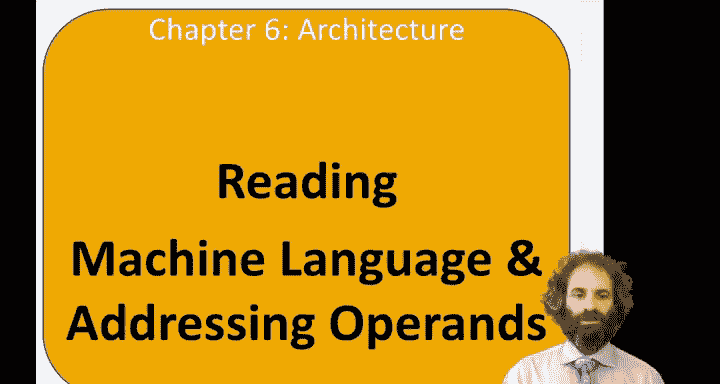
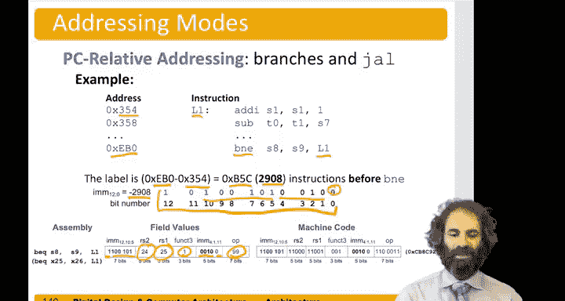

# 088：指令解码与寻址模式 🔍



在本节中，我们将学习如何解读机器语言指令，并理解操作数的寻址方式。我们将从指令格式的识别开始，逐步深入到不同寻址模式的具体应用。


## 指令格式回顾

上一节我们介绍了RISC-V指令集的基本概念。以下是目前我们已学习的一些指令在汇编语言和机器语言中的对应关系。

以下是部分指令及其编码的总结：
*   每条指令都有其汇编语言助记符和对应的操作码。
*   R型指令（如 `add`, `sub`, `and`, `or`）的操作码都是 `51`。它们通过 `funct3` 和 `funct7` 字段来区分。
*   例如，`add` 和 `sub` 的 `funct3` 字段相同，但 `funct7` 字段不同。`and` 和 `or` 的 `funct3` 编码则不同。
*   `addi` 是I型指令，操作码为 `19`。
*   分支指令是B型指令，操作码为 `99`，并通过 `funct3` 字段区分不同类型。
*   `lw`（加载字）的操作码是 `3`，`funct3` 为 `2`。
*   `sw`（存储字）的操作码是 `35`，`funct3` 为 `2`。
*   `jal`（跳转并链接）是J型指令，操作码为 `111`。
*   `jalr`（寄存器跳转并链接）的操作码是 `103`。
*   `lui`（加载高位立即数）是U型指令，操作码为 `55`。
*   值得注意的是，`jalr` 实际上属于I型指令，因为它只包含一个12位的偏移量，并需要一个目标寄存器。

## 解码机器指令

当需要解读一段机器语言代码时，最佳起点是将十六进制数转换为二进制，然后查看 `op` 和 `funct3` 字段，以确定指令类型并解析其余部分。接着，根据指令类型提取各个字段。

假设我们遇到以下两条机器语言指令：
```
0x41f383b3
0xfff48493
```

对于第一条指令 `0x41f383b3`：
*   其低7位（操作码）是 `0110011`，即十进制的 `51`。这告诉我们这是一条R型指令。
*   我们需要查看 `funct3` 和 `funct7` 字段。`funct3` 字段（第12-14位）是 `000`。
*   现在我们知道，`funct3` 为 `000` 时，可能是 `add` 或 `sub`。
*   最后，我们查看高7位（`funct7` 字段）：`0100000`，即十进制的 `32`，这对应 `sub` 指令。
*   因此，这条指令是 `sub`。

对于第二条指令 `0xfff48493`：
*   其操作码（低7位）是 `0010011`，即十进制的 `19`。这看起来像是一条I型指令，例如 `addi`。
*   同样，我们查找 `funct3` 字段，发现是 `000`。
*   可以确定，这是一条 `addi` 指令。

## 提取指令字段

一旦确定了指令的格式，我们就可以将其余位解包到对应的字段中。

对于第一个例子（`sub` 指令，R型）：
*   十六进制数 `0x41f383b3` 对应的二进制位如下：
    *   `funct7`: `0100000`
    *   `rs2`: `11111` (x31)
    *   `rs1`: `11101` (x29)
    *   `funct3`: `000`
    *   `rd`: `00111` (x7)
    *   `opcode`: `0110011`
*   我们已经通过 `op`、`funct3` 和 `funct7` 知道它是 `sub` 指令。其他字段告诉我们源寄存器和目标寄存器。
*   目标寄存器 `rd` 是 `x7`，查表可知是寄存器 `t2`。
*   源寄存器 `rs1` 是 `x29` (`t4`)，`rs2` 是 `x31` (`t6`)。
*   因此，这条指令是：`sub t2, t4, t6`

对于第二个例子（`addi` 指令，I型）：
*   十六进制数 `0xfff48493` 对应的二进制位如下：
    *   `imm[11:0]`: `111111111111` (这是一个负数，因为最高位是1，作为二进制补码表示-1)
    *   `rs1`: `01001` (x9)
    *   `funct3`: `000`
    *   `rd`: `01001` (x9)
    *   `opcode`: `0010011`
*   我们看到立即数 `imm` 由于前导的1，是一个负数，作为12位二进制补码表示 `-1`。
*   `rs1` 是 `x9` (`s1`)，`rd` 是 `x9` (`s1`)。
*   因此，这条指令是：`addi s1, s1, -1`

## 寻址模式

理解机器和汇编语言的另一个部分是寻址模式，即指令中如何寻址操作数。这里讨论几种选择。

以下是RISC-V中常见的几种寻址模式：
*   **寄存器寻址**：R型指令只使用寄存器寻址模式，它们从寄存器中取两个源操作数，并将结果写入一个目标寄存器。例如：`add x1, x2, x3`
*   **立即数寻址**：I型指令采用一个源寄存器、一个目标寄存器和一个立即数。对于I型指令，立即数是一个12位的有符号值。例如：`addi x1, x2, 100`
*   **基址寻址**：用于加载和存储指令。要访问的内存地址通过将一个寄存器中的基地址加上一个立即数偏移来计算。例如：`lw x1, 4(x2)` 计算地址为 `x2 + 4`。
*   另一个存储指令的例子：`sw x3, -25(x6)`，其地址计算为 `x6 - 25`。
*   **PC相对寻址**：用于分支指令和 `jal` 指令。在这种模式下，我们需要计算目标地址相对于当前程序计数器（PC）的偏移量。

## PC相对寻址示例

假设我们有一条分支指令：`bne x24, x25, L1`。
*   这条 `bne` 指令本身位于内存地址 `0xEB0`。
*   标签 `L1` 位于地址 `0x354`。
*   分支的距离是向后的 `0xEB0 - 0x354 = 0xB5C`（十六进制），即十进制的 `2908` 个字节。因此，偏移量应为 `-2908`。
*   以下是如何将 `-2908` 表示为一个13位的二进制补码数（分支指令的立即数字段是13位，但编码时最低有效位总是0，因此被省略）。
*   我们有操作码 `branch`，`funct3` 字段为 `001` 表示 `bne`。
*   源寄存器是 `x24` (`s8`) 和 `x25` (`s9`)。
*   分支立即数字段编码如下：
    *   最低4位（`imm[3:1]`）是 `0010`。
    *   第5到10位（`imm[10:5]`）是 `110101`。
    *   第11位（`imm[11]`）是 `1`。
    *   第12位（`imm[12]`）是 `1`（因为是向后跳转，符号位为1）。




## 总结


本节课中，我们一起学习了如何解码RISC-V机器语言指令。我们从识别操作码和功能字段开始，以确定指令类型，然后提取出寄存器、立即数等具体字段。接着，我们探讨了不同的寻址模式，包括寄存器寻址、立即数寻址、基址寻址和PC相对寻址，并通过具体示例理解了它们在指令中的编码和应用。掌握这些知识是理解计算机如何执行底层指令的关键一步。