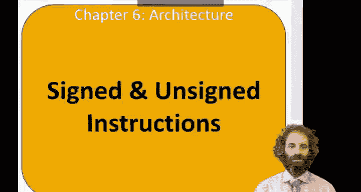
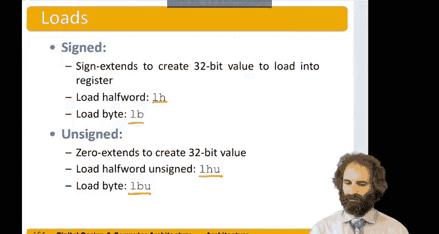

# 091：有符号与无符号指令 🔢



在本节中，我们将学习RISC-V指令集中处理有符号数和无符号数的指令，以及如何检测运算中的溢出。

## 概述

RISC-V为某些运算提供了处理有符号数和无符号数两种版本的指令，同时也提供了检测溢出的方法。理解这些指令的区别对于编写正确的程序至关重要。

## 乘法指令

上一节我们介绍了乘法运算，本节中我们来看看不同符号处理方式对乘法结果的影响。当两个32位数相乘时，会得到一个64位的结果。我们之前看过的 `mul` 指令执行的是有符号乘法。

RISC-V也提供了无符号版本的乘法指令：
*   `mulhu`：将两个操作数都视为无符号数进行乘法。
*   `mulhsu`：将第一个操作数视为有符号数，第二个操作数视为无符号数进行乘法。

在执行乘法时，结果的低32位无论操作数被视为有符号还是无符号都是相同的，因此我们可以直接使用 `mul` 指令来获取低32位。然而，结果的高32位取决于我们如何解释符号。

例如，假设寄存器 `s0` 的值为 `0x80000000`，`s2` 的值为 `0xC0000000`。

*   如果将它们视为**有符号数**：
    *   `s0` 是 -2³¹
    *   `s2` 是 -2³⁰
    *   乘积应为 2⁶¹，其二进制表示为 `0x2000000000000000`。
*   如果将它们视为**无符号数**：
    *   `s0` 是 2³¹
    *   `s2` 是 3 × 2³⁰
    *   乘积应为 3 × 2⁶¹，其二进制表示为 `0x6000000000000000`。
*   如果第一个数视为**有符号**，第二个视为**无符号**：
    *   `s0` 是 -2³¹
    *   `s2` 是 3 × 2³⁰
    *   乘积应为 -3 × 2⁶¹，其二进制表示为 `0xA000000000000000`。

可以看到，根据将数字解释为有符号还是无符号，乘法的结果是不同的，因此需要使用相应的指令。

## 除法、余数、分支与比较指令

除法和取余运算通常也针对有符号数，但同样有无符号版本（如 `divu`, `remu`）。

分支指令通常将数字解释为有符号的二进制补码，但也有无符号版本。例如，假设 `s1` 为 `0x80000000`，`s2` 为 `0x40000000`。

*   执行 `blt s1, s2`（有符号小于则分支）：
    *   `s1` 解释为 -2³¹
    *   `s2` 解释为 2³⁰
    *   `s1` 小于 `s2`，因此分支被采取。
*   执行 `bltu s1, s2`（无符号小于则分支）：
    *   `s1` 解释为正的 2³¹
    *   `s2` 解释为 2³⁰
    *   `s1` 不小于 `s2`，因此分支不被采取。

类似地，置小于指令 `slt` 也有有符号 (`slt`) 和无符号 (`sltu`) 版本。一个需要注意的细节是，立即数版本的指令（如 `slti`, `sltiu`）总是对立即数进行符号扩展，即使是在执行无符号比较时也是如此。

例如，使用相同的 `s1` 和 `s2`：
*   `slt t0, s1, s2`（有符号比较）：
    *   `s1` 是 -2³¹，`s2` 是 2³⁰。
    *   `s1` 小于 `s2`，结果 `t0` 被置为 1。
*   `sltu t1, s1, s2`（无符号比较）：
    *   `s1` 被视为一个很大的正数 (2³¹)。
    *   它不小于 `s2` (2³⁰)，因此结果 `t1` 为 0。
*   `slti t2, s1, -1`（有符号立即数比较）：
    *   `s1` 是 -2³¹。
    *   立即数 -1 被符号扩展为 `0xFFFFFFFF`。
    *   `s1` 小于 -1，因此 `t2` 被置为 1。
*   `sltiu t3, s1, -1`（无符号立即数比较）：
    *   `s1` 被视为无符号数 2³¹。
    *   立即数 -1 同样被符号扩展为 `0xFFFFFFFF`，但此时它被**解释为**无符号数，其值为 2³² - 1（一个非常大的正数）。
    *   2³¹ 小于 2³² - 1，因此 `t3` 同样被置为 1。这里的关键在于，指令中的立即数 `-1` 在编码时已经被转换成了 `0xFFFFFFFF`。

## 加载指令

加载指令会对值进行符号扩展。当我们使用 `lh`（加载半字）或 `lb`（加载字节）指令将8位或16位数据加载到32位寄存器时，寄存器的高位会用所读取值的第16位或第8位进行符号扩展。

RISC-V也提供了无符号版本的加载指令，它们进行零扩展：
*   `lhu`（无符号加载半字）：将半字放入寄存器的低16位，高位用0填充。
*   `lbu`（无符号加载字节）：将字节放入寄存器的低8位，高位用0填充。



## 溢出检测

RISC-V不提供专门的无符号加法指令，因为常规的 `add` 指令对无符号加法同样有效。它也不直接提供溢出检测指令，因为可以利用现有指令计算溢出。

**检测无符号溢出**：
假设我们将两个数相加 `add t2, t0, t1`。对于无符号数，结果应该大于或等于任一加数。如果结果 `t2` 小于第一个加数 `t0`，则发生了溢出，结果是错误的。判断逻辑可以用以下伪代码表示：
```
if (t2 < t0) {
    // 发生无符号溢出
}
```

**检测有符号溢出**：
检测有符号加法溢出稍微复杂一些。假设我们执行 `add t2, t0, t1`。我们可以通过以下步骤检测：
1.  判断结果 `t2` 是否为负数：`slt t3, t2, zero`（如果 `t2 < 0`，则 `t3 = 1`）。
2.  判断加数 `t0` 是否小于另一个加数 `t1`：`slt t4, t0, t1`（如果 `t0 < t1`，则 `t4 = 1`）。
3.  分析溢出条件：当结果 `t2` 为负数，但实际加法（两个正数或一正一负）本应产生非负结果时，或者结果为正数但本应产生负数时，发生溢出。可以证明，当 `t3`（结果符号）与 `t4`（操作数比较）**不相等**时，发生了溢出。
4.  因此，可以通过判断 `t3` 和 `t4` 是否相等来检测溢出：`bne t3, t4, overflow_handler`。

## 总结

本节课中我们一起学习了RISC-V指令集中处理有符号和无符号操作的关键指令。我们了解了乘法、除法、分支、比较和加载指令的有符号与无符号版本之间的区别，特别是立即数在无符号比较指令中仍会被符号扩展这一细节。最后，我们掌握了如何利用现有的比较和算术指令来检测加法的无符号溢出和有符号溢出。正确理解和使用这些指令是编写可靠、高效底层代码的基础。