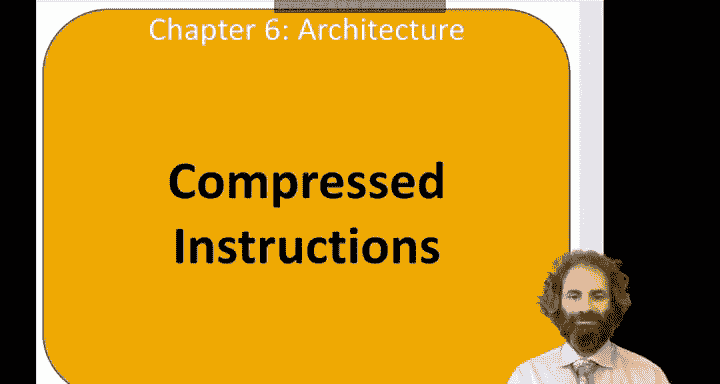
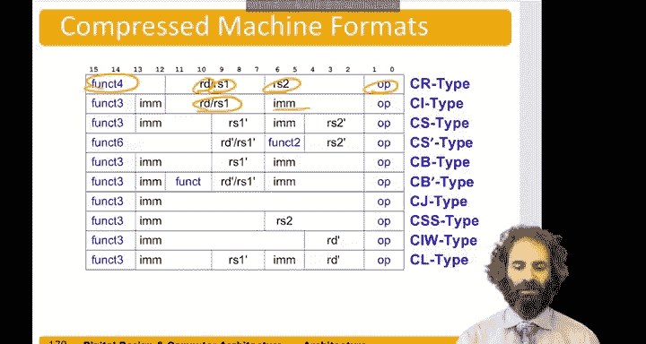

# 092：压缩指令 💾



在本节中，我们将学习RISC-V指令集架构中的压缩指令。压缩指令是一种16位版本的指令，旨在减少程序代码的存储空间，这对于成本敏感且存储资源有限的微控制器应用尤为重要。

## 概述

到目前为止，我们讨论的都是RISC-V架构的32位指令版本。然而，RISC-V也需要与市场上的微控制器竞争。许多16位微控制器将指令打包在仅16位中，因此所需的代码存储空间大约只有一半。由于代码存储通常是微控制器成本中最大的部分，16位处理器在这方面具有优势。因此，RISC-V以及其他指令集架构（如ARM）都定义了16位的压缩指令版本。这是RISC-V中的一个可选特性，但大多数RISC-V编译器在可能的情况下都会生成32位和16位指令的混合代码，以节省代码空间。

## 压缩指令的基本概念

核心思想是用16位版本替换常见的整数和浮点指令。这些压缩指令的助记符以字母“C”开头。例如，`add`指令的压缩版本是`c.add`，`load`指令的压缩版本是`c.lw`。

为了将指令压缩到仅16位（而不是32位），一些压缩指令被限制为仅使用3位寄存器标识符（而不是5位），因此只能选择X8到X15之间的8个寄存器。此外，立即数编码也相当不规则，其范围通常在6到11位之间，具体取决于指令格式中能塞进多少位。操作码部分则只有2位。

## 压缩指令格式示例

以下是几种不同类型的压缩指令格式：

*   **R类型指令**：使用一个寄存器同时作为源操作数和目的操作数，第二个源操作数来自另一个寄存器，操作由`funct`字段指定。
    *   格式：`c.[op] rd, rs2`
*   **I类型指令**：使用一个寄存器同时作为第一个源操作数和目的操作数，并包含一个打包的立即数。立即数由指令中的5位加上额外的2位组成，共7位，并由`funct3`字段指定指令类型。
    *   格式：`c.[op] rd, imm`
*   **存储、分支、跳转指令**：格式类似，例如跳转指令可以携带一个看起来像12位（实际为11位长）的立即数。
    *   格式示例：`c.j imm`

## 程序示例分析

让我们通过一个示例程序来理解压缩指令的混合使用。

```assembly
c.li s1, 0          # 将0加载到寄存器s1（i=0），这是压缩指令。
addi t2, zero, 200  # 将200放入t2用于比较。200这个立即数太大，无法放入压缩指令，因此使用常规的addi指令。
loop:
bge s1, t2, done    # 如果i (s1) >= 200 (t2)，则跳转到done。这个分支目标地址需要较多位，因此使用非压缩指令。
c.lw a1, 0(t0)      # 从地址(t0)加载数据到a1。假设t0指向数组起始地址，这是压缩指令。
c.addi a1, a1, 10   # 给a1加10，这是压缩指令。
c.sw a1, 0(t0)      # 将a1存回地址(t0)，这是压缩指令。
c.addi t0, t0, 4    # 将基地址指针t0增加4，指向下一个字，这是压缩指令。
c.addi s1, s1, 1    # i加1，这是压缩指令。
c.j loop            # 跳转回循环开始，这是压缩指令。
done:
```

在这个程序中，许多指令（如`c.li`, `c.lw`, `c.addi`, `c.sw`, `c.j`）都使用了压缩格式，从而有效减少了整体代码大小。而处理大立即数（200）和长距离分支的指令则保留了标准的32位格式。



## 总结


本节课我们一起学习了RISC-V的压缩指令。我们了解到压缩指令是16位版本的常用指令，旨在减少代码存储空间，这对微控制器应用至关重要。我们探讨了其基本设计思路，例如限制寄存器寻址范围和采用不规则的立即数编码。最后，通过分析一个混合使用压缩与非压缩指令的程序示例，我们直观地看到了压缩指令如何在实际中节省代码空间。理解压缩指令有助于我们编写更高效的代码，并深入理解RISC-V架构为适应不同应用场景所做的设计权衡。