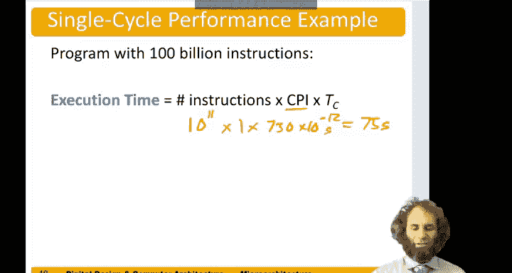

# 099：单周期处理器性能分析 🚀

在本节中，我们将分析单周期处理器的性能。我们已经构建了一个单周期处理器，现在来看看它能以多快的速度运行程序。

## 概述

程序执行时间取决于三个因素：程序中的指令数量、执行每条指令所需的平均周期数，以及每个周期的时长。其关系可以用以下公式表示：

**程序执行时间 = 指令数 × CPI × 周期时间**

对于单周期处理器，每条指令恰好需要一个周期，因此CPI（每条指令的周期数）为1。本节的核心任务是确定处理器的**周期时间**，即完成最复杂指令所需的最长时间路径。

## 确定关键路径

周期时间由处理器中最长的数据路径决定，这条路径被称为**关键路径**。在单周期处理器中，`lw`（加载字）指令通常涉及最多的组件，因此其路径可能是最长的。

以下是`lw`指令执行过程中的两个主要潜在关键路径：

### 路径一：寄存器文件读取路径（蓝色路径）

此路径从程序计数器（PC）开始，依次经过以下组件：
1.  从指令存储器中读取指令。
2.  从指令中解析出寄存器地址，并从寄存器文件中读取源操作数。
3.  将读取的数据送入ALU进行计算。
4.  将ALU结果作为地址，访问数据存储器以读取数据。
5.  将读取的数据通过结果选择器（Result Mux）送回。
6.  在时钟周期结束前，将数据写回寄存器文件。

### 路径二：立即数生成路径（灰色路径）

此路径与路径一的前半部分不同：
1.  同样从指令存储器中读取指令。
2.  指令送入控制器，解码出立即数类型（IMM Src）。
3.  根据类型，由立即数扩展器（Immediate Extender）生成立即数。
4.  该立即数通过源B选择器（SrcB Mux）送入ALU。
5.  后续步骤（ALU计算、访问数据存储器、结果选择、写回寄存器）与路径一相同。

**关键路径**是这两条路径中较长的那一条。它决定了处理器的最小周期时间。

## 关键路径延时计算

综合来看，单周期处理器的关键路径延时是以下各部分延时之和：
*   程序计数器（PC）的传播时间。
*   访问指令存储器的时间。
*   **（取寄存器文件读取时间）与（指令解码、立即数扩展及通过源B选择器的时间）两者中的较大值**。
*   ALU的计算时间。
*   访问数据存储器的时间。
*   结果选择器（Result Mux）的传播时间。
*   寄存器文件的写入建立时间。

通常，存储器访问、ALU操作和寄存器文件访问是延时最大的部分。

假设路径一（寄存器文件读取）更长，那么关键路径可以概括为：从程序计数器开始，依次经过**指令存储器、寄存器文件、ALU、数据存储器、结果选择器，最后准备写回寄存器文件**。

## 性能实例分析

假设我们使用以下组件延时（单位：皮秒，ps）进行分析：

| 组件 | 延时 (ps) |
| :--- | :--- |
| 程序计数器 (PC) | 40 |
| 指令存储器 (IMem) | 200 |
| 数据存储器 (DMem) | 200 |
| 寄存器文件读取 (Reg File Read) | 100 |
| 算术逻辑单元 (ALU) | 120 |
| 结果选择器 (Result Mux) | 30 |
| 寄存器文件写入建立 (Reg File Setup) | 60 |

根据关键路径，总周期时间计算如下：
`周期时间 = PC + IMem + RegRead + ALU + DMem + ResultMux + RegSetup`
`周期时间 = 40 + 200 + 100 + 120 + 200 + 30 + 60 = 750 ps`

现在，假设运行一个包含1000亿条指令的程序（即 $10^{11}$ 条指令）。对于单周期处理器，CPI = 1。

程序总执行时间为：
`执行时间 = 指令数 × CPI × 周期时间`
`执行时间 = $10^{11}$ × 1 × (750 × $10^{-12}$ 秒) = 75 秒`

因此，我们的单周期处理器需要75秒来完成这个程序。

## 总结

本节课中，我们一起学习了如何分析单周期处理器的性能。我们了解到：
1.  程序执行时间由指令数、CPI和周期时间共同决定。
2.  对于单周期处理器，CPI恒为1，因此**周期时间是决定性能的关键**。
3.  周期时间由处理器的**关键路径**决定，通常是执行`lw`这类复杂指令所需的最长数据通路。
4.  通过累加关键路径上各逻辑元件的延时，我们可以估算出处理器的周期时间和整体性能。在给定的例子中，周期时间为750皮秒，执行一个千亿条指令的程序需要75秒。

理解关键路径和延时分析是评估和优化处理器设计的基础。