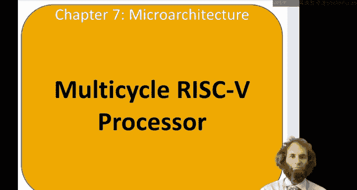
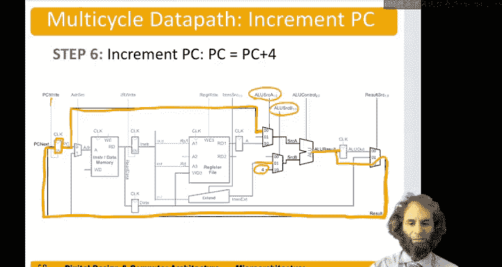

# 103：多周期处理器数据通路（lw指令）

在本节课中，我们将学习多周期RISC-V处理器的设计。我们将重点关注**lw**（加载字）指令，并了解如何将指令执行分解为多个步骤，以复用硬件并提高时钟频率。

上一节我们介绍了单周期处理器的优缺点。本节中我们来看看多周期处理器如何通过将指令执行分解为更小的步骤来解决这些问题。

## 多周期处理器概述

多周期处理器将指令执行分解为多个较短的步骤。这样，简单指令可以用更少的步骤完成，从而可能更快结束。硬件可以被复用，例如，一个ALU可以在多个不同的步骤中使用，从而无需额外的加法器。由于每个步骤更小，时钟周期可以更快，从而获得更高的时钟频率。其缺点是，每个周期都需要支付寄存器建立时间和时钟到Q延迟等时序开销，这会降低性能。

我们将遵循与设计单周期处理器相同的过程：首先设计数据通路，然后设计控制器。在本讲中，我们将专注于**lw**指令的数据通路设计。

## 状态元件

与单周期处理器类似，我们从状态元件开始。但这次我们将使用一个统一的存储器，它同时包含指令和数据，而不是分开的指令存储器和数据存储器。

*   **存储器**：有一个地址端口用于指定要读写的单元，一个数据输出端口用于读取数据，一个数据输入端口用于写入数据。当写使能信号 `MemWrite` 为真时，在时钟上升沿将数据写入指定地址。
*   **寄存器文件**：与之前相同。
*   **程序计数器**：与之前相同。

我们将继续连接这些元件，并像单周期处理器那样添加ALU和多路选择器。

## 分解lw指令的步骤

以下是**lw**指令的六个执行步骤。

### 步骤1：取指

无论执行什么指令，第一步都是相同的。程序计数器指向当前指令。我们将其连接到存储器地址端口，从该地址读取当前指令。然后，我们将该指令存储在一个寄存器中，称为**指令寄存器**。这样，即使在后续步骤中，我们也能记住这条指令。我们只希望在取指步骤中写入这个寄存器，因此需要一个使能信号 `IRWrite`，它在第一个周期有效，表示我们希望用新指令写入此寄存器。

### 步骤2：译码与读寄存器

在第二步中，我们将从寄存器文件和符号扩展模块中读取源操作数和立即数。我们从指令寄存器中取出指令，并将其分解为若干字段。`rs1`字段（指令的第19至15位）将送到寄存器文件，读取该寄存器的内容，并将其存储在一个我们称为**A寄存器**的寄存器中。同时，指令中的立即数字段被送到符号扩展器，得到扩展后的立即数。我们需要一个控制信号 `ImmSrc` 来告知立即数的格式。

### 步骤3：计算存储器地址

对于加载指令，下一步是计算存储器地址。我们将来自A寄存器的源操作数 `rs1` 和扩展后的立即数送入ALU。设置ALU控制信号以指示其执行加法操作。计算出的结果称为**ALU结果**，我们将在该步骤结束时将其存储在一个寄存器中，称为**ALU输出寄存器**。

### 步骤4：访问存储器

在第四步中，我们使用ALU输出寄存器中的地址从存储器中读取数据。我们的统一存储器地址输入需要一个多路选择器，以便从多个来源中选择地址信号。该多路选择器需要一个控制信号 `AdrSrc`。当 `AdrSrc` 为0时，从PC获取指令地址；当 `AdrSrc` 为1时，从ALU输出寄存器获取数据存储器地址。存储器读取后，数据输出端口的值将被存储在一个我们称为**数据寄存器**的寄存器中。

### 步骤5：写回寄存器文件

第五步，我们将结果写回寄存器文件。寄存器文件的结果输入需要一个多路选择器，以便从ALU输出寄存器或数据寄存器等来源中选择结果。实际上，我们很快会需要另一个来源，因此我们将预留一个额外的输入端，并需要一个2位控制信号 `ResultSrc[1:0]`。在此步骤中，我们从数据寄存器获取结果，将其送回寄存器文件，并置位写使能信号 `RegWrite`，将该值写入寄存器文件。要写入的寄存器地址来自指令的 `rd` 字段（第11至7位）。

### 步骤6：更新程序计数器

最后需要做的是将PC递增，指向下一条指令。程序计数器的值可以作为ALU的另一个输入源。因此，源A `SrcA` 除了来自寄存器文件，也可以来自PC；源B `SrcB` 除了来自立即数，也可以选择常数4。我们指示ALU执行加法，计算 `PC + 4`，并将结果放在ALU结果线上。我们需要在本周期内立即将其送到PC。因此，我们在结果多路选择器上添加一个输入来选择ALU结果，并将该结果送回PC。我们还需要一个使能信号 `PCWrite` 来指示我们希望在此周期更改程序计数器。同时，我们需要控制信号 `ALUSrcA` 和 `ALUSrcB` 来选择源A和源B的来源。

本节课中我们一起学习了多周期RISC-V处理器数据通路的设计，并详细分解了**lw**指令执行的六个步骤：取指、译码/读寄存器、计算地址、访问存储器、写回寄存器和更新PC。通过复用ALU等硬件和分步执行，多周期设计为优化性能和硬件成本提供了基础。下一节我们将探讨如何设计控制这个数据通路的有限状态机。