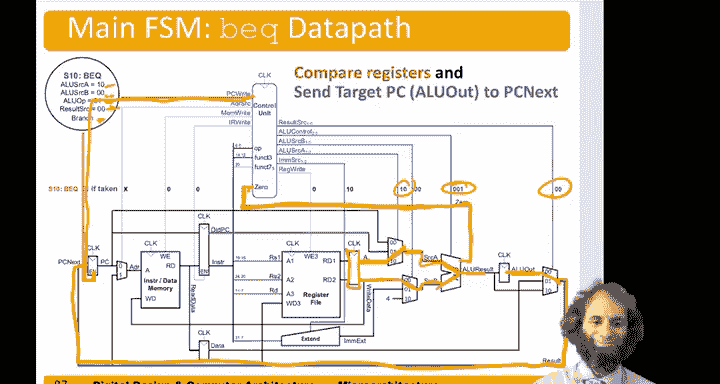

# 106：多周期处理器其他指令的控制设计 🎛️

在本节中，我们将学习如何为除 `lw`（加载字）指令之外的其他指令设计多周期处理器的控制器。我们将依次分析 `sw`（存储字）、R型指令和 `beq`（分支等于）指令的控制流程。

## 概述

上一节我们介绍了 `lw` 指令的控制流程。本节中，我们将扩展控制器设计，使其能够处理 `sw`、R型算术逻辑指令以及 `beq` 分支指令。我们将看到，这些指令共享部分执行步骤，但在关键步骤上有所不同。

## 存储字指令的控制流程

`sw` 指令的前三个步骤与 `lw` 指令完全相同。

1.  **取指**：从内存中获取指令，并将程序计数器加4。
2.  **译码**：读取寄存器文件，并计算立即数。
3.  **地址计算**：计算基地址与偏移量之和，得到内存地址。

以下是 `sw` 指令的第四个步骤，也是其独有的步骤：

在第四步中，我们需要将数据写入内存。此时，计算出的地址位于 `ALUOut` 寄存器中。我们需要将此地址提供给内存，并将要写入的数据（来自寄存器文件 `ReadData2` 端口）也提供给内存。

*   **控制信号设置**：
    *   `ResultSrc` 设为 `00`，选择 `ALUOut` 作为结果。
    *   `AdrSrc` 设为 `1`，将 `ALUOut` 提供的地址传递给内存。
    *   `MemWrite` 信号需要置为有效，以执行写操作。
    *   要写入的数据来自寄存器文件的 `ReadData2` 端口，通过数据路径传递到内存的数据输入端口。

完成写入后，与 `lw` 指令一样，控制流会通过一个箭头返回到取指状态，开始执行下一条指令。

## R型指令的控制流程

R型指令包括 `add`、`sub`、`and`、`or` 和 `slt`。它们的前两个步骤（取指和译码）与其他指令相同。其独特之处在于第三和第四步。

在第三步（执行阶段），我们需要执行ALU运算。

*   **控制信号设置**：
    *   `ALUSrcA` 设为 `10`，选择寄存器文件 `ReadData1` 端口作为ALU的第一个操作数。
    *   `ALUSrcB` 设为 `00`，选择寄存器文件 `ReadData2` 端口作为ALU的第二个操作数。
    *   `ALUOp` 设为 `10`，指示控制器根据指令的 `funct` 字段（`[14:12]` 和 `[30]`）来生成具体的ALU控制信号，以决定执行加法、减法等操作。
    *   ALU的计算结果存储在 `ALUOut` 寄存器中。

接下来是第四步（写回阶段），我们需要将ALU的结果写回寄存器文件。

*   **控制信号设置**：
    *   `ResultSrc` 设为 `00`，选择 `ALUOut` 中的值作为写回数据。
    *   `RegWrite` 信号需要置为有效，将数据写入由指令中 `rd` 字段指定的目标寄存器。

## 分支等于指令的控制流程

`beq` 指令需要计算两样东西：分支目标地址（PC + 偏移量）和两个源寄存器值的比较结果（是否相等）。我们可以优化设计，在译码阶段就提前计算分支目标地址。

在第二步（译码阶段），当我们读取寄存器时，ALU此时是空闲的。我们可以利用它来计算分支目标地址。

*   **控制信号设置**：
    *   `ALUSrcA` 设为 `01`，选择当前的 `PC` 值。
    *   `ALUSrcB` 设为 `01`，选择经过符号扩展的立即数（偏移量）。
    *   `ALUOp` 设为 `00`，指示ALU执行加法操作。
    *   计算结果 `PC + offset` 被存入 `ALUOut` 寄存器，供后续可能的分支跳转使用。

接下来，对于 `beq` 指令，我们需要进入第三个状态进行比较。

在第三步（分支执行阶段），我们比较两个寄存器的值。

*   **控制信号设置**：
    *   `ALUSrcA` 设为 `10`，选择 `ReadData1`。
    *   `ALUSrcB` 设为 `00`，选择 `ReadData2`。
    *   `ALUOp` 设为 `01`，指示ALU执行减法操作。ALU会生成一个 `Zero` 标志位，如果结果为0，则表示两个寄存器值相等。
    *   控制器需要置位 `Branch` 信号。如果 `Branch` 和 `Zero` 同时为真，则 `PCWrite` 信号有效。

当需要跳转时，之前计算并存放在 `ALUOut` 中的分支目标地址将被写入程序计数器。

*   **控制信号设置**：
    *   `ResultSrc` 设为 `00`，选择 `ALUOut` 中的分支目标地址。
    *   该地址通过多路选择器反馈到 `PCNext` 的输入端。当 `PCWrite` 有效时，它被载入程序计数器。

## 总结

本节课中，我们一起学习了多周期处理器控制器的完整设计。我们分析了四种基本指令的控制序列：

1.  **`lw`/`sw`指令**：共享取指、译码和地址计算阶段。`lw`在第四步读内存并写回寄存器；`sw`在第四步向内存写入数据。
2.  **R型指令**：在第三步使用ALU执行运算，在第四步将结果写回寄存器文件。
3.  **`beq`指令**：在译码阶段提前计算分支目标地址，在第三步比较寄存器并决定是否跳转，跳转时用之前计算的目标地址更新PC。

通过将这些步骤整合到一个统一的状态机中，并设置相应的控制信号，我们就构建出了一个能够执行多条指令的多周期处理器控制器。理解数据路径与控制信号之间的协作是掌握处理器设计的关键。