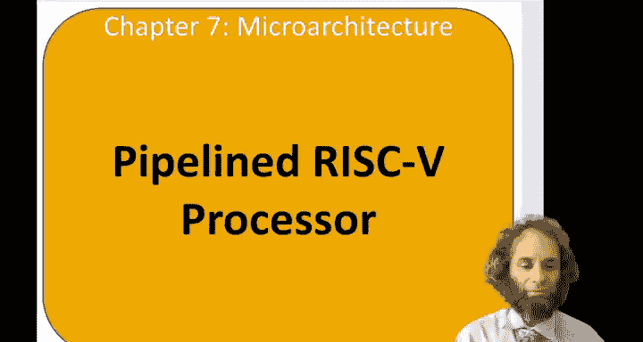
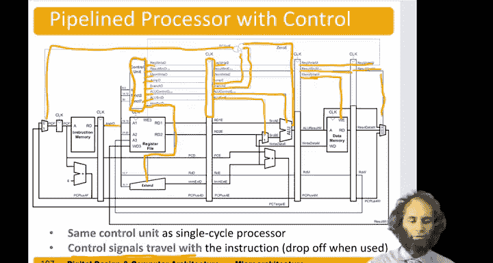

# 109：流水线处理器介绍 🚀

在本节中，我们将学习流水线RISC-V微处理器的基本概念和工作原理。我们将看到如何通过将指令执行过程划分为多个阶段并重叠执行，来显著提升处理器的吞吐量。

## 流水线概念回顾

上一节我们介绍了多周期处理器，但发现其性能提升有限。本节中，我们来看看流水线技术，这是一种更有效的性能提升方法。

流水线的核心思想是**时间并行性**。我们可以通过重叠执行不同指令的不同阶段，来提高整体吞吐量。一个经典的类比是洗衣流程：

*   **顺序执行**：洗一桶衣服 -> 晾干 -> 折叠 -> 收好 -> 再开始洗下一桶。
*   **流水线执行**：当第一桶衣服在晾干时，第二桶衣服可以开始洗；当第一桶在折叠时，第二桶在晾干，第三桶可以开始洗。

这样，虽然完成单件任务的总时间不变，但单位时间内完成的任务数量（吞吐量）大大增加。

## 单周期与流水线处理器对比

为了理解流水线的优势，我们先对比单周期处理器和流水线处理器的执行时间。

在单周期处理器中，每条指令必须顺序完成所有五个阶段：
1.  **取指**：从指令存储器读取指令。
2.  **译码**：从寄存器文件读取操作数。
3.  **执行**：在算术逻辑单元进行计算。
4.  **访存**：访问数据存储器（如果需要）。
5.  **写回**：将结果写回寄存器文件。

假设各阶段最长耗时如下：
*   取指/访存：200皮秒
*   译码：100皮秒
*   执行：120皮秒
*   写回：50皮秒

那么，单条指令的总执行时间接近 **700皮秒**。第二条指令必须等待第一条完全结束后才能开始。

在流水线处理器中，我们将这五个阶段用**流水线寄存器**分隔开。每个阶段完成后，其结果被锁存到寄存器中，供下一阶段使用。关键点在于，**只要一个阶段完成了当前指令的处理，它就可以立即开始处理下一条指令**。

以下是流水线执行的时间线示意图：
*   **周期1**：取指指令1。
*   **周期2**：取指指令2，同时译码指令1。
*   **周期3**：取指指令3，译码指令2，执行指令1。
*   **周期4**：取指指令4，译码指令3，执行指令2，访存指令1。
*   **周期5**：取指指令5，译码指令4，执行指令3，访存指令2，写回指令1。

此时，处理器的吞吐量变为**每200皮秒完成一条指令**（由最慢的阶段决定），相比单周期的700皮秒，获得了显著的性能提升。理想情况下，如果五个阶段完全均衡，可以获得5倍的加速比。

## 流水线数据通路构建

现在，我们来看看如何构建一个流水线处理器的数据通路。我们从熟悉的单周期数据通路开始，并在关键位置插入流水线寄存器，将其划分为五个独立的阶段。

以下是构建流水线数据通路的核心步骤：

1.  **划分阶段**：在取指、译码、执行、访存、写回五个阶段之间插入四个流水线寄存器。这些寄存器在时钟边沿锁存数据，确保每个阶段在一个周期内处理一条指令的特定部分。
2.  **信号传递**：所有在阶段间传递的数据和控制信号都必须通过流水线寄存器。为了清晰区分，我们为信号名添加后缀（如 `_F`, `_D`, `_E`, `_M`, `_W`），以表明它属于哪个流水线阶段。
3.  **解决数据冲突**：一个关键问题是，写回阶段需要知道将结果写入哪个寄存器（由指令的 `rd` 字段指定）。这个信息在译码阶段被解析，但必须**伴随指令数据一起穿过流水线**，直到写回阶段才被使用。因此，我们需要将 `rd` 字段从译码阶段开始，通过流水线寄存器一直传递到写回阶段。
4.  **寄存器文件读写**：为了在同一周期内既能读取（译码阶段）又能写入（写回阶段）寄存器文件，我们采用一种时序设计：在时钟上升沿进行读操作，在时钟下降沿进行写操作。这样避免了读写冲突。

## 流水线控制逻辑

控制逻辑也需要进行流水化。控制单元仍然根据当前处于译码阶段的指令来生成所有控制信号。

以下是控制信号在流水线中的传递过程：

*   **立即数类型**等少数信号在译码阶段就需要使用。
*   大部分控制信号（如 `ALUOp`, `ALUSrc`, `MemWrite`, `RegWrite` 等）在生成后，会**跟随对应的指令数据一起进入流水线寄存器**。
*   这些信号在后续的流水阶段中被“激活”：
    *   `ALUSrc` 和 `ALUOp` 在执行阶段被使用。
    *   `Branch` 和 `Jump` 信号也在执行阶段用于解析分支/跳转，并可能影响下游的取指阶段（这引入了**控制冒险**，后续会讨论）。
    *   `MemWrite` 在访存阶段被用作数据存储器的写使能。
    *   `RegWrite` 和结果选择信号在写回阶段被使用，以决定是否以及如何写回寄存器文件。

通过这种方式，控制信号就像指令的“行李”一样，在流水线中流动，并在需要的时候被取出使用。

## 总结

本节课中我们一起学习了流水线处理器的基本原理。我们了解到，通过将指令执行过程划分为多个阶段（取指、译码、执行、访存、写回），并在阶段间插入寄存器，可以实现多条指令的重叠执行，从而大幅提高处理器的吞吐量。我们构建了流水线数据通路的框架，并说明了数据和控-制信号如何沿流水线传递。关键点包括：使用流水线寄存器隔离阶段、传递目标寄存器地址 `rd` 以解决写回问题、以及将控制信号与指令数据同步流水化。流水线是几乎所有现代高性能处理器的基石技术。