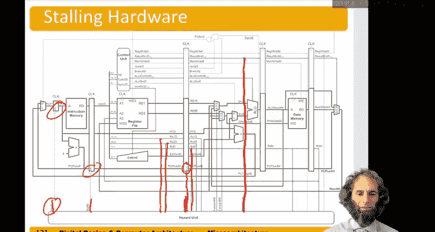

# 110：流水线处理器的数据冒险 🚧


在本节中，我们将学习流水线处理器中数据冒险的概念、成因以及几种主要的解决方法。数据冒险发生在一条指令需要依赖前一条尚未完成指令的结果时。我们将重点探讨通过编译器插入空操作、代码重排、硬件前递以及流水线停顿这几种策略来应对数据冒险。

---

## 数据冒险的成因与示例

上一节我们介绍了流水线的基本概念，本节中我们来看看流水线中可能出现的“冒险”问题。流水线冒险发生在一条指令的执行依赖于前一条尚未完成指令的结果时。

数据冒险是其中一种类型，它发生在我们需要使用一个寄存器的值，但这个值尚未被前一条指令写回寄存器文件时。

让我们来看一个数据冒险的例子。假设我们执行一条加法指令 `add s8, s4, s5`，随后四条指令都将 `s8` 作为源操作数使用。

```
add s8, s4, s5
sub s9, s8, s10
or  s11, s8, s12
and s13, s8, s14
```

在流水线中，`add` 指令在第五个周期的前半段才将结果写回 `s8` 寄存器。然而，紧随其后的 `sub` 指令在第三个周期就需要从寄存器文件中读取 `s8` 的值，此时它读到的是旧的、错误的 `s8` 值。同样，`or` 指令在第四个周期读取 `s8` 时也会遇到同样的问题。只有 `and` 指令在第五个周期的后半段读取时，才能获得正确的 `s8` 值。因此，`sub` 和 `or` 指令会得到错误的结果，这就是一个典型的数据冒险。

---

## 解决数据冒险的方法

为了解决数据冒险，有几种可能的方案。

### 编译器插入空操作

一种方法是在编译时，在一条指令和需要其结果的指令之间插入不做任何操作的 `nop` 指令。由于从写入寄存器到可以安全读取之间通常间隔两个周期，我们可能需要插入两个 `nop`。

例如，在 `add` 指令后插入两个 `nop`：

```
add s8, s4, s5
nop
nop
sub s9, s8, s10
...
```

这样，`sub` 指令在第五个周期才尝试读取 `s8`，此时值已就绪。然而，这种方法效率低下，因为它会降低程序速度并增加代码体积。

### 编译器代码重排

另一种编译时优化是重排代码顺序。如果程序中存在与当前数据流无关的指令，编译器可以尝试将这些指令提前执行，以填充等待数据就绪的空闲周期。

例如，原始代码：
```
add s8, s4, s5
sub s9, s8, s10  // 依赖于 s8
// 一些与 s8 无关的指令
```

重排后：
```
add s8, s4, s5
// 一些与 s8 无关的指令（被提前）
sub s9, s8, s10  // 此时 s8 已就绪
```

这种方法的缺点是，对于不同的处理器微架构，指令结果就绪的延迟可能不同，编译器可能无法做出最优的重排决策。

### 硬件前递

硬件前递（或称旁路）是一种在运行时由硬件动态解决数据冒险的方法。其核心思想是：当一条指令在流水线的执行阶段产生结果后，如果后续指令需要这个结果，我们可以绕过寄存器文件，直接将这个结果“前递”给需要它的指令。

回顾之前的例子，`add` 指令的结果在第三个周期（执行阶段）就已经计算出来了（`s4 + s5`）。而 `sub` 指令在第四个周期才需要这个值进行减法运算。通过硬件前递，我们可以将执行阶段计算出的 `s8` 值直接传递给 `sub` 指令的ALU输入，而不是等待它写回寄存器文件后再读取。

实现前递需要额外的硬件逻辑。我们需要检查执行阶段的源寄存器是否与处于访存阶段或写回阶段指令的目的寄存器相匹配。如果匹配，且该指令确实要写入寄存器，则触发前递。

以下是前递逻辑的部分公式描述：

*   **检查是否从访存阶段前递：**
    `ForwardAE = (Rs1E == RdM) && RegWriteM && (RdM != 0)`
    *   `Rs1E`: 执行阶段的源寄存器1编号。
    *   `RdM`: 访存阶段指令的目的寄存器编号。
    *   `RegWriteM`: 访存阶段指令是否要写寄存器。
    *   `(RdM != 0)`: 确保目的寄存器不是 `x0`（恒为0的寄存器）。

*   **检查是否从写回阶段前递：**
    `ForwardAE = (Rs1E == RdW) && RegWriteW && (RdW != 0)` （当不满足访存阶段前递条件时）
    *   `RdW`: 写回阶段指令的目的寄存器编号。
    *   `RegWriteW`: 写回阶段指令是否要写寄存器。

对于源寄存器2（`Rs2E`）的前递逻辑（`ForwardBE`）与上述公式类似。

### 流水线停顿

然而，并非所有情况都能通过前递解决。一个典型的例子是加载指令（`lw`）后紧跟使用其结果的指令。

```
lw s7, 40(s5)
and s10, s7, s11
```

`lw` 指令直到第四个周期（访存阶段）结束时才从内存中读出数据。而紧随其后的 `and` 指令在第三个周期（执行阶段）就需要 `s7` 的值。此时，数据尚未就绪，无法前递。

这种情况下，处理器必须采用**停顿**策略。硬件会检测到这种“加载-使用”冒险，并暂停流水线中相关指令的推进，直到数据可用为止。

具体操作是：将 `and` 指令阻塞在译码阶段，不让它进入执行阶段。同时，`and` 之后的所有指令也相应地被阻塞在更早的阶段（例如取指阶段）。当 `lw` 指令在第四个周期结束时获得数据后，可以通过前递机制将数据送给 `and` 指令，然后解除停顿，流水线继续执行。

以下是加载停顿的检测逻辑公式：

`Stall = ((Rs1D == RdE) || (Rs2D == RdE)) && MemReadE`
*   `Rs1D`, `Rs2D`: 译码阶段的源寄存器编号。
*   `RdE`: 执行阶段指令的目的寄存器编号。
*   `MemReadE`: 执行阶段指令是否为加载指令（`lw`）。为真时表示需要停顿。

当检测到停顿时，控制逻辑会：
1.  关闭取指和译码阶段流水线寄存器的使能信号，使其内容保持不变（停顿）。
2.  对执行阶段的流水线寄存器发出清空信号，使其输出为零（相当于在执行阶段插入一个 `nop`），防止错误操作。

---

## 总结

本节课中我们一起学习了流水线处理器中的数据冒险问题。我们了解到，数据冒险源于指令间的数据依赖与流水线并行性的冲突。我们探讨了四种主要的解决策略：
1.  **编译器插入空操作**：简单但低效，会增加延迟和代码大小。
2.  **编译器代码重排**：一种软件优化，通过调整指令顺序来隐藏延迟，但其效果受限于架构知识。
3.  **硬件前递**：一种高效且常见的硬件解决方案，通过旁路网络将已计算但未写回的结果直接传递给需要它的指令，解决了大部分数据冒险。
4.  **流水线停顿**：当前递无法解决问题时（如加载-使用冒险）的必要手段，通过暂停流水线来等待数据就绪，会引入性能开销。



现代处理器通常结合使用硬件前递和流水线停顿机制，并辅以编译器的优化，来高效地处理数据冒险，从而在保持流水线高效运行的同时确保程序执行的正确性。