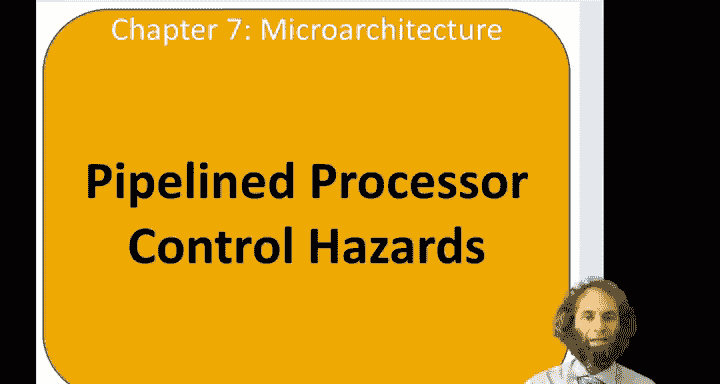
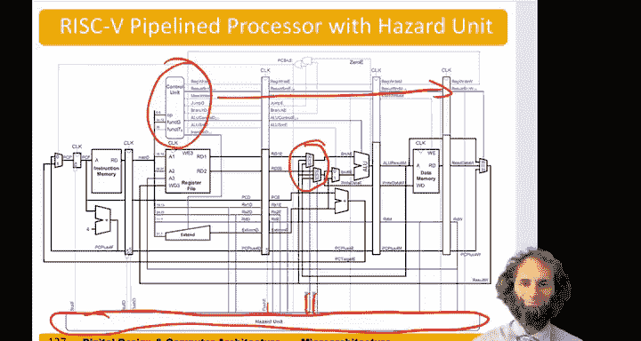

# 111：流水线处理器中的控制冒险 🚧

在本节中，我们将继续探讨流水线处理器中的冒险问题，这次的重点是**控制冒险**。

## 概述
控制冒险发生在我们需要取指时，却还不知道应该取哪条指令的情况下。这在诸如`beq`（相等时分支）这类指令中尤为明显。分支指令的判断结果要到执行阶段才能确定，因为此时才会比较数值并判断结果是否为零。然而，在分支指令之后，流水线已经取入了后续指令。如果分支被采纳，这些后续指令就必须被**冲刷**掉。

## 控制冒险详解
让我们在流水线中具体观察这个过程。假设我们有一条`beq`指令。如果寄存器`s1`等于`s2`，程序将跳转到下方的`label1`处。紧接着`beq`之后还有两条指令（例如`sub`和`or`）。

*   **周期1**：取指`beq`。
*   **周期2**：取指`sub`。
*   **周期3**：取指`or`。同时，在执行阶段，我们**发现分支应该被采纳**。

此时，我们实际上应该去取`label1`处的指令（例如`add`）。但`sub`和`or`指令本不该执行，因此我们需要将它们从流水线中冲刷掉。这种因错误预测分支而丢弃工作的过程，被称为**分支误预测惩罚**，其大小等于分支被采纳时需要冲刷的指令数量。

## 冲刷逻辑的实现
为了实现冲刷，我们需要在分支于执行阶段被采纳时，冲刷掉当时处于取指和解码阶段的指令。我们通过引入`FlushD`和`FlushE`信号来实现这一点，这两个信号将作为对应流水线寄存器的清零输入。

具体的逻辑是：
*   如果在执行阶段，`PCSrcE`信号（该信号指示程序计数器应从分支目标地址而非`PC+4`取值）被置位，则冲刷执行阶段。
*   同时，如果`PCSrcE`信号为真（意味着我们正在采纳一个分支），或者存在一个`lw`指令导致的**数据冒险**（我们之前已经知道在`lw`冒险时需要冲刷执行阶段），我们也需要冲刷解码阶段。

这引入了一些额外的硬件。我们需要监控`PCSrcE`信号，如果它有效，我们不仅要断言`FlushE`（冲刷执行阶段），还需要断言`FlushD`（冲刷解码寄存器）。

## 完整的处理器架构
将所有这些部分整合起来，我们就得到了一个完整的流水线处理器，它包含三个主要部分：

1.  **数据通路**：本质上与单周期处理器相同，但为了提升性能，我们增加了一些**前递多路选择器**。
2.  **控制单元**：与单周期处理器相同，但我们将控制信号**流水化**，将它们传递到需要它们的相应阶段。
3.  **冒险单元**：负责侦测冒险。如果冒险可以通过**前递**解决，则启用对应的前递多路选择器。否则，可能需要采取**冲刷**或**暂停**操作。具体来说，我们可以暂停流水线前段，冲刷执行阶段。如果遇到分支误预测，我们还需要冲刷分支之后的两条指令。

## 总结
本节课我们一起学习了流水线处理器中的**控制冒险**。我们了解到，控制冒险源于分支指令结果确定较晚，导致后续错误取入的指令需要被冲刷，从而产生性能惩罚。我们探讨了通过`FlushD`和`FlushE`信号来实现指令冲刷的逻辑。最后，我们回顾了包含数据通路、控制单元和冒险单元的完整流水线处理器架构，其中冒险单元负责处理包括控制冒险在内的各种冒险情况。