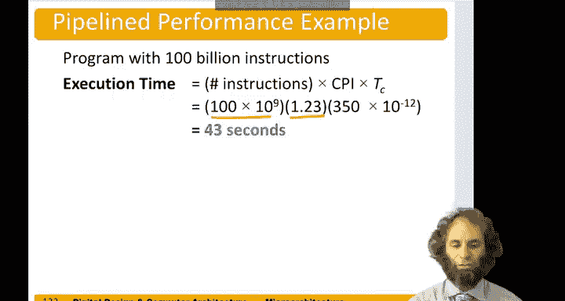
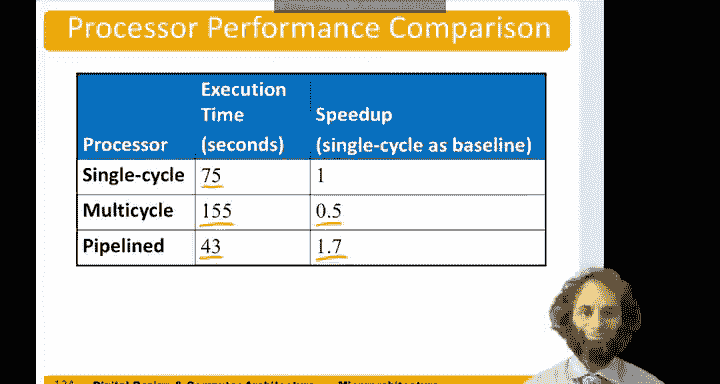

# 112：流水线处理器性能分析 📊


在本节中，我们将分析流水线处理器的性能。我们将通过一个具体的基准测试程序，计算其平均每条指令周期数，并识别处理器的关键路径以确定其最大时钟频率。最后，我们将对比流水线处理器与单周期、多周期处理器的性能差异。

---

## 性能分析概述

我们再次考虑一个包含多种指令类型的基准测试程序。假设其中40%的加载指令被下一条指令使用，导致一个周期的停顿；同时，50%的分支指令预测错误，导致两条指令被冲刷。我们的目标是计算该程序在流水线处理器中的平均每条指令周期数。

理想情况下，流水线处理器应达到 **CPI = 1**。但在现实中，停顿会增加CPI。

---

## 计算平均CPI

以下是不同指令类型的CPI计算：

*   **加载指令**：60%的情况下需要1个周期，40%的情况下（由于数据冒险）需要2个周期。
    *   平均CPI = `0.6 * 1 + 0.4 * 2 = 1.4`
*   **分支指令**：50%的情况下需要1个周期，50%的情况下（由于预测错误）需要3个周期。
    *   平均CPI = `0.5 * 1 + 0.5 * 3 = 2.0`
*   **其他指令**：始终需要1个周期。

假设指令混合比例为：加载指令占25%，分支指令占13%，其余指令占62%。则整体平均CPI计算如下：

```
平均CPI = (0.25 * 1.4) + (0.13 * 2.0) + (0.62 * 1) = 1.23
```

因此，该程序的平均每条指令周期数为 **1.23**。

---

## 识别关键路径

上一节我们计算了平均CPI，本节我们来看看决定处理器最大时钟频率的关键路径。我们需要分析流水线每个阶段的最长延迟。

*   **取指阶段**：延迟包括PC寄存器传播延迟、指令存储器读取延迟和下一级寄存器的建立时间。
*   **译码阶段**：需要在半个周期内完成寄存器文件的读取和下一级寄存器的建立，因此整个周期时间至少是此延迟的两倍。
*   **执行阶段**：这是最复杂的阶段。考虑一个需要旁路数据的场景：数据从流水线寄存器出发，经过一个多路选择器，再通过旁路多路选择器，进入ALU的源操作数B多路选择器，最终ALU进行计算。对于分支指令，ALU产生的零标志位还需经过与/或逻辑门，然后通过下一个PC多路选择器，最终为PC寄存器准备好新值。这是最长的路径。
*   **访存阶段**：延迟包括寄存器传播延迟、数据存储器加载延迟和下一级寄存器的建立时间。
*   **写回阶段**：需要在半个周期内完成从寄存器出发、经过一个多路选择器、写入寄存器文件的操作，因此周期时间至少是此延迟的两倍。

通过代入具体数值（例如：`T_pcq = 40ps`， 多路选择器延迟 `30ps`， ALU延迟 `120ps`， 逻辑门延迟 `20ps`， 建立时间 `50ps`），我们可以计算执行阶段关键路径的总延迟：

```
关键路径延迟 = 40 + (4 * 30) + 120 + 20 + 50 = 350 ps
```

因此，处理器的最小时钟周期应为 **350皮秒**。这虽然不如我们期望的仅由存储器读取决定的200皮秒理想，但相比单周期处理器的750皮秒已有巨大提升。

---

## 性能对比

现在，假设有一个包含1000亿条指令的程序。

*   **流水线处理器执行时间**：
    ```
    总时间 = 指令数 × 平均CPI × 时钟周期
           = 100e9 × 1.23 × 350e-12 秒
           = 43.05 秒
    ```



让我们与其他架构对比：

*   **单周期处理器**：执行相同程序需要 **75秒**。
*   **多周期处理器**：执行时间约为 **155秒**（比单周期更慢，其主要优势在于节省硬件）。

流水线处理器虽然增加了流水线寄存器等硬件成本，但将程序执行时间缩短至 **43秒**，速度达到了单周期处理器的 **1.7倍**（即获得了70%的性能提升）。

---

## 总结



本节课中我们一起学习了流水线处理器的性能分析方法。我们通过计算平均CPI来量化流水线停顿带来的影响，并通过分析关键路径确定了处理器的最大时钟频率。最终对比表明，流水线技术能以相对较小的硬件开销（主要是额外的寄存器），换取显著的性能提升（本例中为70%），这正是现代处理器普遍采用流水线设计的重要原因。