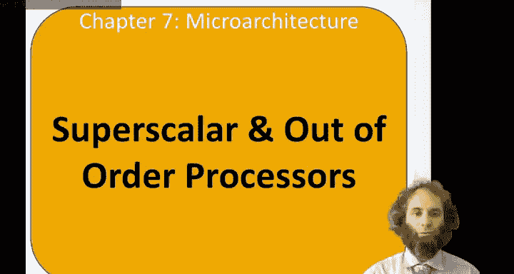
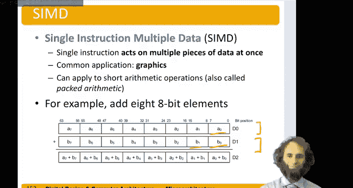

# 114：超标量与乱序处理器 🚀



在本节课中，我们将学习两种提升处理器性能的关键技术：超标量处理器和乱序处理器。我们将探讨它们如何通过同时执行多条指令来加速程序运行，并了解处理指令间依赖关系的各种方法。

---

## 概述

超标量处理器通过复制数据通路，使其能够在每个时钟周期内执行多条指令。然而，指令间的依赖关系会限制这种并行性。乱序处理器则通过前瞻性地分析指令流，并允许没有依赖关系的指令“乱序”执行，来克服这一限制。我们还将介绍寄存器重命名和单指令多数据这两种进一步优化性能的技术。

---

## 什么是超标量处理器？⚙️

上一节我们介绍了基本的流水线处理器。本节中，我们来看看超标量处理器。

一个超标量处理器拥有多个数据通路的副本，以便能够同时执行多条指令。

以我们的流水线RISC-V处理器为例。假设我们不是读取一条指令，而是同时读取两条指令。然后，假设我们的寄存器文件不是3个端口，而是有6个端口。这样，我们可以在每个步骤中获取两条指令的操作数，并写入两条指令的结果。接着，假设我们不是只有一个ALU，而是有两个，这样我们可以在每个步骤中执行两条指令。最后，假设我们有一个双端口存储器，每个周期可以读写两个值，以及两个结果总线。

理想情况下，我们的超标量处理器可以在每个周期发射和执行两条指令。公式可以表示为：
```
理想IPC = 发射宽度
```
其中IPC（Instructions Per Cycle）是衡量性能的关键指标。

---

## 依赖关系与限制 ⛓️

不幸的是，指令间存在依赖关系，这有时会限制我们同时发射多条指令的能力，因为一条指令的执行结果可能依赖于前一条指令。

以下是理解依赖关系及其影响的一些例子。

### 无依赖关系的程序

假设我们有一个将结果放入S7的加载字指令，然后是一个将结果放入S8的加法指令，一个减法指令放入S9，一个与指令放入S10，一个或指令放入S11，以及一个存储指令存入S5。这些指令的输入都不依赖于之前的指令。

在这种情况下，处理器可以高效地并行执行。

*   **周期1**：我们可以从指令存储器同时取指加载和加法指令。
*   **周期2**：我们为加载指令读取S0和40，为加法指令读取T1和T2。同时，我们可以取指减法指令和与指令。
*   **周期3**：加载和加法指令都可以执行加法操作。同时，寄存器文件读取减法指令和与指令的源操作数，并取指或指令和存储指令。
*   **周期4**：加载指令使用数据存储器，加法指令不需要。ALU执行减法操作和与操作。寄存器文件读取或指令和存储指令的操作数。
*   **周期5**：寄存器文件将加载和加法指令的结果写回S7和S8。减法指令和与指令完全不使用数据存储器。ALU执行或指令和存储指令的加法操作。

这里我们在每个周期都发射两条指令，因此指令每周期数（IPC）为2。

### 存在依赖关系的程序

现在考虑一个存在依赖关系的程序。我们加载数据到S8，但假设加法指令需要使用S8。然后假设减法指令的目的地也是S8，而与指令依赖于减法指令产生的S8。最后，假设或指令的目的地是S11，而存储指令依赖于S11。

在这种情况下，并行执行受到严重限制。

*   **周期1**：我们可以发射加载指令，但不能发射加法指令，因为它需要尚未从加载指令获得的S8。
*   **周期2**：我们可以发射加法指令，但它会停顿，因为它需要等到周期5S8才可用。减法指令独立于加法指令，所以我们也可以发射它。它们都在步骤7完成。
*   **周期3**：我们可以发射与指令和或指令。它们也会停顿，因为加法指令和减法指令已经停顿。
*   **周期5**：我们可以发射存储指令。

现在，发射六条指令需要五个周期，因此实际IPC为6/5 = 1.2。这比1好，但并不理想。

---

## 乱序执行处理器 🔄

为了尝试解决这些问题，我们可以设计一个乱序微处理器。这种处理器可以前瞻多条指令，并尽可能多地同时发射指令，只要它们之间没有依赖关系。它允许指令不按程序顺序发射。

我们需要关注的依赖关系有三种：写后读、读后写和写后写。

1.  **写后读依赖**：一条指令写入一个寄存器，后面的指令要读取该寄存器。读操作必须等待写操作完成，或者至少需要旁路机制。
2.  **读后写依赖**：一条指令读取一个寄存器，后面的指令要写入该寄存器。写操作不能乱序到读操作之前，否则可能得到错误结果。
3.  **写后写依赖**：一条指令写入一个寄存器，随后的指令也写入同一个寄存器。需要保持这些指令的顺序，以确保最终寄存器中的值是第二条指令的结果。

乱序处理器通常使用一个称为记分板的设备来跟踪等待发射的指令、可用的功能单元以及指令间的依赖关系。它会在记分板中查找下一个准备就绪、有可用功能单元且所有依赖都已满足的指令。

让我们看看这个乱序处理器如何处理之前的例子。

*   **周期1**：我们可以执行加载字指令。加法指令依赖于它，所以不能执行。但我们可以向前查看程序，找到或指令，并将其与加载指令同时发射。
*   **周期2**：或指令产生S11。存储指令需要S11，所以我们可以在本周期发射存储指令，并将S11的结果从或指令旁路给存储指令。我们也想发射加法指令，但它依赖于尚未从加载指令准备好的S8，所以加法指令必须停顿，不能与存储指令同时发射。
*   **周期3**：我们在本周期发射加法指令和减法指令。
*   **周期4**：与指令依赖于减法指令的结果，我们在本周期发射它。

现在，我们在四个周期内发射了六条指令，得到IPC为1.5。这比之前好，但仍不理想。

---

## 寄存器重命名技术 🏷️

另一个关键技术是寄存器重命名。在上一个例子中，减法指令直到加载字指令之后才能发射，因为它们都写入S8，存在读后写依赖。而与指令必须等到减法指令之后。

如果我们愿意重命名寄存器，不让减法指令写入S8，而是引入一个新的临时寄存器R0，情况就会改变。

*   我们可以同时发射加载指令到S8，以及减法指令到寄存器R0。
*   依赖于减法结果的与指令，在重命名硬件的作用下，其源操作数S8变成了R0，因此我们可以将R0的结果从减法指令旁路给与指令。
*   或指令访问S11，因此它可以与与指令同时发射。
*   最后，加法指令和存储指令可以同时发射。

当所有指令执行完毕后，处理器需要确保S8的最终值实际上在这个重命名后的寄存器R0中，而不是原始的S8。

通过寄存器重命名，我们可以在两个周期内发射所有六条指令，获得IPC为2，这非常出色。

---

## 单指令多数据技术 🧮

另一种同时执行更多操作的技术是单指令多数据。

在这种技术中，一条指令同时对多个数据片段进行操作。这在图形处理和机器学习中非常常见，也适用于任何类型的短算术运算，有时被称为打包算术。

例如，假设我们有一条加法指令，用于对8个8位元素进行加法。假设我们有64位寄存器D0和D1。我们执行一条打包加法指令。寄存器将被视为8个8位值，并得到8个8位的和。列之间的任何溢出都会被丢弃，而不会影响下一列。

如果这些值是像素，我们就可以同时对多个像素进行算术运算，获得八倍的性能。代码示例如下：
```assembly
// 假设 D0 = [A7, A6, A5, A4, A3, A2, A1, A0] (每个A为8位)
// 假设 D1 = [B7, B6, B5, B4, B3, B2, B1, B0]
PADD8 D2, D0, D1 // D2 = [A7+B7, A6+B6, ..., A0+B0] (每个结果取低8位)
```

---

## 总结

本节课中，我们一起学习了提升处理器性能的几种高级技术。

*   **超标量处理器**通过复制硬件资源来支持指令级并行，但受限于指令间的数据依赖。
*   **乱序执行**通过动态调度指令，允许无依赖的指令先执行，从而更充分地利用硬件资源。
*   **寄存器重命名**通过消除假依赖（如写后写、读后写），进一步提高了乱序执行的效率。
*   **单指令多数据**则通过一条指令处理多个数据元素，实现了数据级并行，特别适用于多媒体和科学计算等场景。



这些技术共同构成了现代高性能处理器设计的核心。