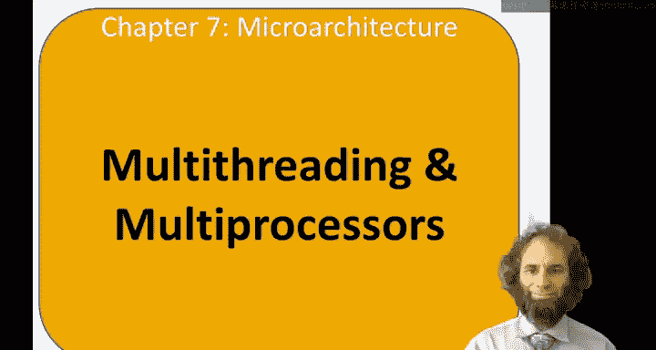
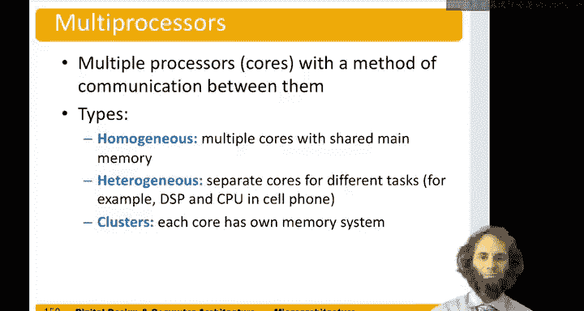

# 115：多线程与多处理器 🧵💻

在本节中，我们将学习多线程与多处理器的基本概念。我们将探讨什么是线程，以及如何通过多线程和多处理器技术来提高计算机系统的性能和效率。

## 概述

线程是程序的一部分，可以同时执行。在典型的计算机中，许多线程同时运行。例如，运行文字处理器时，可能有一个线程用于检测按键输入，另一个线程在后台检查拼写或语法，同时可能还有一个线程在打印文档，而所有这些操作都不会妨碍你继续打字。在一个应用程序中，可能有多个线程同时运行。此外，当你使用文字处理器时，可能还有视频在后台播放，或者正在下载电影或音乐。用户希望所有这些线程看起来是同时执行的。如果我们有足够的硬件，实际上可以让它们同时执行。

## 线程与进程

线程是程序的一部分，可以同时执行。进程是计算机上运行的程序，一个应用程序可能包含多个进程。一个进程可能由多个线程组成。

在传统的单核处理器中，一次只能运行一个线程。当一个线程停滞时，例如，当线程访问主内存并因缓存未命中而需要100个周期时，该线程可能会停滞。此时，该线程的架构状态可以被保存起来，另一个线程的架构状态可以被加载到寄存器文件和程序计数器中，以便新线程开始运行。这称为上下文切换。如果频繁进行上下文切换，用户会觉得所有线程都在同时运行，尽管它们实际上只是在非常快速地来回切换。

## 多线程技术

通过多线程技术，我们可以拥有多个架构状态的副本，例如多个寄存器文件副本和多个程序计数器副本。这样，我们可以有多个线程在同一时间处于活动状态。当一个线程停滞时，另一个线程可以立即开始执行。实际上，如果一个线程无法充分利用所有执行单元，我们可能会同时从另一个线程发出指令，以保持执行硬件的完全占用。

多线程并不会增加单个线程的指令级并行性，但它确实提高了系统的吞吐量。英特尔将这种技术称为超线程。

## 多处理器技术

多处理器是另一种技术，其中我们有许多处理器核心，它们之间通过某种方式进行通信。多处理器的一些例子包括同构多处理器、异构多处理器或集群。

在同构多处理器中，有许多相同的核心，通常共享一个共同的主内存，并通过读写该内存进行通信。异构多处理器中，核心类型不同。例如，在你的手机中，可能有一个四核CPU用于运行应用程序，一个数字信号处理器用于处理无线电信号，一个图形处理器用于视频加速，以及一个小处理器用于控制其他处理器的电源开关。集群是另一种类型，其中每个核心或核心组都有自己的内存系统，集群之间通过网络（如以太网）进行通信。集群之间的通信速度比集群内部的通信速度慢。

## 总结

在本节中，我们一起学习了多线程与多处理器的基本概念。我们了解了线程和进程的区别，探讨了多线程技术如何通过上下文切换提高系统吞吐量，以及多处理器技术如何通过同构、异构和集群等不同架构实现并行计算。希望这些知识能帮助你更深入地理解现代计算机架构的先进技术，并为未来的学习和实践打下基础。