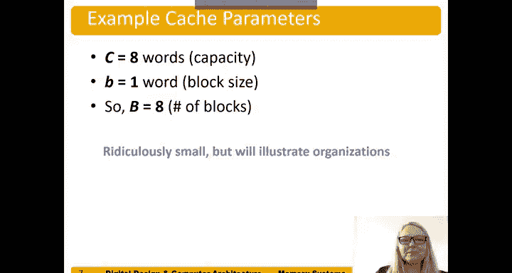

# 118：缓存介绍 🧠

在本节中，我们将学习计算机系统中一个至关重要的组件——缓存。缓存是内存层次结构中的最高层，它的设计目标是让处理器感觉访问内存的速度非常快。我们将探讨缓存的基本概念、工作原理以及设计时需要考虑的关键问题。

## 缓存概述与设计问题

上一节我们介绍了内存层次结构的概念，本节中我们来看看其中的核心——缓存。

缓存位于内存层次结构的最高层，其访问速度通常非常快，大约为一个处理器周期。理想情况下，它能向处理器提供所需的大部分数据。因此，对于处理器而言，内存的访问时间看起来就像是一个周期。缓存通常保存最近被访问过的数据。

当我们设计一个缓存时，主要讨论三个核心问题：
1.  缓存中存放什么数据？
2.  如何在缓存中找到数据？
3.  如果缓存已满，但需要载入新数据，如何替换旧数据？

在本次讨论中，我们将重点关注加载操作，但存储操作遵循相同的原则。

## 缓存存放的数据

那么，缓存中存放什么数据呢？本质上，缓存会预测处理器需要的数据并将其放入缓存。虽然无法准确预测未来，但我们可以利用过去来预测未来。

我们利用之前讨论过的局部性原理：时间局部性和空间局部性。
*   我们利用**时间局部性**，将新访问的数据复制到缓存中。这样，如果数据最近被访问过，它就已经在缓存中，为下一次访问做好准备。
*   **空间局部性**意味着，当我们访问某个数据时，也会将相邻地址（内存地址）的数据一并载入缓存。

## 缓存术语

以下是缓存相关的术语，我们将在后续讨论中使用它们。

*   **缓存容量（C）**：指缓存中存储的**数据字节**的数量。需要特别注意，这个数字仅指存储的数据量，缓存实际还会存储一些其他信息。
*   **块大小（B）**：指一次被载入缓存的数据字节数。这也被称为**行大小**。
*   **块数量（B）**：指缓存的总容量除以块大小（b）的结果，即 `B = C / b`。
*   **关联度（N）**：我们稍后会详细讨论。它指的是一个组（set）中包含的块（block）数量。
*   **组数量（S）**：每个内存地址会精确映射到其中一个组。组数量等于总块数除以关联度，即 `S = B / N`。

我们稍后将更详细地讨论最后两个术语。

## 数据的查找方式

缓存中的数据被组织成多个组（set），组数为 S。每个内存地址会精确映射到这些组中的一个。

缓存根据每个组中包含的块数进行分类：
*   **直接映射缓存**：每个组只有一个块。
*   **N路组相联缓存**（也简称为N路相联缓存）：每个组有N个块。
*   **全相联缓存**：所有缓存块都在一个单独的组中。

接下来，我们将逐一分析这些缓存组织结构。这里使用一个简化的示例来演示原理，实际缓存不会只有8个字（word）这么小，但这有助于阐明概念。

对于这些示例缓存，其参数如下：
*   容量（C）：8个字
*   块大小（b）：1个字（32位）
*   块数量（B）：8

用项目符号总结如下：
*   容量：8个字
*   块大小：1个字
*   块数量：8

---

本节课中我们一起学习了缓存的基本介绍。我们了解了缓存的设计目标、三个核心设计问题（存什么、怎么找、怎么换），以及利用局部性原理来预测数据需求。我们还定义了缓存的关键术语，如容量、块大小、关联度等，并简要介绍了三种主要的缓存组织结构：直接映射、组相联和全相联。在接下来的课程中，我们将深入探讨这些组织结构的具体工作原理。