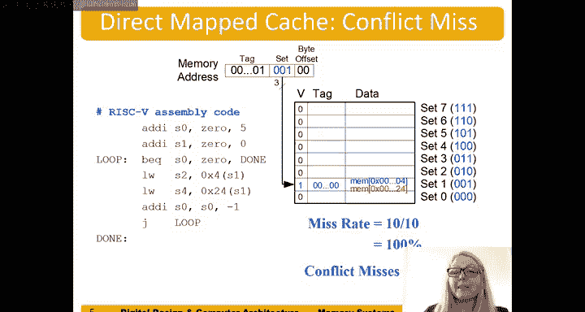

# 119：直接映射缓存 🧠


在本节中，我们将学习直接映射缓存的基本工作原理。我们将了解内存地址如何映射到缓存中的特定位置，以及缓存如何通过标签和有效位来识别数据。理解这些概念是掌握缓存设计的关键。

---

## 系统地址空间

首先，我们讨论一个直接映射缓存系统。该系统使用32位地址。

地址范围从0一直到全1（即0x00000000到0xFFFFFFFF）。图中显示的是字地址，因此地址的低两位始终为零。地址空间从十六进制的0x00000000一直到0xFFFFFFFC。

但只有这些地址数据的一个子集可以保存在缓存中。

---

## 缓存映射原理

我们采取的做法是：将前8个字（块）映射到缓存中。这8个字分别是字0到字7。如果只访问这前8个字，字0会进入缓存的位置0，字1进入位置1，依此类推，直到字7。

当缓存被填满后，接下来的8个字（字8到字15）也会映射到相同的缓存位置。例如，字8会重新映射到缓存底部的集合0，字9映射到集合1，以此类推。这意味着主存中的多个字可以映射到缓存的同一个位置。

如果访问了字0并将其载入缓存，随后再访问字8，那么字8的数据会“驱逐”字0的数据并替换它。这种设计被称为直接映射缓存。特定的字地址直接映射到给定的缓存集合。

---

## 缓存硬件结构

上图展示了一个直接映射缓存的硬件结构。我们从32位内存地址开始。

由于我们一次载入整个字，因此忽略地址的最低两位（字节偏移）。接下来的3位用于确定数据存放在哪个集合。因为有8个缓存条目（2^3 = 8），所以需要3位索引。

例如，地址0（字地址）的索引位是000，它映射到集合0。地址32（字地址8，因为8 * 4 = 32）的索引位也是000，同样映射到集合0。

地址中剩余的位被称为**标签**。标签用于标识具体是哪个地址的数据。例如，地址0的标签是0，而地址32的标签是1。我们必须将标签与数据一起存储在缓存中，以便区分映射到同一集合的不同数据。

此外，每个缓存条目还有一个**有效位**。当缓存是“冷”的（即未载入任何数据）时，所有有效位都是0。只有当数据被载入某个缓存条目时，其有效位才被设置为1。

这个缓存的尺寸可以看作是一个小型SRAM（静态随机存取存储器），每个条目的宽度是：1位（有效位）+ 27位（标签位）+ 32位（数据位）。因此，这是一个8行 x (1+27+32)位的SRAM。

---

## 缓存访问示例

假设我们执行指令 `lw t2, 0(x0)`，访问地址0。这是第一次访问，缓存未命中。我们从主存中取出数据（例如 `0x01234567`）载入缓存。同时，我们将标签设置为0，并将该条目的有效位设为1。

接着，执行指令 `lw t2, 32(x0)`，访问字地址32（内存地址32）。其索引位指向集合0。此时，缓存中集合0已有数据。由于标签不匹配（请求的标签是1，缓存中的标签是0），发生未命中。我们需要将地址0的数据“驱逐”出缓存，然后将地址32的数据（例如 `0xABCD1234`）和其标签（1）载入，并保持有效位为1。

如果下一条指令再次访问地址32，处理器会检查集合0。此时标签匹配（都是1），且有效位为1，因此发生**缓存命中**，数据可以直接从缓存中读取并发送给处理器。

反之，如果下一条指令访问地址0，处理器检查集合0，发现标签不匹配（请求0，缓存中是1），尽管有效位为1，但仍为**缓存未命中**。此时无法使用缓存中的数据，必须访问下一级存储层次（如主存）来获取数据，并将其载入缓存。

---

## 时间局部性示例

以下是一段RISC-V汇编代码示例，展示了时间局部性：

```assembly
addi s1, zero, 0
addi s0, zero, 5
loop:
lw t2, 4(s1)   # 访问地址 4
lw t2, 12(s1)  # 访问地址 12
lw t2, 8(s1)   # 访问地址 8
addi s0, s0, -1
bne s0, zero, loop
```

假设初始缓存为空（冷缓存）。
*   **第一次循环迭代**：三次`lw`指令都会未命中（强制性未命中），并将数据分别载入到集合1（地址4）、集合3（地址12）和集合2（地址8）。
*   **后续四次循环迭代**：所有对地址4、12、8的访问都会命中，因为数据已经在缓存中。

总访问次数：循环5次 * 3次加载 = 15次。
未命中次数：3次（仅第一次迭代）。
未命中率：3/15 = 20%。

此例体现了**时间局部性**：最近访问过的数据很可能再次被访问。最初的未命中属于**强制性未命中**，因为缓存初始为空。

---

## 冲突未命中示例

以下代码展示了冲突未命中：

```assembly
addi s1, zero, 0
addi s0, zero, 5
loop:
lw t2, 4(s1)   # 访问地址 4 (映射到集合1)
lw t2, 0x24(s1)# 访问地址 0x24 (也映射到集合1)
addi s0, s0, -1
bne s0, zero, loop
```

地址4（二进制...**001**00）和地址0x24（二进制...**001**00100）的索引位相同，都映射到**集合1**。
假设初始缓存为空。
*   **第一次迭代**：访问地址4，未命中，数据载入集合1。访问地址0x24，未命中，它驱逐地址4的数据，将自己载入集合1。
*   **第二次迭代**：访问地址4，未命中（因为数据已被驱逐），它驱逐地址0x24的数据，将自己载入。接着访问地址0x24，再次未命中，又驱逐地址4的数据。
*   此模式在每次循环中重复。

总访问次数：循环5次 * 2次加载 = 10次。
未命中次数：10次（每次访问都未命中）。
未命中率：10/10 = 100%。

这种因为不同数据映射到同一缓存集合而相互驱逐导致的未命中，称为**冲突未命中**。

---

## 总结



本节课我们一起学习了直接映射缓存的核心机制。我们了解了内存地址如何通过索引位映射到特定的缓存集合，并利用标签来唯一标识数据。通过示例，我们分析了**缓存命中**、**未命中**、**强制性未命中**和**冲突未命中**的情况。直接映射缓存结构简单，但可能因冲突未命中而导致性能下降，这是其设计上的一个权衡。理解这些基础是学习更复杂缓存组织方式（如组相联缓存）的重要前提。