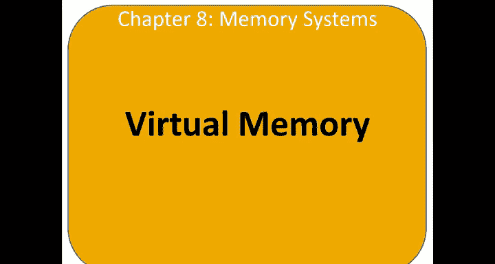
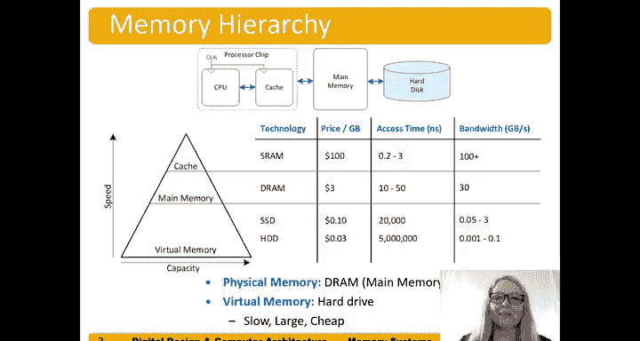
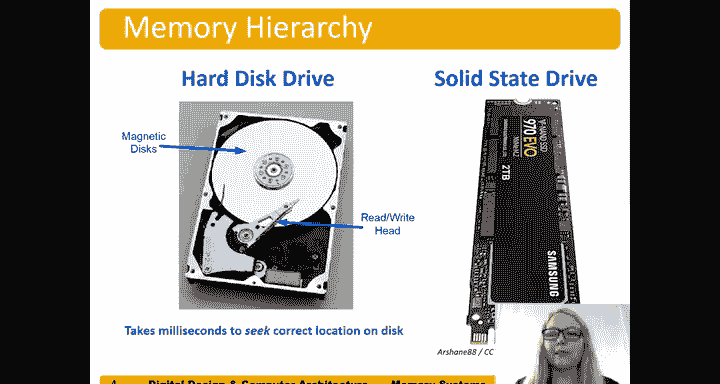
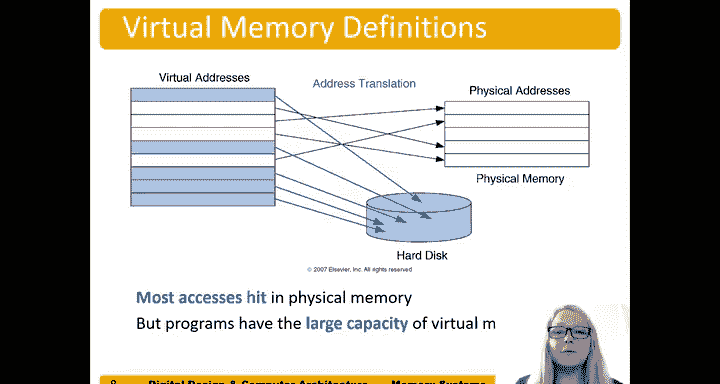

# 124：虚拟内存简介 💾

在本节中，我们将学习计算机内存层次结构中的最低一层——虚拟内存。我们将了解它如何利用硬盘来模拟更大的内存空间，以及它如何提供内存保护功能。

---

上一节我们介绍了内存层次结构中的缓存。本节中，我们来看看层次结构中的最后一级，即虚拟内存。

虚拟内存存储在硬盘上。它给程序制造了一种拥有更大内存的假象，而主内存（DRAM）则充当了硬盘的缓存。硬盘速度很慢，但容量非常大且成本低廉。

以下是两种常见的硬盘类型：
*   **硬盘驱动器**：包含可旋转的磁性盘片和读写磁头，访问时间在毫秒级。
*   **固态硬盘**：目前更常用，使用闪存芯片，没有机械部件，速度更快。

---

程序运行时使用的是**虚拟地址**，整个虚拟地址空间都存储在硬盘上。其中一部分数据子集被加载到主内存（DRAM）中。CPU负责将虚拟地址**翻译**成物理地址（即DRAM地址）。如果所需数据不在DRAM中，则需要从硬盘中获取。

除了能有效扩展可访问的内存容量，虚拟内存还提供了**内存保护**功能。每个程序都有自己独立的虚拟地址到物理地址的映射关系。因此，两个程序可以使用相同的虚拟地址来指向不同的物理数据。程序无需知道其他程序的存在，虚拟内存系统会处理这一切。这防止了一个程序（或病毒）错误地访问或修改另一个程序正在使用的内存。

---

虚拟内存与缓存系统有许多相似之处，我们可以进行类比：

以下是缓存与虚拟内存的关键概念对比：
*   **缓存块** ↔ **页**：缓存中一次传输的数据单位称为“块”；虚拟内存中，从硬盘加载到物理内存的数据单位称为“页”。
*   **块内偏移** ↔ **页内偏移**：用于定位块或页内的具体字。
*   **未命中** ↔ **缺页**：缓存中找不到数据称为“未命中”；虚拟内存中找不到对应页称为“缺页”。
*   **标记** ↔ **虚拟页号**：缓存中用于匹配的标识；虚拟内存中用于查找物理页的标识。

因此，物理内存（主存）实质上是虚拟内存的一个缓存。

---

以下是虚拟内存系统的几个核心概念：
*   **页大小**：指一次从硬盘传输到DRAM的内存容量。
*   **地址翻译**：将处理器生成的虚拟地址转换为物理地址的过程。
*   **页表**：一个用于实现从虚拟地址到物理地址转换的查找表。

我们可以通过一个示意图来理解：左侧是虚拟地址空间，其中一部分页（蓝色）仅存在于硬盘上。另一部分页则被加载到物理内存（主存）中，处理器可以直接访问它们，尤其是可以将其调入更快的缓存。大多数内存访问都能在物理内存中命中，但程序可以访问的虚拟地址空间容量要大得多。虚拟内存系统之所以能提供“容量大且速度快”的假象，正是得益于硬盘（虚拟内存）和DRAM（物理内存）之间的这种层次化协作。

---

本节课中我们一起学习了虚拟内存的基本原理。我们了解到虚拟内存如何利用硬盘扩展内存容量，并通过地址翻译和页表机制提供内存保护。同时，我们也看到了虚拟内存与缓存系统在概念上的相似性，这有助于我们理解整个内存层次结构是如何协同工作的。