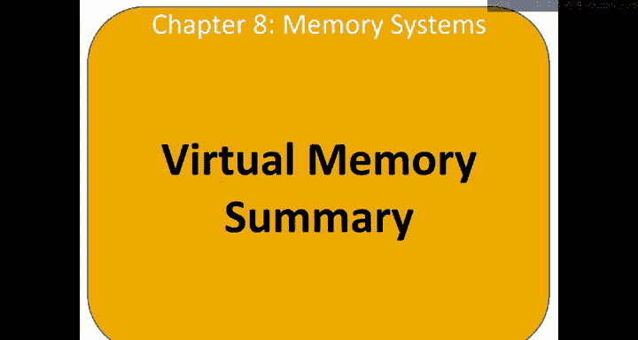
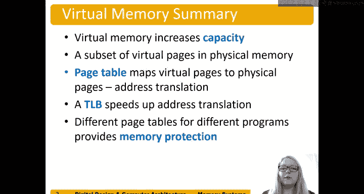

# 128：虚拟内存总结 🧠

在本节中，我们将对虚拟内存的核心概念进行总结。虚拟内存是现代计算机系统中管理内存的关键技术，它允许多个程序高效、安全地共享物理内存资源。

上一节我们介绍了虚拟内存的具体机制，本节中我们来看看它的核心优势与工作原理总结。

---

虚拟内存提供了内存保护功能。多个同时运行的程序或进程无法访问同一块物理内存，因为每个进程都拥有自己独立的页表。

每个进程都可以使用整个虚拟地址空间。例如，在我们的案例中，虚拟地址空间可达 2^31 字节（即 2 GB）的数据。进程不会因为其他进程也需要内存而被限制只能使用少量数据。

但是，一个进程在物理内存中只能访问其整个虚拟地址空间的一个子集。这些子集通过其自身的页表进行映射。因此，在任何给定时刻，只有该虚拟内存的一个子集可以被调入主内存。

虚拟内存增加了系统的有效容量。虽然只有虚拟页的一个子集在物理内存中，但系统给人的感觉是，你可以访问所有内存，只是不能同时访问全部。

以下是虚拟内存系统的核心组件：

*   **页表**：负责将虚拟页映射到物理页，并执行地址转换。
*   **TLB**：即**翻译后备缓冲器**，用于加速地址转换过程。

不同的程序拥有不同的页表，每个程序都有自己的页表。这为进程之间提供了内存保护，防止一个进程覆盖另一个正在运行的程序所使用的数据。

---

本节课中我们一起学习了虚拟内存的总结。我们了解到，虚拟内存通过为每个进程提供独立的虚拟地址空间和页表，实现了内存保护和多程序并发运行。它利用页表进行地址映射，并通过TLB来提升性能，使得有限的物理内存能够高效地支持更大的虚拟地址空间。