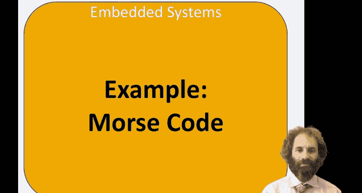
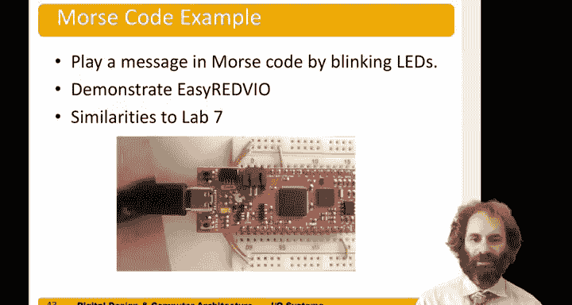
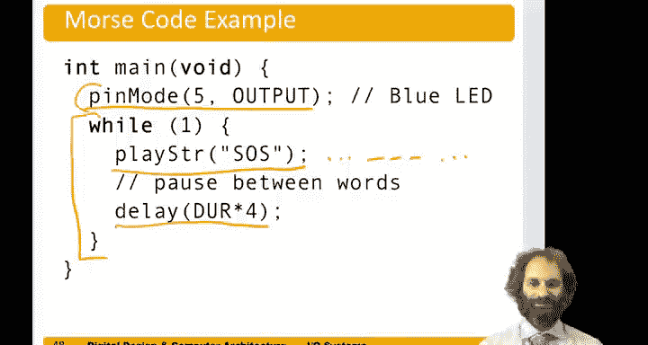

# 135：摩尔斯电码示例 📡



在本节中，我们将综合运用之前学到的GPIO、定时器和设备驱动程序知识，构建一个能够播放摩尔斯电码信息的系统。这个系统将控制蓝色LED灯的闪烁，演示EasyRed5 IO设备驱动库的使用，并且与实验7的内容有相似之处。

## 概述



我们将编写一个程序，通过LED灯的闪烁来发送“SOS”的摩尔斯电码信号。程序的核心包括定义摩尔斯电码表、编写播放单个字符和字符串的函数，以及使用EasyRed5库来控制GPIO引脚。

## 程序结构

首先，我们定义程序的基本框架，包括头文件引用和常量定义。

```c
#include "easyred5io.h"
#define DURATION 100 // 定义最短时间间隔为100毫秒
```

接下来，我们需要定义摩尔斯电码表。摩尔斯电码由点和划组成，点代表短脉冲，划代表长脉冲。每个字母对应一串点和划的组合。

```c
const char* morse_codes[26] = {
    ".-",   // A
    "-...", // B
    "-.-.", // C
    // ... 其他字母的定义
    "...",  // S
    // ... 继续定义直到Z
};
```

## 播放单个字符

现在，我们编写一个函数来播放单个字符。该函数接收一个字符作为输入，并根据摩尔斯电码表控制LED灯的闪烁。

```c
void play_char(char c) {
    const char* code = morse_codes[c - 'a']; // 获取字符对应的摩尔斯电码
    int i = 0;
    while (code[i] != '\0') { // 遍历电码字符串直到结束符
        digital_write(5, HIGH); // 打开LED
        if (code[i] == '.') {
            delay(DURATION); // 点：等待100毫秒
        } else if (code[i] == '-') {
            delay(DURATION * 3); // 划：等待300毫秒
        }
        digital_write(5, LOW); // 关闭LED
        delay(DURATION); // 字符内间隔：等待100毫秒
        i++; // 处理下一个点或划
    }
    delay(DURATION * 2); // 字符间间隔：等待200毫秒
}
```

## 播放字符串

为了播放完整的消息，我们需要一个函数来遍历字符串中的每个字符，并依次播放它们。

```c
void play_string(const char* str) {
    int i = 0;
    while (str[i] != '\0') { // 遍历字符串直到结束符
        play_char(str[i]); // 播放当前字符
        i++; // 移动到下一个字符
    }
}
```

## 主程序

最后，我们在主函数中初始化GPIO引脚，并设置一个无限循环来持续播放“SOS”信号。

```c
int main() {
    pin_mode(5, OUTPUT); // 设置引脚5为输出模式
    while (1) {
        play_string("sos"); // 播放“SOS”
        delay(DURATION * 4); // 单词间间隔：等待400毫秒
    }
    return 0;
}
```

## 总结



在本节中，我们一起学习了如何构建一个摩尔斯电码播放系统。我们定义了摩尔斯电码表，编写了播放字符和字符串的函数，并利用EasyRed5 IO库的`pin_mode`和`digital_write`函数来控制LED灯。通过这个示例，你将GPIO操作、定时延迟和字符串处理综合应用到了一个完整的项目中。