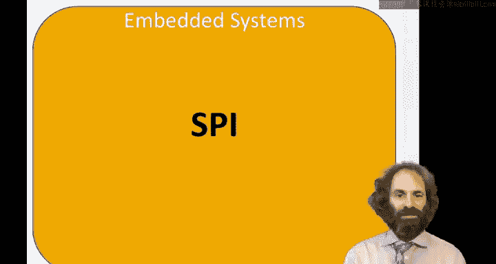
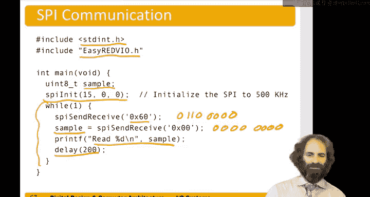

# 137：SPI接口 🧩



在本节课中，我们将学习串行外设接口（SPI）。这是一种使用少量连线连接设备的简单通信协议。我们将了解其工作原理、信号定义、配置方法，并学习如何编写代码来使用SPI进行通信。

## SPI概述

SPI是一种简单的通信方式，仅需几根线即可连接设备。在一个SPI系统中，有一个主设备与一个或多个从设备通信。主设备发出时钟信号和数据输出信号，从设备则用数据输入信号响应。主设备还可以选择性地发送从设备选择信号，以指定与多个从设备中的哪一个通信。

## SPI信号

以下是SPI通信中涉及的主要信号：

*   **SCK/SCLK（串行时钟）**：由主设备生成，每个传输的位对应一个脉冲。
*   **MOSI（主出从入）**：从主设备发送到从设备的串行数据。
*   **MISO（主入从出）**：从从设备发送回主设备的串行数据。
*   **SS/CS（从设备选择/片选）**：由主设备发出，用于选择特定的从设备。该信号通常是低电平有效。

SPI的一个优点是，从设备的硬件可以只是一个移位寄存器。主设备生成时钟，并通过MOSI线发送数据。在时钟的每个边沿，从设备捕获一位数据，并可能通过MISO线发回自己的数据。

## 连接方式

SPI的连接方式灵活。以下是几种常见配置：

*   **单主单从**：这是最简单的配置。由于只有一个从设备，从设备选择信号可以始终拉低（使能），或者在某些情况下可以省略。
*   **单主多从**：主设备与多个从设备通信。SCK和MOSI信号连接到所有从设备，MISO信号从所有从设备连回主设备（但同一时刻只能有一个驱动）。主设备为每个从设备提供独立的从设备选择信号。
*   **重要提示**：必须将所有设备的**地（GND）** 连接在一起，以确保电压参考一致，否则通信可能不可靠。

从设备选择信号通常低电平有效。禁用从设备可以降低功耗。连接方式有多种选择：如果只有一个从设备且不关心功耗，可以将其片选引脚永久拉低；对于多个从设备，可以使用GPIO引脚在SPI事务前后控制片选，或者使用支持自动生成片选脉冲的SPI控制器。

## 配置SPI通信

上一节我们介绍了SPI的基本连接，本节中我们来看看如何配置SPI控制器以启动通信。通常需要遵循以下步骤：

1.  **选择SPI端口**：确定使用哪个SPI硬件模块。
2.  **配置引脚模式**：将用于SCK、MOSI、MISO以及可选的SS的GPIO引脚设置为SPI功能模式（而非通用输入/输出）。
3.  **设置波特率**：决定通信速度。在面包板等实验环境中，建议将时钟频率设置为1MHz或更低，以确保信号完整性。
4.  **设置时钟极性和相位**：这两个参数定义了数据采样相对于时钟边沿的关系。对于大多数设备，将两者都设置为0即可正常工作。具体含义如下：
    *   **时钟极性（CPOL）**：0表示时钟空闲时为低电平；1表示时钟空闲时为高电平。
    *   **时钟相位（CPHA）**：0表示在第一个时钟边沿采样数据；1表示在第二个时钟边沿采样数据。
5.  **其他配置**：通常使用默认设置即可，但某些设备可能需要配置其他控制寄存器。

## 数据传输过程

配置好SPI后，就可以进行数据传输了。以下是发送和接收数据的基本流程：

1.  **发送数据**：
    *   检查发送数据寄存器中的“满”标志位。必须等待该标志为0（表示有空闲位置）才能发送新数据。
    *   将待发送的字节写入发送数据寄存器的数据字段。SPI硬件会自动开始工作，生成8个时钟脉冲，并逐位发送数据。
2.  **接收数据**：
    *   在发送数据的同时，SPI也会通过MISO线接收来自从设备的8位数据。
    *   读取接收数据寄存器，并检查其“空”标志位（通常是最高位）。如果为1，表示接收数据仍为空，需要持续读取直到该标志变为0。
    *   当“空”标志为0时，读取接收数据寄存器的数据字段，即可获得从设备返回的数据。**注意**：读取操作会同时将数据从接收队列中取出，因此每个有效数据只能读取一次。

## SPI寄存器映射

为了编程控制SPI，我们需要了解其内存映射的寄存器。以下是一些关键寄存器（以某个具体芯片为例）：

*   **波特率寄存器**：低12位用于设置时钟分频值。SPI时钟频率计算公式为：
    `F_sck = F_ahb / (2 * (div + 1))`
    例如，若系统时钟`F_ahb`为16MHz，分频值`div`设为15，则SPI时钟频率为 16MHz / (2 * 16) = 0.5MHz。
*   **时钟模式寄存器**：最低两位分别控制时钟相位和极性。
*   **发送数据寄存器**：
    *   位[31]：“满”标志。
    *   位[7:0]：待发送的数据字段。
*   **接收数据寄存器**：
    *   位[31]：“空”标志。
    *   位[7:0]：接收到的数据字段。

我们可以使用C语言的结构体和位域来方便地访问这些寄存器。例如，定义波特率寄存器的结构体：
```c
typedef struct {
    uint32_t div : 12; // 低12位为分频值
    uint32_t : 20;     // 高20位保留未用
} sck_div_bits;
```
然后，定义一个完整的SPI外设结构体，包含这些寄存器在内存中的偏移地址。

## 编写SPI驱动程序

现在，让我们将理论知识付诸实践，编写一个简单的SPI设备驱动库。核心是初始化和收发函数。

首先，我们需要一个初始化函数来配置SPI。该函数需要设置引脚模式、波特率、时钟极性和相位。
```c
void spi_init(uint16_t clock_div, uint8_t phase, uint8_t polarity) {
    // 1. 配置SCK, MOSI, MISO引脚为SPI功能模式（IO Function 0）
    pin_mode(SCK_PIN, IO_MODE_FUNC0);
    pin_mode(MOSI_PIN, IO_MODE_FUNC0);
    pin_mode(MISO_PIN, IO_MODE_FUNC0);

    // 2. 配置波特率
    SPI1->sck_div.div = clock_div;

    // 3. 配置时钟极性和相位
    SPI1->sck_mode.phase = phase;
    SPI1->sck_mode.polarity = polarity;
}
```
其次，我们需要一个收发函数。该函数发送一个字节，并接收从设备返回的一个字节。
```c
uint8_t spi_transfer(uint8_t data_to_send) {
    // 等待发送寄存器非满
    while (SPI1->tx_data.full) {
        // 空循环等待
    }
    // 写入要发送的数据
    SPI1->tx_data.data = data_to_send;

    // 等待接收寄存器非空，并读取数据
    uint8_t received_data;
    while (1) {
        received_data = SPI1->rx_data.data; // 读取整个寄存器（包含空标志位）
        if (!SPI1->rx_data.empty) { // 检查空标志位
            break; // 数据有效，跳出循环
        }
        // 若为空，则继续等待
    }
    return received_data;
}
```
**注意**：上面的`spi_transfer`函数示例中，`SPI1->rx_data`是一个结构体，其`empty`成员代表“空”标志位。读取`data`字段和检查`empty`标志是原子操作，实际实现需参考具体硬件的数据手册。

## 引脚模式函数扩展

为了支持SPI，我们需要扩展之前课程中提到的`pin_mode`函数，使其能够将GPIO引脚设置为特殊的“IO功能”模式（如SPI），而不仅仅是输入或输出模式。这通常涉及设置GPIO功能使能位和功能选择位。
```c
typedef enum {
    GPIO_MODE_INPUT,
    GPIO_MODE_OUTPUT,
    GPIO_MODE_FUNC0, // 例如SPI
    GPIO_MODE_FUNC1  // 其他外设功能
} gpio_mode_t;

void pin_mode(uint8_t pin, gpio_mode_t mode) {
    // ... 根据mode参数配置相应的GPIO控制寄存器位 ...
}
```

## 示例程序

最后，让我们看一个使用上述驱动进行SPI通信的简单示例程序。
```c
#include <stdint.h>
#include "io_red5.h" // 包含我们的GPIO和SPI驱动头文件

int main() {
    uint8_t sampled_value;

    // 初始化SPI：500kHz时钟，相位0，极性0
    spi_init(15, 0, 0); // 假设分频值15对应500kHz

    while (1) {
        // 发送数据 0x60 (二进制 0110 0000) 并接收返回数据
        sampled_value = spi_transfer(0x60);

        // 可以在这里处理或打印接收到的数据 sampled_value
        // print_value(sampled_value);

        // 短暂延时
        delay_ms(100);
    }
    return 0;
}
```
这个程序会持续向从设备发送数值`0x60`，并读取从设备返回的响应。

## 总结



本节课中我们一起学习了串行外设接口（SPI）。我们从SPI的基本概念和信号定义开始，了解了其主从架构和连接方式。接着，我们深入探讨了如何配置SPI的波特率、时钟极性和相位。然后，我们学习了SPI数据传输的流程，包括如何检查状态标志、发送和接收数据。最后，我们通过分析寄存器映射、编写初始化函数、数据收发函数以及一个简单的示例程序，将理论知识转化为实际的编程技能。SPI是一种高效、简单的同步串行通信协议，广泛应用于传感器、存储器、显示器等外设与微控制器的连接中。