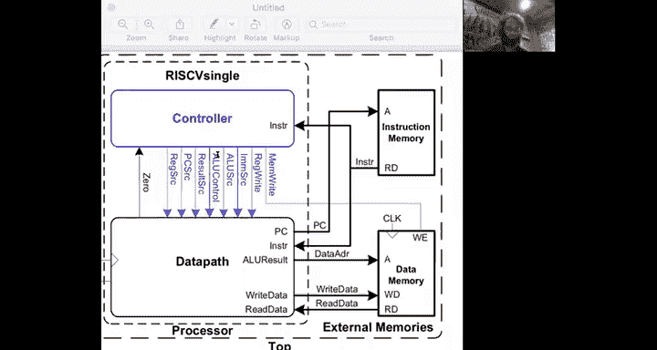
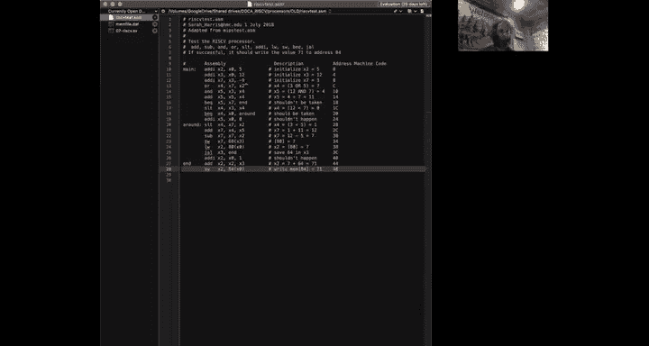

# 数字设计和计算机架构：7.6a：单周期处理器测试平台 🧪

在本节中，我们将学习单周期RISC-V处理器的顶层模块设计，并了解如何通过一个测试程序来验证其功能正确性。

上一节我们介绍了处理器的核心组件，本节中我们来看看如何将它们集成并测试。

## 系统总体设计

我们的系统由一个RISC-V处理器构成，该处理器包含数据通路和控制器。通常，存储器位于处理器核心外部，因此我们将指令存储器和数据存储器独立出来。

数据通路将程序计数器发送给指令存储器，以获取指令。指令存储器通过其读数据端口返回指令，该指令会同时发送给数据通路和控制器。

为了访问数据存储器，数据通路会将ALU结果信号作为数据地址发送到数据存储器的地址端口，并将正确的数据值发送到数据存储器的写数据端口。数据通路将从存储器的读数据端口接收读数据信号。数据存储器还有一个写使能信号，称为 `MemWrite`，由控制器产生。

控制器接收指令，并基于指令产生一系列控制信号。当ALU结果为零时，数据通路会向控制器回复 `Zero` 信号。数据通路和控制器都接收时钟信号和复位信号，复位信号用于将程序计数器初始化为起始地址，以便逐条执行指令。

## 测试策略

现在，让我们切换到测试平台。测试处理器有几种策略：一种是系统性的方法，应用大量测试来单独检查每种指令；另一种是更整体但临时的测试方法，即运行一个能执行所有指令的程序，然后检查程序最终是否产生正确的结果。

对于这个简单的处理器，我们将采用第二种方法，即运行一个测试程序。

以下是该测试程序的流程和预期结果：

*   **`addi x2, x0, 5`**：将值 `5` 存入寄存器 `x2`。
*   **`addi x3, x0, 12`**：将值 `12` 存入寄存器 `x3`。
*   **`addi x7, x3, -9`**：计算 `12 - 9`，将结果 `3` 存入寄存器 `x7`。这测试了负数的加法。
*   **`or x4, x7, x2`**：计算 `3 OR 5`（二进制 `0011 OR 0101`），将结果 `7` 存入寄存器 `x4`。
*   **`and x5, x3, x4`**：计算 `12 AND 7`（二进制 `1100 AND 0111`），将结果 `4` 存入寄存器 `x5`。
*   **`add x5, x5, x4`**：计算 `4 + 7`，将结果 `11` 存入寄存器 `x5`。
*   **`beq x5, x7, end`**：比较 `x5`（11）和 `x7`（3），它们不相等，因此分支**不执行**。这测试了条件不满足时的分支。
*   **`slt x4, x3, x4`**：判断 `x3`（12）是否小于 `x4`（7），结果为假（0），将 `0` 存入寄存器 `x4`。
*   **`beq x4, x0, around`**：判断 `x4`（0）是否等于 `x0`（0），结果为真，因此分支**执行**，跳转到 `around` 标签处。这测试了条件满足时的分支，并跳过了下一条可能破坏 `x5` 值的 `addi` 指令。
*   **`slt x4, x7, x2`**：在 `around` 标签处，判断 `x7`（3）是否小于 `x2`（5），结果为真（1），将 `1` 存入寄存器 `x4`。这测试了 `slt` 指令能产生 `0` 和 `1` 两种结果。
*   **`add x7, x4, x5`**：计算 `1 + 11`，将结果 `12` 存入寄存器 `x7`。
*   **`sub x7, x7, x2`**：计算 `12 - 5`，将结果 `7` 存入寄存器 `x7`。
*   **`sw x7, 68(x3)`**：将 `x7` 的值（7）存储到内存地址 `x3 + 68` 处。`x3` 为 `12`，所以地址是 `80`。这测试了向内存写入数据。
*   **`lw x2, 80(x0)`**：从内存地址 `x0 + 80`（即地址 `80`）加载数据到 `x2`。`x2` 现在应该得到值 `7`。这测试了从内存读取数据。
*   **`jal x3, end`**：执行跳转并链接指令，跳转到 `end` 标签。这测试了跳转指令，并跳过了下一条可能破坏 `x2` 的指令。同时，返回地址（下一条指令的地址，假设为十进制 `64`）应被存入 `x3`。
*   **`add x2, x2, x3`**：在 `end` 标签处，计算 `x2`（7）加上 `x3`（返回地址 `64`），将结果 `71` 存入 `x2`。
*   **`sw x2, 84(x0)`**：最后，将 `x2` 的值（71）存储到内存地址 `84` 处。

如果处理器设计有任何错误，程序执行过程中就可能出错，最终导致向地址 `84` 写入的值不是 `71`。因此，通过监控内存地址 `84` 的最终值，我们可以判断处理器是否工作正常。

## 生成机器码

接下来，我们需要将这个RISC-V汇编程序翻译成机器语言。这是一个繁琐的过程，最好使用汇编器来完成。最终，我们得到了与18条汇编指令对应的18条机器语言指令。

本节课中我们一起学习了单周期RISC-V处理器的顶层模块连接方式，并通过一个精心设计的测试程序来验证其功能。测试程序涵盖了算术、逻辑、访存、分支和跳转等关键指令，通过检查程序最终向特定内存地址写入的预期值（71），可以有效地判断处理器设计的正确性。