# 哈维穆德学院《数字设计和计算机架构RISC版｜Digital Design and Computer Architecture： RISC-V Edition》 - P101：Chapter 7 6b.Single-Cycle Processor SystemVerilog.zh_en - GPT中英字幕课程资源 - BV1JC1MY1E7F

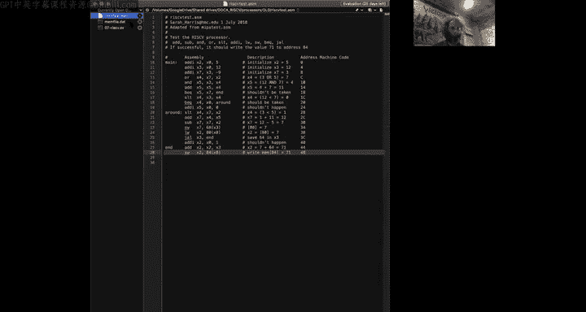

Now， let's talk about the risk5 verlog。So。Here's our very file， starts out with the name of the file。

 what it's for， and who wrote it and when and how to get a hold of them。Next。

 I like to indicate on a complex design， how to test whether the design is correct。

 so saying we can simulate it model SimM by typing in run 200。And if the result is correct。

 we should see the message simulation succeeded when the value 71 is written to address 84。

 and I'm showing it in both heodadeimal and decimal because we might be viewing it either way。Next。

 define what exactly this module is implementing， so this is our single cycle processor doing the instructions load。

 store， add subtract， and or set less than， add immediate branch of equal， jump and like。

 just like we worked our way through in the data path in the controller for the single cycle process。

So talk about what's not built， so this doesn't do exceptions， traps or interrupts。

 and it uses a little Indian memory。

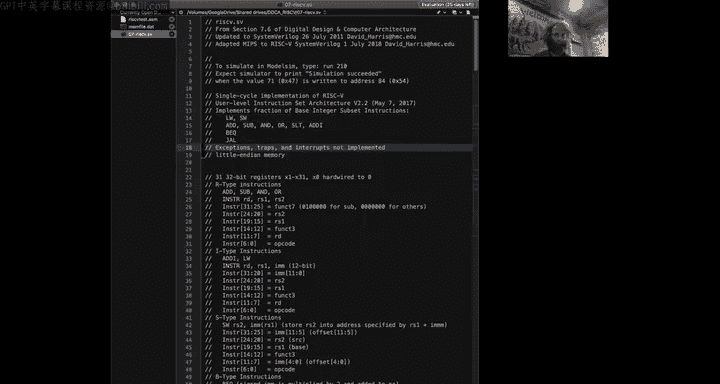

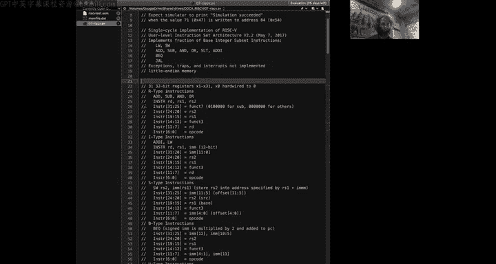

Next， I give some more detail about which instructions were implemented。So we've got the  32。

 32 bit registers plus including x0， which is headwire to zero。

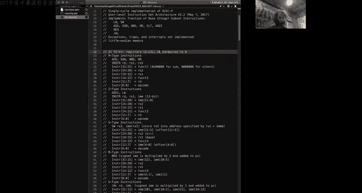

Here's the different types of instructions that were implemented。For instance。

 the art type instructions ands say add Subtract and an or and the fields of those instructions I do that for each different type of instruction to make it easy when I'm coding up the system to remember what I need to implement。

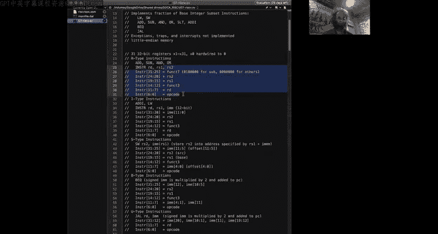

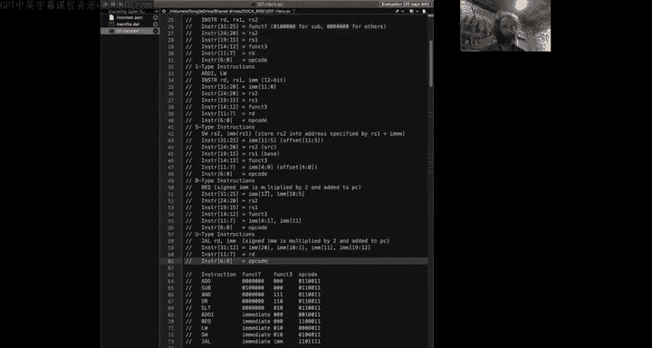

And I also have a handy table of which fields do for these instructions。

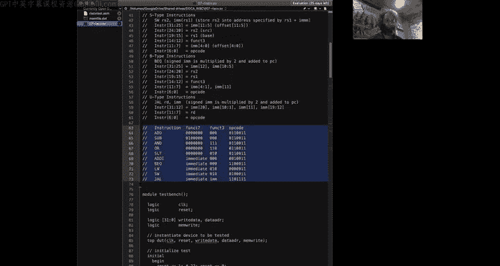

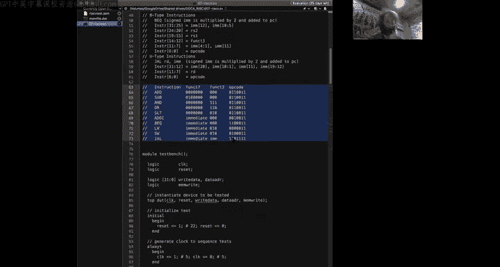

Now let's take a look at the test bench， so the test bench should instantiate the device under test。

 it should apply a clock in a reset and it should check if the result is correct。

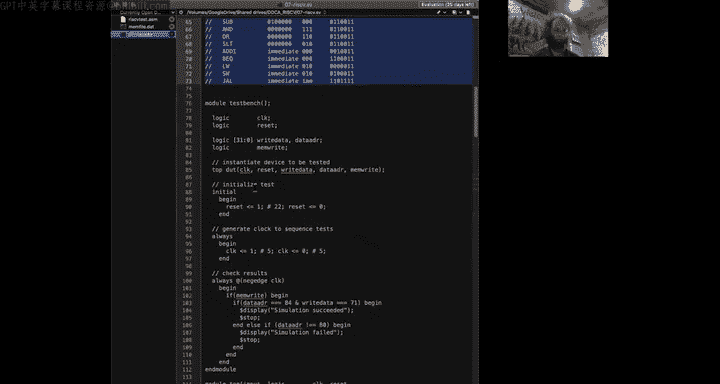

So here is the device under test。This is the entire processor including the data path。

 controller and memories， and we're giving it the clock and reset， and we're getting back right data。

 data address and Meite to be able to see what is happening on your memories。

These lines were generating a clock with a period of 10 units。

And here we're applying a reset for 22 units， or just over two clock cycles。

 so we reset this thing for the first two cycles and then it can run ahead。

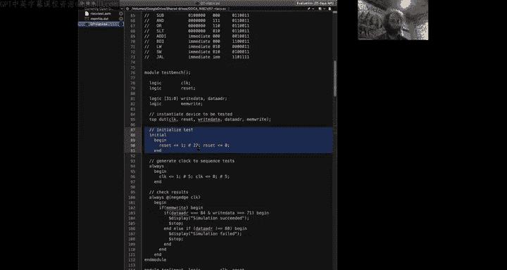

Now to see if the answer is correct。We said we should write the value 71 to address 84。

 if it's correct。So each cycle on the negative edge of the clock will take a look at the memory rate Sigma that's true that memory rights is taking place。

And if we're writing the correct value to the correct address。

 we'll indicate the simulation succeeded。We also had a store to address 80。

 so if there's a store to 80， we'll ignore that because that wasn't the end of things。

 but otherwise if we' were writing any different value to any different address。

 then the program went，Heywire， something wasn't right and we'll say that simulation failed。

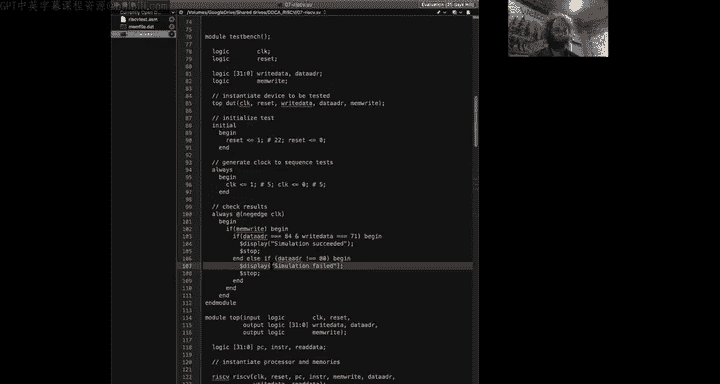

All right， so now let's take a look at the top level module。

Top level module was one from our picture， had the processor， instruction memory and the data memory。

And they were hooked up with a program counter instruction going from the processor to the instruction memory and the data memory。

 getting memory write， data address， write data， and read data to connect to the processor。

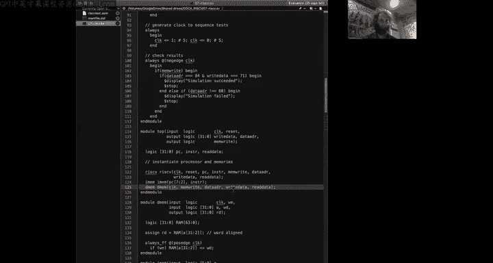

The data memory looks just like we talked about in chapter5 its a。

Process and memory with a read port and a write court， so it's got。

64 words of memory each 32 bits wide。To read。This is the syntaxt to read。

And we write synchronously on the rising edge of the clock when the right enable signal is true。

 then we write the desired address with the desired data。

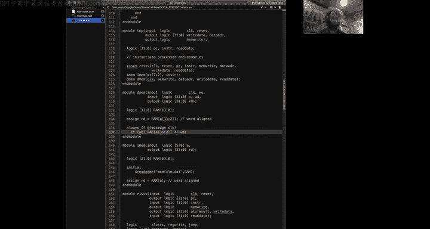

The instruction memory。It also has 64 words。And。嗯。We initialize it with our program from mephi。

 so we read these 18 machine language instructions into the first 18 words。

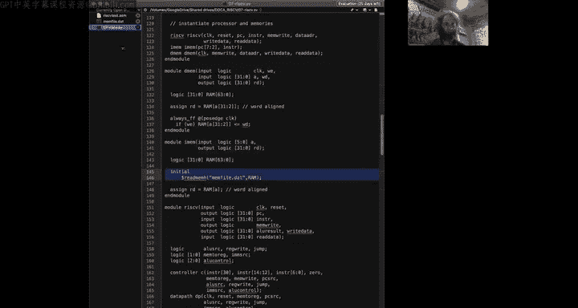

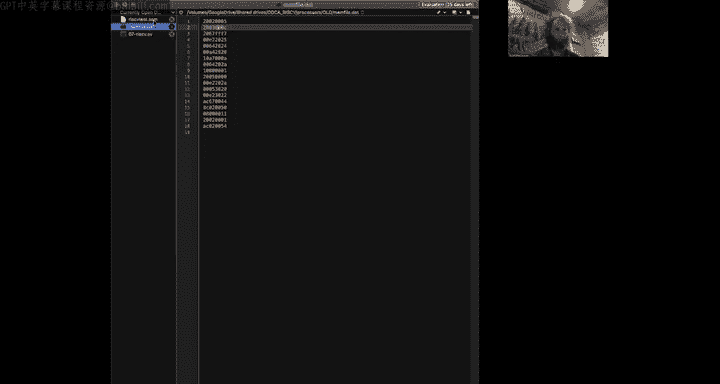

Of the members。And for the memory to read， this is the idiom for reading a memory。

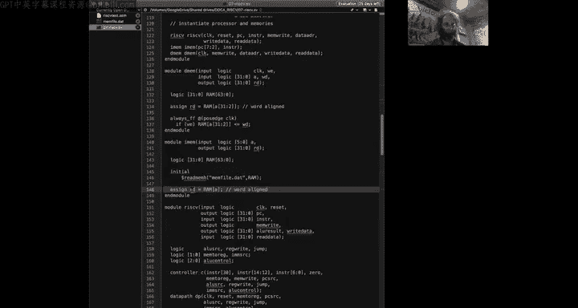

Now let's go into the processor。So the processor consisted of the data path。

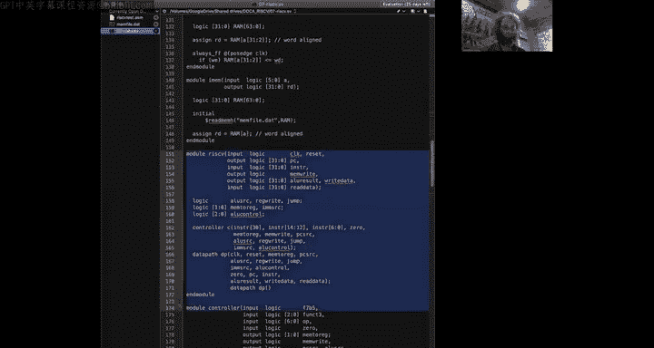

And the controller。And。你。啊，熟水嘅。Junks sit in here。The data path。Obviously the clock and reset。

And a bunch of control signals。It produced the zero output。

To send to the controller and had some 32 bit buses to communicate with the memories。

The controller receives the instruction。In several different fields。

 it also receives a zero signalma from the data path。

And it produces the control signals for the data path。

And remember that we need to declare any signals connecting in between the blocks。In very log。

 you should always declare all of your internal signals if they are not declared verlog assumes they're a single bit so things like。

T to add immediate source or ALU control would misbehave because they had the wrong number of bits。

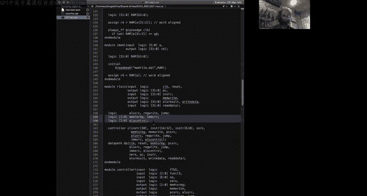

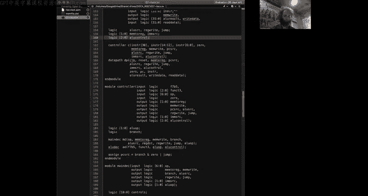

Now we'll continue our process of hierarchy， decompose each block into subblocks， so the controller。

Consists of a main decoder that takes the op field and produces most of the control signals。

There is also the ALU decoder that takes ALU up and a few bits of the instruction。

And produces the3 bit AluU control signal to their controller and sorry to the AluU。And finally。

 the logic to compute PC source whether to change the program counter。

 we did that when you have a taken branch， so branch and the result is zero。

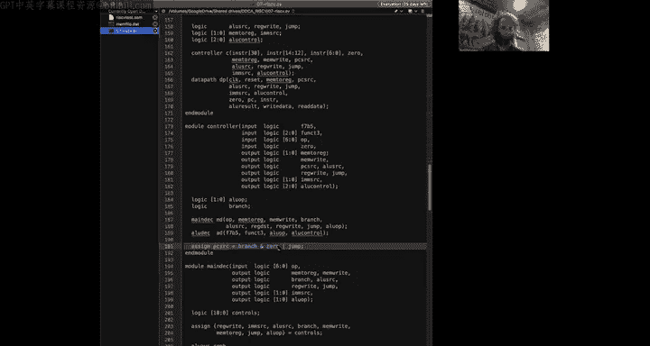

Or if we're doing a jump， then we want to change the program count， All right。

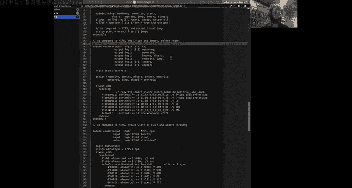

So let's take a look at the main decoder。The main decoder， as we described in the controller section。

 takes a seven bit up field and it produces a bunch of control sick。

So we described it as a few thing。In the system Blog。

 the typical idiom for truth table is a case statement。

So we have cases for the different out fieldss corresponding different instructions。

We could for each case。Have a beginning and an end and a whole bunch of assignments to give the different control signals to value。

That's kind of tedious to type it over and over， so instead let's define a 11 bit bus called controls that will have all of the control segments。

So。We'll give controllers a value in the case statement and then we'll break it apart into the different controller outputs。

So for example， if opP is 011，0011， that's an R type instruction op code。

And the control signals would be one for Ridge right。你逼。Xx。For immediate source。Because。

For our type instructions， the immediates not used， so don't care。

ALU source is 00 sorry zero because we're choosing the source B from the register file rather than the immediate。

Branch is zero because an our tech instruction is not a branch。

Mem rate is zero because I type instruction don't right to the memory。N Ri is0，0。Because。没人。

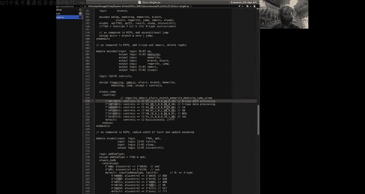

This is also the results source signal。Because we。I taking off from the alienium。

Jump is zero because it's not a jump instruction。And Alu up is 10 because we need to look at the function field of the instruction to say what kind of AluU instruction。

So the other control signals are similar， there's a default case that puts out x's for everything。

 so if we get a bad instruction in， we should get a bunch of x's into our simulation。

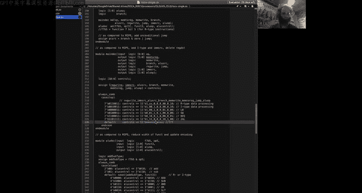

So that's the main deco。

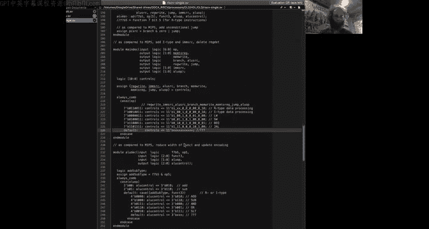

ALU decoder is a similar style， it's also described as a truth table。

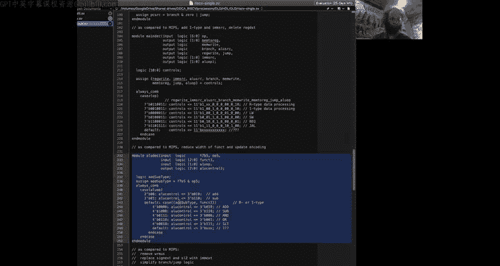

And so。We can look at AOU opp。And the bits of the instruction， and based on that。

 produce the ALU control signal。

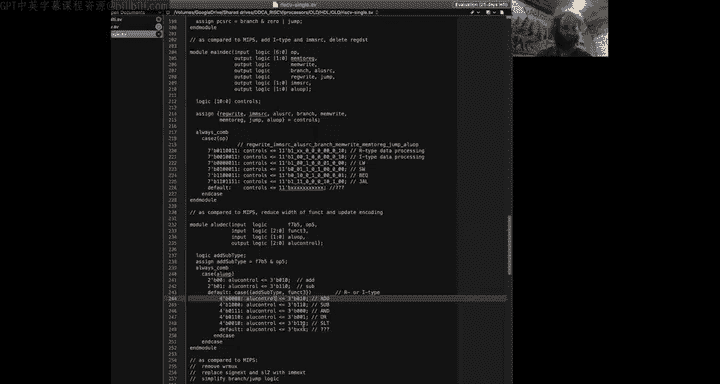

For each possible。They you up an instruction。

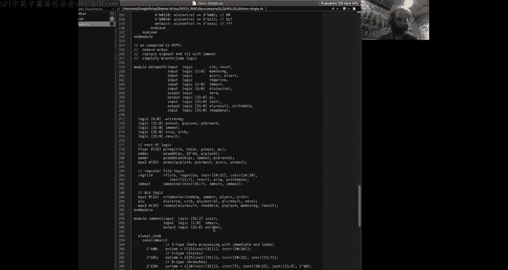

Now we have the data path。So the data path we see is clock and reset。Extterernly。

It receives a number of control signals from the control tro。

 but it returns the zero flag to the controller。And it puts out some 32 bit buses to talk to。

Here's some internal signals。嗯。嗯。Have program counter， immediate source A。

 source B and result and so on。

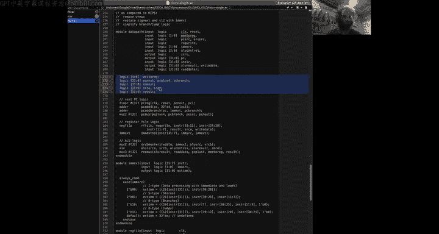

So。Here's。😔。

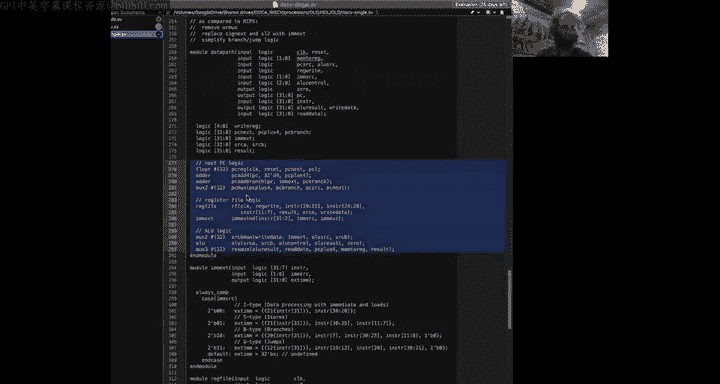

Different pieces for the next program counter， we have a foot shot。It's the plug in China。

We have the adder to do PC Que4， another adder for branch and the multiplea to choose。嗯。Weer。

Next PC was PC+4， a PC plus the branch offset set。And PC source was the control signal to do that。

Then we have the registered file。That tick clock。It takes。

The three different Reg addresses are asked for source one， source two and destination。It takes。

The value to write。Then we're writing the result。And it reads out the two sources on the buses called Soay and right dip。

We also have an immediate extender。That takes the bits of the instruction and the IMM source control signal and puts out the appropriate media。

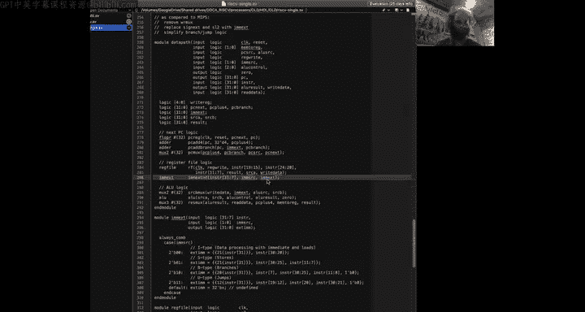

Finally， we have this stuff around the ALU， so we have the source BM that chooses the input from either the second source of the register file or from the immediate sign extender。

Based on alien source。That source speed。Now the ALU operates on source A and source B。

 the operation is described by AU control， the result， it goes on to ALU result and。

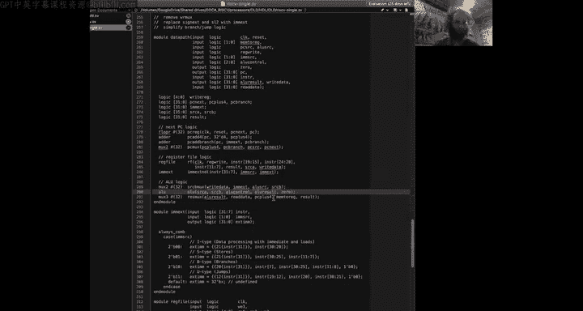

They also put out the control signal zero the flag to indicate whether the result is zero。

And finally， we had the result。

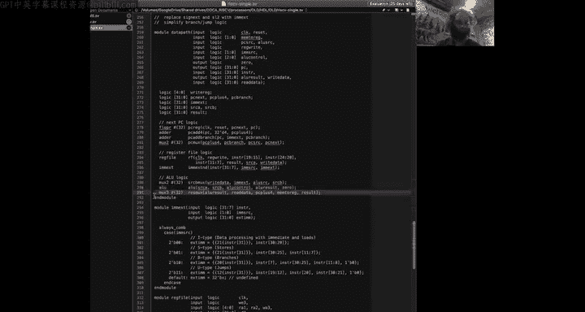

Here's the immediate extension logic， so there are four possibilities of IMM source。

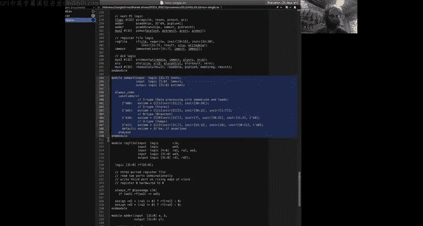

For I type S type B type a new type instructions， and we create the extended immediate by appropriately swizzling the immediate bits out of the instruction。

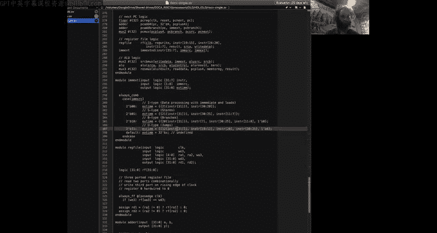

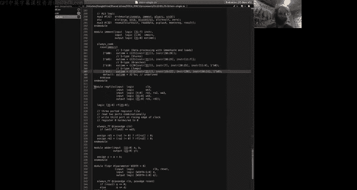

Here's our register file， this is a standard3 party register file like we described in chapter。

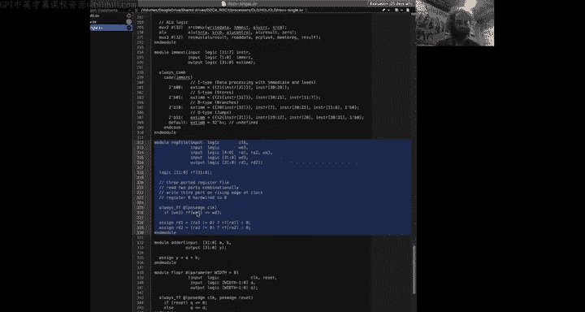

Five， it's got。32 entries and 32 bits each。It's synchronous。

 so it takes a clock and it write enable ports one and two are to read port。

 so take an address on port one and an address for port two and we'll read out data for port one and data for port two。

Port three is the right port， so it also takes an address， takes the data to write。

 and it takes it right and able to say whether to write。So to do the right。

 we write synchronously on the rising edge of clock， if the right enable for port3 is true。

 then we write to the address registered specified by WA3 data specified by WD3。To do the reads。

We check if the meat address is zero， that's Reg zero， Reg zero should be hardwired to zero。

So if it's not register zero， then we return the value from that address of the register file。

 otherwise we just return zero。

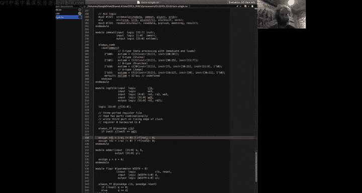

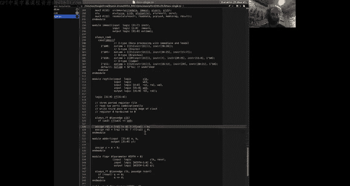

Finally， there's other miscellaneous blocks。So this was the idiom for an adder， Y it was a plus B。

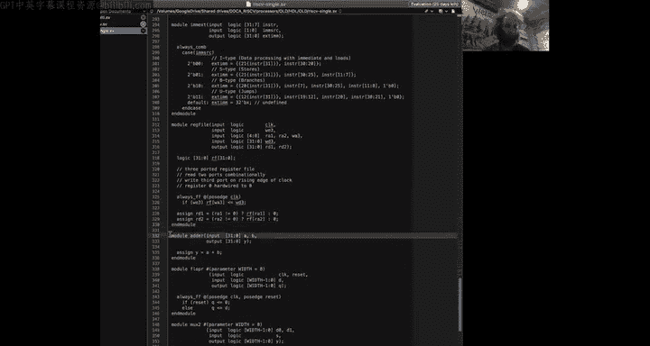

There's the idiom for a resetable foot flop， always at Pos edge clock or Posage reset if reset Q is0。

 otherwise Q gets D。Here's the idiom for2 input maxs assign y equals S， question D1， colon D0。

 and so forth。And so that concludes our very for a single psychoprocessor。

 and you see how the diagram of the processor directly responds to the hardware。

And our approach was to look at each piece of hardware and write the corresponding idiom in the barrela。

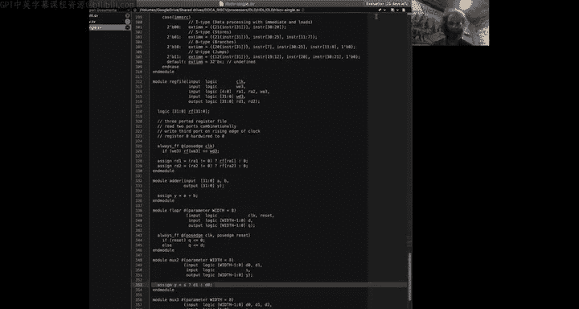