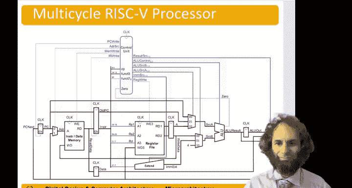
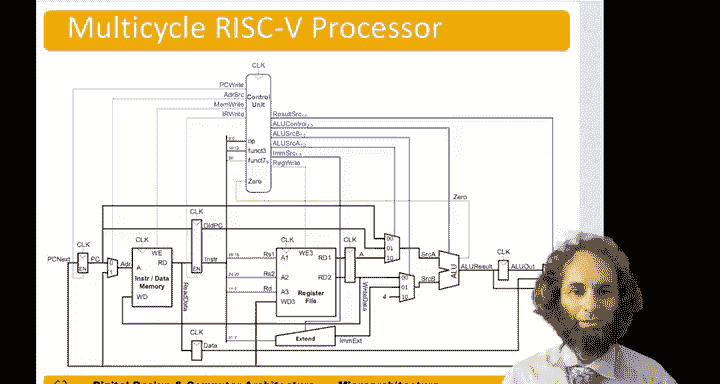
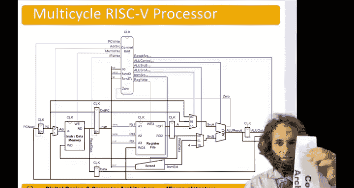
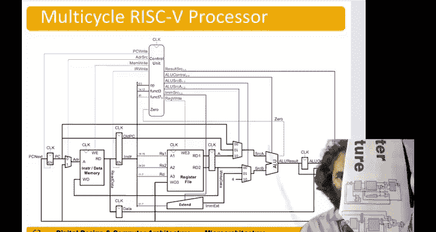
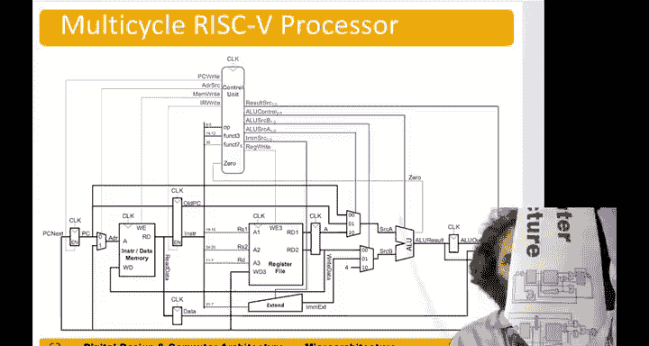

# 数字设计和计算机架构：7.6c：单周期处理器领带庆祝 🎉

在本节中，我们将通过一个特别的庆祝活动，回顾单周期和多周期处理器的核心数据通路设计。

上一节我们详细探讨了处理器的数据通路设计。为了庆祝这一重要里程碑，本节将展示一个为此特别设计的领带图案。

以下是领带图案的展示和说明。

为庆祝我们的单周期和多周期处理器设计完成，我为此场合制作了一条特别的领带。

领带上的图案主题是计算机架构。图案中展示了我们的单周期和多周期数据通路设计。

遗憾的是，印刷时图案被略微裁剪了，但整体效果依然清晰。让我们为此欢呼。

本节课中，我们一起通过一个有趣的庆祝方式，回顾并形象化地展示了单周期与多周期处理器的数据通路，这是计算机架构学习中的一个重要里程碑。