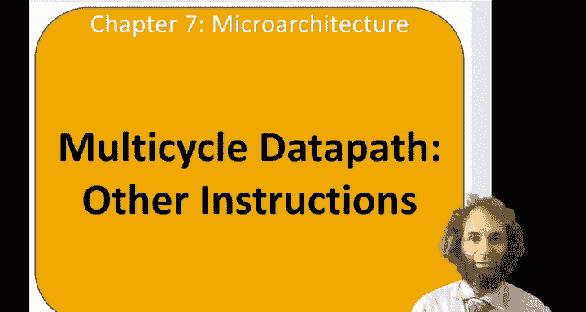
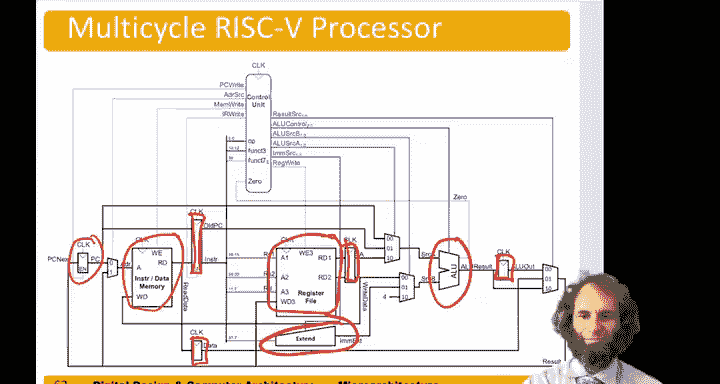

# 哈维穆德学院《数字设计和计算机架构RISC版｜Digital Design and Computer Architecture： RISC-V Edition》 - P104：Chapter 7 8.Multicycle Processor Datapath for Other Instr.zh_en - GPT中英字幕课程资源 - BV1JC1MY1E7F

Hello， in this video we'll continue the multicycle data path and implement the rest of the instructions。

So next， let's take a look at the Stward instruction。

So remember that the Star War instruction will write the data from the second source register into the memory。

We already have most of the capability。 We can fetch the instruction。 We can read the registers。

 but now we need to read two registers instead of just one。So we'll add。

A wire here from the Rs field of the instruction to the register file and read out the second source。

And we'll expand the register， the Fop after the register file to hold both sources。Next。

 we'll be able to take that value。 We'll call it right data。

And bring it back to the right data port of the。Memory。And on that。Meanwhile。

 we are calculating the address。To write two on the third step and on the fourth step。

 we could take the address。Come around here。 I can a load。The data。

From the register file and insert the Memorite control signal to write the data into memory。

So that's all we needed for Stward。For our type instructions。

 we actually already have all the hardware on the first step。

 we fetched the instruction from the memory， put it in the instruction register On the second step。

 we would read the two sources。On the third step， those sources would go to the ALU。

And we could do the operation， and on the fourth step， we could take that result。

And write it back in to the register file。So that was for our type instructions for branch。

The branch instructions， we need to calculate the branch target address。And we also need to。

Decide whether to take the bridge。So let's draw that on here。On the first step。

We would read the instruction。But， we could， also。嗯。Capture。The program counter。On the second step。

We can。Take the program counter。And add。Andd。The。Immediate， so on the second step。

 we've got an immediate。From the design extender。And we could add those together。

And get a branch target address， start， nail you out。On the third step。We could。

Compare the registers， so we have A and B， put those into the ALU。

And do a subtract and see if they're equal。And then if they are equal， we could take that result。

From PC， plus immediate。And write it into the program counter。By asserting PC right。

And that way take the branch。'll notice that the PC is updated in the fetch stage to PC+4。

 so since we want to do PC plus immediate， not PC plus4 plus immediate。

 we needed to keep that copy of the old program counter to add the immediate tip。So to summarize。

 here's our multie risk5 processor， the black part is the data path。

 the black wires are generally the heavy black wires are 32 bit buses。

 the light ones are smaller buses like the five bit。Register identifiers。

And the blue is the control signals。So again， we have our architectural state， the program counter。

 the memory and the register file。Then we added the signine extender to get the immediate and the ALU to do the math。

At this time we've had to add registers after each step。

 so to hold the values of the instruction and the data， to hold the values coming out of the ALU。

 sorry out of the register file and out of the ALU。To break into steps。

And we've needed additional multiplexors to choose from one of several options。

And then we added the blue control signals to tell the ALUs what to do and to assert the right enables to the memories and some of these registers to capture values on the appropriate step。

