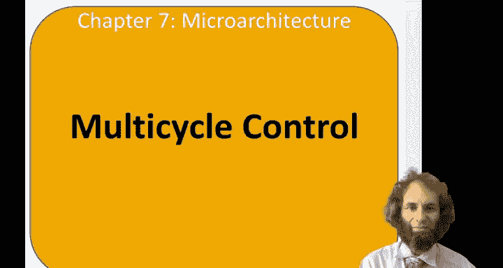
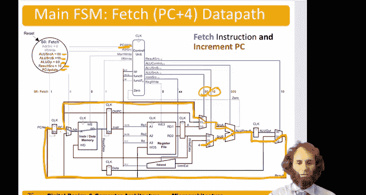

# 哈维穆德学院《数字设计和计算机架构RISC版｜Digital Design and Computer Architecture： RISC-V Edition》 - P105：Chapter 7 9.Multicycle Processor Control FSM for lw.zh_en - GPT中英字幕课程资源 - BV1JC1MY1E7F

Hello， and this video will develop the controller for the multie processor。

So just like we did with a single cycle processor， we're going to work out the controller。

 here's the high level view of it。 It takes the instruction。And the zero flag from the AU in。

 just like in the single cycle processor， and it produces the appropriate control signals This time there are a few more control signals and more importantly。

 the control signals take on different values on different steps。Let's break that。

Controller down into some subbs， so this is an example of hierarchical design。

Instead of having a main decoder that was combinational， we'll now have a main FSM。

That produces most of the control signals on the appropriate clock cycles based on up。

Then we'll have the ALU decoder that's exactly the same as the single cycle processor。

 it will take ALU up from the main FSM and the funt fields。

Bit five up and determine what AU instruction， what AU control need to use。

The PC logic will be similar。Based on a branch and zero。And on another signal called PC Upate。

 we will determine whether we want to write to the program counter。

So PC update will be true when it's time to fetch the next instruction or when we're doing an unconditional jump。

Branch will be true for branch not equal。Finally， we're going to pull the instruction decoder out from the main FSM because the immediate source depends only on the op code。

 not on any steps， so that will let us simplify a little bit。Itll be combinational logic。

So let's look more closely at that。Instruction decoder。Based on the type of instruction。

 this will put out the appropriate immediate source， so load word had an op of three。

 so immediate source should be 00。I type format。Store word is an S type instruction， Opus 35。

 and so immediate exc should be 01。Our type instructions don't need any immediate。

 so immediate sources don't care。And branch on equal has an op code of 99。

And so the immediate source would be 10。And。The instruction name here， of course。

 doesn't actually mean anything to the truth table。

 it's just to make it easier for the human to read this is simply some combinational logic that looks at the seven bits of op and produces two bits of output。

Now let's design the multicycle main FSM。So， again。It's taking seven bit up。

And it's putting out the right enables， so that would be redrite and memoryite， just like before。

 also I are right to tell us it's time to update the instruction register。

And the things to change the program counter， branch and PC update。

It also puts out the same control signals to the multiplexors， Alia source A and Aus source B。

 Now there there's a little bit more to choose from。 so these are each two bit control signals。

Addres source。As the address input to the。Memory。And result source to choose which result to take to write back。

And of course， ale you up on encoding with 0，0 for add。0，1 for subtract。And 1。

0 for look at the function。So this is a lot of signals to write and to there're going to be a state machine generating these signals to declutter the FSM。

 let's have some terminology for these right。Enable signals。Here。

We will just list their name if they're asserted， if they're one。And if they're not asserted。

 if they're zero， we'll om them from the state。The multiplexer select signals。

 if we care about them we'll list their value if they don't care， we won't list them。

So that we said the first step in any instruction was to fetch it。So on reset。

 let's have the main FSM go to a fetch state called state 0。And in that state。

 the program counters ready for us。 We need to choose it from。Address source。

So address source needs to be 0。Right here。Based on that address。

 we read the instruction out of the instruction memory。

 and we will write it into the instruction register。By asserting the enable signal I R red。

 So we need to make I R red。Nothing else is happening in the data path。

 so that's all we need to do in state zero array。On the next step。

 we're going to decode the instruction and do the sign extending。

So the instruction is sitting right here， we'll take bits 15 through9 of it。

 feed that to the register file and read out value of Rs1。Will take。

Upper bits and feed those to the signine extender。And get out the sign extended immediate。

That immediate depends on。I am M source。But remember。

 IM M's source is determined by the instruction decoder to just combinational logic。

Based on the op code。 So we don't need anything in the state machine to handle that。So actually。

 there is no control signals at all needed in this state。

 we just give time for the register file and the send extender to do the business。All right。

So that was decoded。Next， depending on the instruction， we'll go into the third step。

So if the op code。Is3 for a load word。Then we need to do the load。

 And the first step of a load was to calculate the address。

 We need to add the first source to the immediate。So the first source is hitting here。

 we need to choose it。With this multiplexer。 So we need。A U source A to be 1，0。

The second source is coming from the immediate。 We need to choose this terminal of the mugs。

 A U source B needs to be 0，1。Pass those to the A L U。And we want the AU to add。 Remember。

 an A U up of 0，0 tells the A you always add。So now we get our answer and we'll store it。

Into the A you out register。The end of step。In the fourth step。

 we need to actually do the read from memory。 Now it's getting too cluttered to show both the FSM and the data path on the same slides。

 So we're going to break it into two slides。But when we're doing a memory， read。嗯。We will。

Set result source to 0，0 and address source to 0，1。 Let's look at that on the data path。

So we have our our address sitting in here。 We need to choose it， So result source needs to be 0，0。

We'll bring that result around。As the address to the data memory。So we need to make A DR source。Bi。1。

To choose that value。We go read from that address in the data memory。

And we get read data out and store it in the data register at the end of step。Finally。

 it's time for step5。So。It's time to write the result back to the register file。And in this step。

The value sitting in the data memory。We need to choose it。So we'll go into the result multiplexer。

Choose that input 0，1 is oldsource is 0，1。Bring that as the value。To the register file。

So a little bit loopy， but we're just choosing data as the thing we want to write to the registered file。

We also are getting the R D field from the instruction。And we need to assert。Rdge W。

To tell the register file to write this value to R D。All right。

 so it seems like we have completed the load word， but we've forgotten about one step。

We needed to add4 to the program counter， as well。Now， during the fetch stage。

 the AU wasn't doing anything else， so we might as well use that time to do PC+4。

And so back in the fetch stage at the very beginning， we have the programme counter sitting here。

We can bring that program counter over。To A U source a Mu。We need A source A to be 0。

0 to choose the program counter。We want to add  four， so alia source B needs to be 10。

To choose the form。Tell the A U to add。 So A U op needs to be 0，0 to indicate add。

That result we want to put right into the program counter。 So the result mugs needs to be。

Result source 1，0 to choose a result。Bring this around。Ass PC next。

And then we need to assert PC update。De tello。PC rate to be one。

And enable the program counter to get this new PC plus4。So， that concludes。

The controller for handling the load word instruction。

