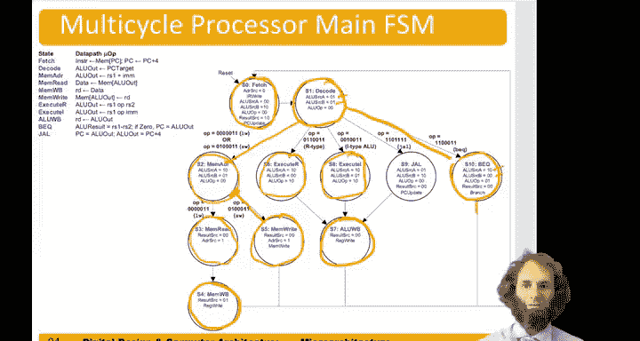

# 哈维穆德学院《数字设计和计算机架构RISC版｜Digital Design and Computer Architecture： RISC-V Edition》 - P107：Chapter 7 11.Multicycle Processor Extending to other Instructions.zh_en - GPT中英字幕课程资源 - BV1JC1MY1E7F

Hello， in this video we'll extend the risk5 multicycle processor to handle new instructions in particular we'll look at add I and jump in link。

 just like with a single cycle processor。

So suppose we wanted to handle a immediate or in fact， any type of I type AU instruction。

 so and immediate or immediate， etc。We look at the up field。If it's got this value。

 then it's an i type AluU instruction。And if it is。

 we want to execute it very much the same as the R type， except the second source should come from。

Immediate rather than from the second register。So for this， execute I type step。

The first source comes from the registered file。 So AL use source A。Needs to be 1，0。

The second source comes from the immediate， so Alu source B needs to be 01 to select from the immediate。

Those two sources go into the ALU。 We do the ALU op that depends on the instruction。

 so ALU op needs to be 10 to say look at the funed fields。And we get our result。

And now everything else is the same。So once we've finished that， execute。Memediate stage。

Then we can go to the regular A you right back and do the same。As。When we're executing an our type。

So now we' have handled。はい。Add I， but also Ands or I， et cetera， all the immediate ALU instructions。

And the difference。Wass just。Ail you source B。And they execute state。All right。

 next let's take a look at adding jump and link， this is a larger change just like it was in the。

Single cycle processor。 So remember， jump and link has to do a few things。

It needs to get the J type immediate。It needs to。嗯。Write the program counter for sure。

And it needs to。嗯。Calculate the jump target address。So to get the jump target address。

We do that very similar to branch。We have the old program counter。

So we need to choose that with ALU source A being 01。We need。So， in this step， we we're doing the。嗯。

PC plus4。So we'd already calculate target address and decode just like we did for branch。

 but in this step we're doing PC+4 to know where to return to。So OPC and then four。

A use source B needs to be 10。Make AU op。0，0 to tell it to add。 So now we've got PC plus4。

And to take that result。嗯。And。嗯。Meanwhile， we have。啲啊。PC plus。Offset。

Which was our jump target address， sitting in AU out during the third step。

 So we're going to choose that with results source being 0。

And assert PC update to write the program counter。This。Jump targetet address。So that's this step。

Finally， we need to write PC plus4 to the registered file。

And the AU write back step already took the output of ALU and wrote it to the register file so we can just use that step one more time。

Result source will be 00 to take the value from。The啊 a o u。AU。

And redrite one to write PC+4 into the register file。

So that concludes our multicycle processor main finite state machine。Remember。

 this state machine takes a variable number of steps between 3 and 5 on to execute the instruction。4。

All instructions， we start by fetching the instruction and decoding it。

Then we look at the type of instruction。If it's a load， it's going to take five steps on step 3。

 we compute the address we wantload from。On step four， we read a value for memory and on step five。

Write that value to the register file。For a store。It only takes four steps。On the fourth step。

 we write to memory based on the address we compute。

Our type and eye type instructions also take four steps。So on the third step。

 we execute the instruction by doing the AluU operation on the two sources。

And then on the fourth step， we write the result to the register file。

And a branch only takes three steps。Because on the second step。

 wed computed the branch target address。On the third step。

 we compare the registers and if they're equal， then we update the program count。

So that concludes our multie processor。

